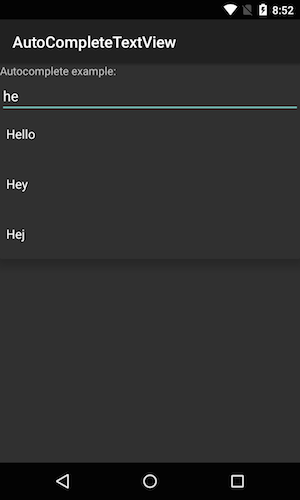

<a name="Recipe" class="injected"></a>


# Recipe

-  Create a layout file that contains an `AutoCompleteTextView`, such as Main.axml in the example code: 


```
<?xml version="1.0" encoding="utf-8"?>
<LinearLayout xmlns: android="http: //schemas.android.com/apk/res/android"
android: orientation="vertical"
android: layout_width="fill_parent"
android: layout_height="fill_parent">

<AutoCompleteTextView
android: layout_width="fill_parent"
android: layout_height="wrap_content"
android: id="@+id/AutoCompleteInput"
/>
</LinearLayout>
```

-  Use the Main.axml as the view for your activity: 


```
SetContentView (Resource.Layout.Main);
```

-   Create a string array containing the options you would like to be autocompleted: 


```
var autoCompleteOptions = new String[] { "Hello", "Hey", "Heja", "Hi", "Hola", "Bonjour", "Gday", "Goodbye", "Sayonara", "Farewell", "Adios" };
```

-  Use the array to populate an `ArrayAdapter` with the built-in `SimpleDropDownItem1Line` layout: 


```
ArrayAdapter autoCompleteAdapter = new ArrayAdapter(this, Android.Resource.Layout.SimpleDropDownItem1Line, autoCompleteOptions);
```

-   Find the instance of the `AutoCompleteTextView` in the layout and assign the `ArrayAdapter`: 


```
var autocompleteTextView = FindViewById<AutoCompleteTextView>(Resource.Id.AutoCompleteInput);
autocompleteTextView.Adapter = autoCompleteAdapter;
```

-  When the control has focus and the user is typing, matching entries will automatically be displayed for them to choose from.


 [ ](Images/AutoCompleteTextView.png)

 <a name="Additional_Information" class="injected"></a>


# Additional Information

To use a much longer list of autocomplete options than the array in step 3,
use the code below to load the list from a file: 

```
// instead of the small array of greetings, use a large dictionary of words loaded from a file
Stream seedDataStream = Assets.Open(@"WordList.txt");
List<string> lines = new List<string>();

using (StreamReader reader = new StreamReader(seedDataStream)) {
    string line;
    while ((line = reader.ReadLine()) != null) {
        lines.Add(line);
    }
}
string[] wordlist = lines.ToArray();
ArrayAdapter dictionaryAdapter = new ArrayAdapter(this, Android.Resource.Layout.SimpleDropDownItem1Line, wordlist);
autocompleteTextView.Adapter = dictionaryAdapter;
```

The WordList.txt file is included in the example project.