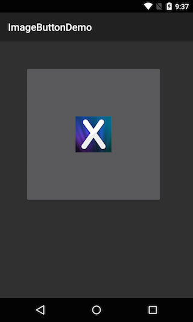

id:{D8C547E3-6671-2680-6163-E0B21414A022}  
title:Create An ImageButton  
brief:This recipe shows how to create an ImageButton.  
samplecode:[Browse on GitHub](https://github.com/xamarin/recipes/tree/master/android/controls/imagebutton/create_an_imagebutton)  
sdk:[ImageButton Class Reference](http://developer.android.com/reference/android/widget/ImageButton.html)  

<a name="Recipe" class="injected"></a>


# Recipe

 [ ](Images/ImageButton.png)

1.  Create a new Xamarin.Android application named `ImageButtonDemo`.
2.  Add an image named *myButtonImage.png* under the <span class="UIItem">Resources &gt; drawable</span> folder in your IDE.
3.  Replace the `Button` declaration in Main.axml with the following,


```
<ImageButton android:id="@+id/myButton"
        android:layout_width="wrap_content"
        android:layout_height="wrap_content"
        android:layout_marginTop="50dip"
        android:layout_marginLeft="50dip"
        android:padding="100dip"
        android:src="@drawable/myButtonImage" />
```

<ol start="4">
  <li>In MainActivity.cs, change the type from <code>Button</code> to <code>ImageButton</code>.</li>
</ol>


```
var button = FindViewById<ImageButton> (Resource.Id.myButton);
```

 <a name="Additional_Information" class="injected"></a>


# Additional Information

The `ImageButton` class behaves like a `Button`, adding support for showing
displaying an image on the button’s surface. The layout of the can be managed
with the various android layout attributes as shown above, where we set the
margin and the padding.
