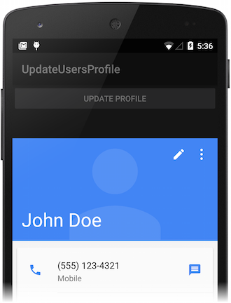
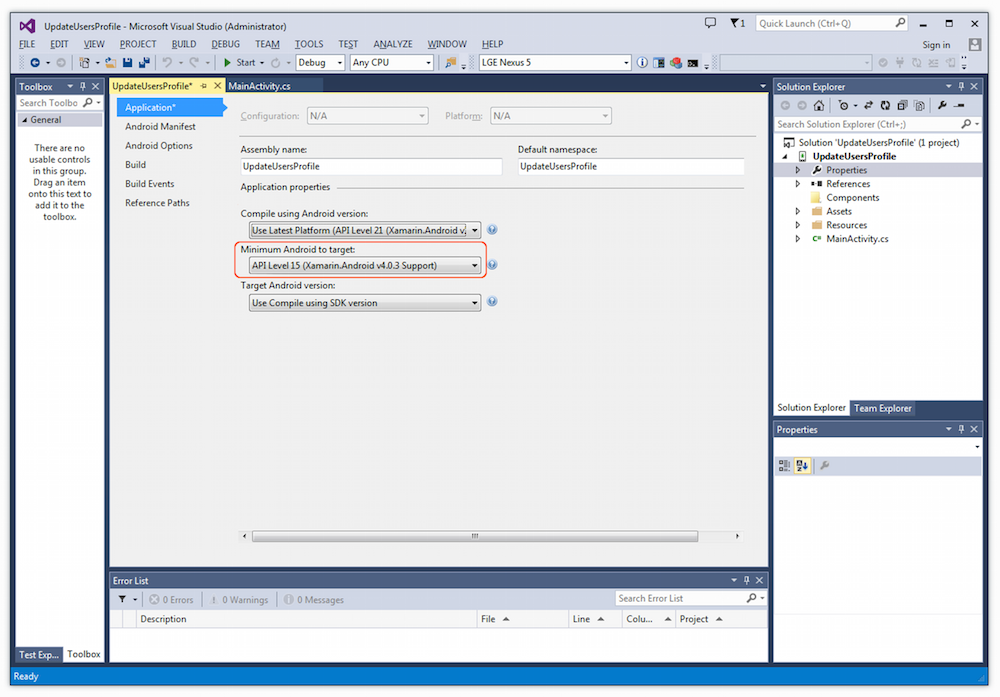
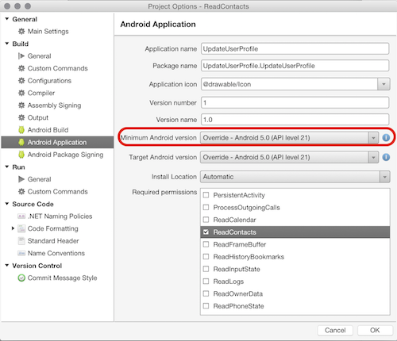
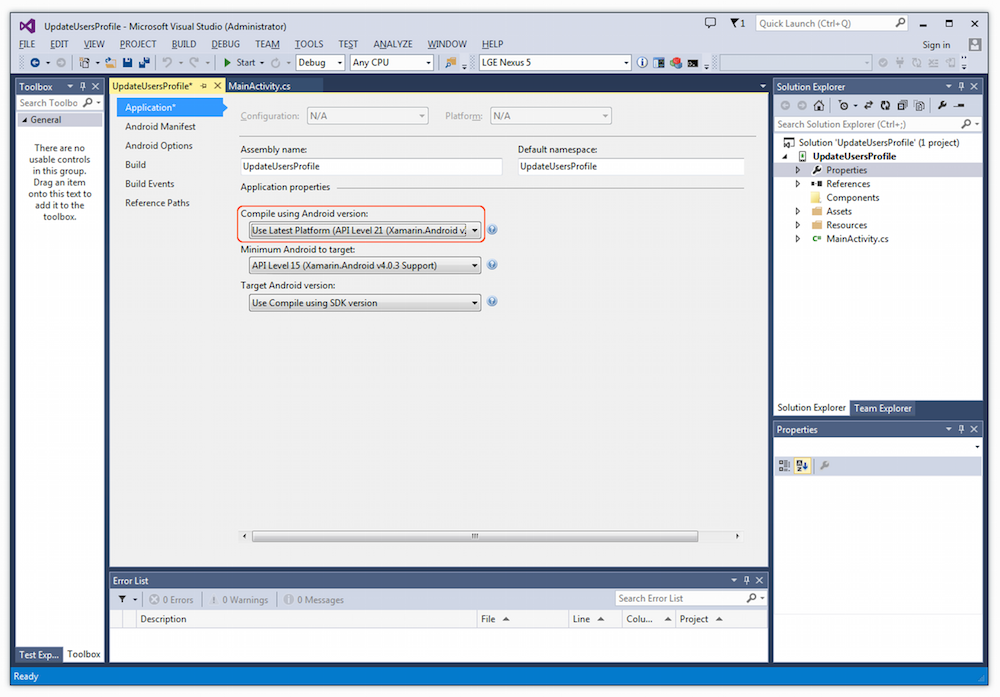
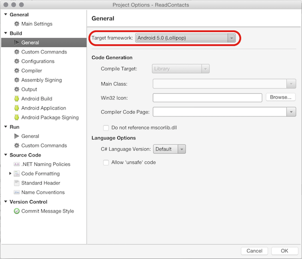
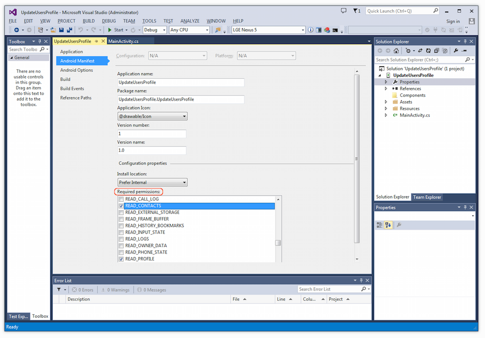
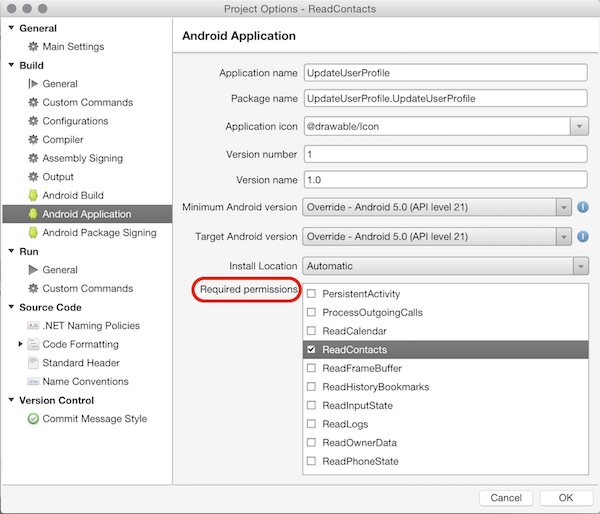
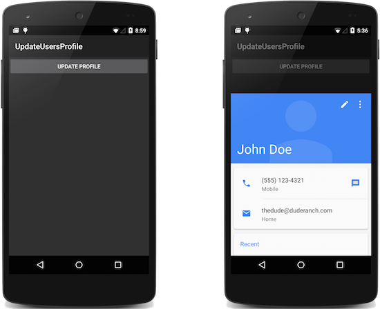

<a name="Recipe" class="injected"></a>

# Recipe

This recipe illustrates how to update the Android device owner's user 
profile. This profile appears in the **Contacts** app (also known as 
the **People** app) under the label, **ME**. In this recipe, we will 
write a simple app that updates the user profile and launches an 
activity to view the updated profile. 



Before we can run this app, the user profile must be manually created 
in our Android device or emulator. If your device does not yet have a 
user profile, use the following steps (depending on your Android 
version) to create the user profile:  

In Android 4.x (Ice Cream Sandwich):  

- Start the **People** app. 
- Tap <span class="uiitem">Create a new contact</span>.
- Tap <span class="uiitem">Keep local</span>.
- Enter a name for a temporary user, such as "Temp".
- Tap the check mark next to <span class="uiitem">Done</span>. 
- Tap the back arrow in the upper left hand corner of the screen.
- Tap <span class="uiitem">Set up my profile</span> (under the
  **ME** heading).
- Under <span class="uiitem">My local profile</span>, enter your 
  name and, optionally, a phone 
  number and email address.
- Tap the check mark next to <span class="uiitem">Done</span>.

In Android 5.x (Lollipop): 

- Start the **Contacts** app. 
- Tap <span class="uiitem">CREATE A NEW CONTACT</span>.
- Tap <span class="uiitem">KEEP LOCAL</span>.
- Enter a name for a temporary user, such as "Temp".
- Tap the check mark next to <span class="uiitem">Add new contact</span>. 
- Click the back button.
- Tap <span class="uiitem">Set up my profile</span> (next to the
  **ME** heading).
- Under <span class="uiitem">My local profile</span>, enter your 
  name and, optionally, a phone 
  number and email address.
- Tap the check mark next to <span class="uiitem">Add new contact</span>.


To update and query the user profile, follow these steps: 

-   Create a new Xamarin.Android application and name it 
    **UpdateUsersProfile**. 

-   Set the minimum Android version to API level 15. 
    (For more information about Android version settings, see
    [Understanding Android API levels](/guides/android/application_fundamentals/understanding_android_api_levels/).)
    In Visual Studio, open the project properties in
    <span class="uiitem">Solution Explorer</span> and select the <span 
    class="uiitem">Application</span> page. In the drop-down menu under 
    <span class="uiitem">Minimum Android to target</span> you can 
    select the minimum Android version for your project:  

    

    In Xamarin Studio, click the gray gear icon to the right of the 
    project and select <span class="uiitem">Options</span>; this opens 
    the <span class="uiitem">Project Options</span> dialog. Click <span 
    class="uiitem">Build > Android Application</span>. Using the 
    drop-down menu to the right of <span class="uiitem">Minimum Android 
    version</span>, you can set the minimum Android version for your
    project: 

    


-   Set the target framework to API level 15 or 
    later. In our example, we have it set to Android 5.0 (API level 
    21). In Visual Studio, go to the project's <span 
    class="uiitem">Application</span> page. Set the target framework by 
    selecting the API level in the drop-down menu under <span 
    class="uiitem">Compile using Android version</span>: 

    

    In Xamarin Studio, open the <span class="uiitem">Project 
    Options</span> dialog. In this dialog, click <span 
    class="uiitem">Build > General</span>. Set the target framework by 
    selecting the API level in the drop-down menu to the right of <span 
    class="uiitem">Target framework</span>: 

    


-   Add permissions to the Android manifest that enables the app to 
    read and write contacts as well as read and write profile data. 
    In Visual Studio, open the project properties in <span 
    class="uiitem">Solution Explorer</span> and select the <span 
    class="uiitem">Android Manifest</span> page:  

    

    Enable the following permissions under <span 
    class="uiitem">Required permissions</span>:  

    -  **READ_CONTACTS**
    -  **READ_PROFILE**
    -  **WRITE_CONTACTS**
    -  **WRITE_PROFILE**

    In Xamarin Studio, click the gray gear icon to the right of the 
    project and select <span class="uiitem">Options</span>; this opens 
    the <span class="uiitem">Project Options</span> dialog. Click <span 
    class="uiitem">Build > Android Application</span>:  

    

    Enable the following permissions in the <span 
    class="uiitem">Required permissions</span> section:  

    -  **ReadContacts**
    -  **ReadProfile**
    -  **WriteContacts**
    -  **WriteProfile**


-   Edit **Resources/values/Strings.xml** and modify the button text
    string to "Update Profile" as follows: 

```xml
<?xml version="1.0" encoding="utf-8"?>
<resources>
    <string name="buttonText">Update Profile</string>
    <string name="ApplicationName">UpdateUserProfile</string>
</resources>
```

-   Edit **Resources/layout/Main.axml** and modify the `Button` layout 
    so that its text value is set from the `buttonText` string resource: 

```xml
<?xml version="1.0" encoding="utf-8"?>
<LinearLayout xmlns: android="http: //schemas.android.com/apk/res/android"
    android: orientation="vertical"
    android: layout_width="fill_parent"
    android: layout_height="fill_parent"
    >
<Button
    android: id="@+id/MyButton"
    android: layout_width="fill_parent"
    android: layout_height="wrap_content"
    android: text="@string/buttonText"
    />
</LinearLayout>
```

-   In the `MainActivity` class (**MainActivity.cs**), add a new method 
    called `NameOwner` as shown below. This code instantiates 
    a `ContentValue` object and calls `ContentValues.Put` to include 
    the profile display name "John Doe" in the `ContentValues` object. 
    `ContentResolver.Update` is called to insert this display name into 
    the existing user's profile. Note that the user's profile cannot be 
    created explicitly &ndash; attempting to do so will throw an 
    exception. 

```
void NameOwner()
{
    ContentValues values = new ContentValues();
    values.Put (ContactsContract.Contacts.InterfaceConsts.DisplayName, "John Doe");
    ContentResolver.Update (ContactsContract.Profile.ContentRawContactsUri, 
        values, null, null);
}

```

-   Next, create another `MainActivity` method called `ReadBackName`, 
    as shown below. This method is called to verify that the name was 
    actually updated. It gets the URI for the user's profile and 
    configures `projection` so that only one column (the user's display 
    name) is read back from this profile. A cursor object is created 
    for accessing the user's profile data. If the cursor is 
    successfully initialized, it is moved to the first item in the 
    user's profile. The first column at this position (the user display 
    name) is read and printed to the console. If these operations 
    succeed, `ReadBackName` returns `true`; else, it returns `false`. 

```
bool ReadBackName()
{
    Android.Net.Uri uri = ContactsContract.Profile.ContentUri;
    string[] projection = { ContactsContract.Contacts.InterfaceConsts.DisplayName };

    CursorLoader loader = new CursorLoader (this, uri, projection, null, null, null);
    ICursor cursor = (ICursor)loader.LoadInBackground();

    if (cursor != null)
    {
        if (cursor.MoveToFirst())
        {
            Console.WriteLine(cursor.GetString(cursor.GetColumnIndex(projection[0])));
            return true;
        }
    }
    return false;
}
```

-   Add another `MainActivity` method called `ViewProfile` that 
    launches the contacts app to view the user profile:  

```
void ViewProfile ()
{
    Intent intent = new Intent (
        Intent.ActionView, ContactsContract.Profile.ContentUri);
    StartActivity (intent);
}

```

-   Modify the `button.Click` hander in **MainActivity.cs** to call these
    three methods as illustrated in the following example:  

```
button.Click += delegate {
    NameOwner();
    if (ReadBackName())
        ViewProfile();
};
```

-   Build and run the app; it displays an <span class="uiitem">UPDATE 
    PROFILE</span> button as seen below in the screenshot on the left. When 
    we tap this button to cause the button click handler to run, the 
    following sequence takes place:  
    -   The call to `NameOwner` updates the profile's display 
        name to "John Doe". 
    -   The call to `ReadBackName` reads the display name from
        the user profile, writes it to the console (for debug), and 
        returns `true` if the user profile was read successfully.
    -   The call to the `ViewProfile` method opens the contacts app, 
        as seen in the screenshot on the right: 

    

<a name="Additional_Information" class="injected"></a>

# Additional Information

The owner's user profile is only available on Android 4.0 (Ice Cream 
Sandwich) and later. Before the user profile can be updated, it must be 
created manually using the **People** (or **Contacts**) app as 
described in the recipe. For more about using
`ContactContracts.Profile`, see the 
[ContactsContract.Profile](http: //developer.android.com/reference/android/provider/ContactsContract.Profile.html) 
class reference. 