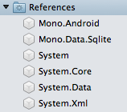
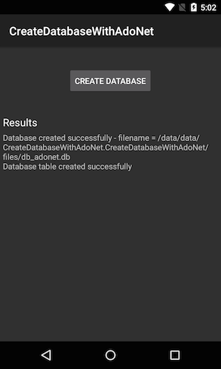

<a name="Recipe" class="injected"></a>


# Recipe

Xamarin.Android has an ADO.NET implementation of SQLite inside the assembly
`Mono.Data.SQLite`

1. Add a reference to `System.Data` and to Mono.Data.SQLite: 

 

2. To create your database, use the `SqliteConnection` class and call the static `CreateFile` method.
You will need to provide a path to the database, as well as the name of the database as a parameter.

The following snippet contains a call to the `Path.Combine` method.
If you are using the `Android.Graphics` namespace within the source file that you set up the database in, you will
need to explicitly state the use of `System.IO`, as `Android.Graphics` also contains a `Path` class. `Android.Environment`
has a class called `Environment`, so again, the `System` namespace will need to be explicitly used if you are using the
`Android.Environment` namespace.

The following snippet demonstrates both set ups: 

```
// with Android.Graphics & Android.Environment
var docsFolder = System.Environment.GetFolderPath(System.Environment.SpecialFolder.MyDocuments);
var pathToDatabase = System.IO.Path.Combine(docsFolder, "db_adonet.db");
SqliteConnection.CreateFile(pathToDatabase);

// without Android.Graphics & Android.Environment
using System.IO;

var docsFolder = Environment.GetFolderPath(Environment.SpecialFolder.MyDocuments);
var pathToDatabase = Path.Combine(docsFolder, "db_adonet.db");
SqliteConnection.CreateFile(pathToDatabase);
```
<ol start="3">
  <li> It is important to test to ensure the file has been created. This can be achieved using either a <code>try</code>/<code>catch</code> or to simply use <code>if (!File.Exists)</code> and test the return value. The following snippet demonstrates both: </li>
</ol>
```
// with try / catch
try
{
    var docsFolder = Environment.GetFolderPath(Environment.SpecialFolder.MyDocuments);
    var pathToDatabase = Path.Combine(docsFolder, "db_adonet.db");
    SqliteConnection.CreateFile(pathToDatabase);
}
catch (IOException ex)
{
    var reason = string.Format("The database failed to create - reason {0}", ex.Message);
    Toast.MakeText(myContext, reason, ToastLength.Long).Show();
}

// using File.Exists
if (!File.Exists(pathToDatabase))
{
    var reason = string.Format("The database failed to create - reason {0}", ex.Message);
    Toast.MakeText(myContext, reason, ToastLength.Long).Show();
}
```
<ol start="4">
  <li> To create a table within the database, a command has to be created and executed. As with the creation, the insertion should be enclosed within a <code>try</code>/<code>catch</code>. The following snippet demonstrates how to create a table and enclose it within a <code>try</code>/<code>catch</code>. The example here uses the async methods (but they can be equally replaced with the non-async methods) to create a table called “People.”</li>
</ol>

```
// create a connection string for the database
var connectionString = string.Format("Data Source={0};Version=3;", pathToDatabase);
            try
{
    using (var conn = new SqliteConnection((connectionString)))
    {
        await conn.OpenAsync();
        using (var command = conn.CreateCommand())
        {
            command.CommandText = "CREATE TABLE People (PersonID INTEGER PRIMARY KEY AUTOINCREMENT, FirstName ntext, LastName ntext)";
            command.CommandType = CommandType.Text;
            await command.ExecuteNonQueryAsync();
        }
    }
}
catch (Exception ex)
{
    var reason = string.Format("Failed to insert into the database - reason = {0}", ex.Message);
    Toast.MakeText(myContext, reason, ToastLength.Long).Show();
}
```

The sample code for this recipe creates a database with the result displayed, when the button is pressed. This is
illustrated below: 

[]