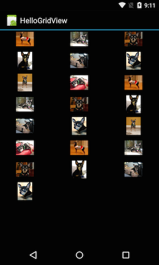

---
id:{D454FB2C-4676-C01B-F1F6-297BB226A28D}  
title:Create a Grid View  
brief:This tutorial will show how to create a Grid View.  
samplecode:[Browse on GitHub](https://github.com/xamarin/recipes/tree/master/android/layout/grid_view/create_a_grid_view)  
sdk:[GridView](http://developer.android.com/reference/android/widget/GridView.html)  
---

<a name="Recipe" class="injected"></a>

# Recipe

-  Create a new Xamarin.Android project named HelloGridView.
-  Find some photos to display, or download these sample images. Add the image files to the project’s Resources/Drawable directory. In the Properties window, each image should have its build action set to `AndroidResource`.
-  Open the file Resources/Layout/Main.axml and change the layout such that it creates a `GridView` that occupies the entire screen:


```
<?xml version="1.0" encoding="utf-8"?>
<GridView xmlns:android="http://schemas.android.com/apk/res/android"
    android:id="@+id/gridview"
    android:layout_width="fill_parent"
    android:layout_height="fill_parent"
    android:columnWidth="90dp"
    android:numColumns="auto_fit"
    android:verticalSpacing="10dp"
    android:horizontalSpacing="10dp"
    android:stretchMode="columnWidth"
    android:gravity="center"
/>
```

-  Open HelloGridView.cs, and insert the following code for the `OnCreate()` method:


```
protected override void OnCreate (Bundle bundle)
{
    base.OnCreate (bundle);
    SetContentView (Resource.Layout.Main);
    var gridview = FindViewById<GridView> (Resource.Id.gridview);
    gridview.Adapter = new ImageAdapter (this);
    gridview.ItemClick += delegate (object sender, ItemEventArgs args) {
        Toast.MakeText (this, args.Position.ToString (), ToastLength.Short).Show ();
    };
}
```

This code will use a custom adapter (created in the next step) for the grid view. This custom adapter will act as the source of data for the `GridView`,
displaying the drawable resources that were added.

-  Create a new class called `ImageAdapter` that will subclass `BaseAdapter`:


```
public class ImageAdapter : BaseAdapter
{
    private readonly Context context;

    public ImageAdapter(Context c)
    {
        context = c;
    }

    public override int Count
    {
        get { return thumbIds.Length; }
    }

    public override Object GetItem(int position)
    {
        return null;
    }

    public override long GetItemId(int position)
    {
        return 0;
    }
```
- Create a new `ImageView` for each item referenced by the
`Adapter`.

```
public override View GetView(int position, View convertView, ViewGroup parent)
    {
        ImageView imageView;

        if (convertView == null)
        {
            // if it's not recycled, initialize some attributes
            imageView = new ImageView(context);
            imageView.LayoutParameters = new AbsListView.LayoutParams(85, 85);
            imageView.SetScaleType(ImageView.ScaleType.CenterCrop);
            imageView.SetPadding(8, 8, 8, 8);
        }
        else
        {
            imageView = (ImageView) convertView;
        }
        imageView.SetImageResource(thumbIds[position]);
        return imageView;
    }
```

```
// references to our images
private readonly int[] thumbIds = {
                                          Resource.Drawable.sample_2,
                                          Resource.Drawable.sample_3,
                                          Resource.Drawable.sample_4,
                                          Resource.Drawable.sample_5,
                                          Resource.Drawable.sample_6,
                                          Resource.Drawable.sample_7,
                                          Resource.Drawable.sample_0,
                                          Resource.Drawable.sample_1,
                                          Resource.Drawable.sample_2,
                                          Resource.Drawable.sample_3,
                                          Resource.Drawable.sample_4,
                                          Resource.Drawable.sample_5,
                                          Resource.Drawable.sample_6,
                                          Resource.Drawable.sample_7,
                                          Resource.Drawable.sample_0,
                                          Resource.Drawable.sample_1,
                                          Resource.Drawable.sample_2,
                                          Resource.Drawable.sample_3,
                                          Resource.Drawable.sample_4,
                                          Resource.Drawable.sample_5,
                                          Resource.Drawable.sample_6,
                                          Resource.Drawable.sample_7
                                      };
}
```

First this class implements some required methods from BaseAdapter. Normally,
`GetItem(int)` would return the actual object at the specified position, but it is
ignored in this example. Likewise, `GetItemId(int)` should return the row id of
the item, but it is not needed here.

The first method necessary is `GetView()`. This method creates a new `View` for
each image added to the `ImageAdapter`. When this is called, a `View` is passed in,
which is normally a recycled object (at least after this has been called once),
so there’s a check to see if the object is null. If the object is null, an
`ImageView` is instantiated and configured with the desired properties for the
image presentation:

 **LayoutParams** – this sets the height and width for the
`View`. It ensures that no matter the size of the drawable, each image is resized
and cropped to find in these dimensions, as appropriate

 **SetScaleType** – this declares that images should be
cropped toward the center.

 **SetPadding(int, int, int, int)** – defines the padding
for all sides. Note that if the images have different aspect ratios, then less
padding will cause more cropping of the image if it does not match the
dimensions given to the `ImageView`.

If the `View` passed to `GetView()` is not null, then the local `ImageView` is
initialized with the recycled `View` object.

At the end of the `GetView()` method, the position integer passed into the
method is used to select an image from the `thumbIds` array, which is set as the
image resource for the `ImageView`.

-  Run the application. You should see the following:


 [ ](Images/gridview.png)