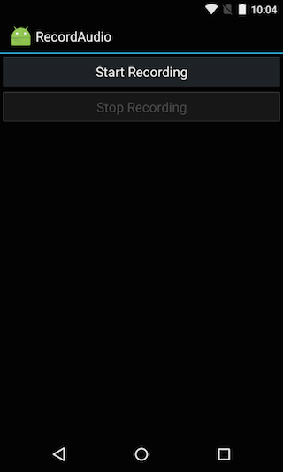

---
id:{1426450D-F53B-6708-2D79-DAC055668532}  
title:Record Audio  
brief:This recipe shows how to record audio using the MediaRecorder class and play it back with the MediaPlayer class.  
samplecode:[Browse on GitHub](https://github.com/xamarin/recipes/tree/master/android/media/audio/record_audio)  
sample:[Record Audio](http://docs.xamarin.com/@api/deki/files/3138/=Record_Audio.pdf)  
sdk:[MediaRecorder Class Reference](http://developer.android.com/reference/android/media/MediaRecorder.html)  
---

<a name="Recipe" class="injected"></a>

# Recipe

 [ ](Images/recordaudio.png)

-  Create a new Xamarin.Android application named RecordAudio.
-  Add the` RECORD_AUDIO` permission to the AndroidManifest.xml.
-  Add two buttons to the Main.axml file to start and stop recording.

```
<?xml version="1.0" encoding="utf-8"?>
<LinearLayout xmlns:android="http://schemas.android.com/apk/res/android"
        android:orientation="vertical"
        android:layout_width="fill_parent"
        android:layout_height="fill_parent">
 <Button
        android:id="@+id/start"
        android:layout_width="fill_parent"
        android:layout_height="wrap_content"
        android:text="Start Recording" />
 <Button
        android:id="@+id/stop"
        android:layout_width="fill_parent"
        android:layout_height="wrap_content"
        android:enabled="false"
        android:text="Stop Recording" />
</LinearLayout>
```

-  In the `Activity`, add class variables for a `MediaRecorder` and `MediaPlayer`. Also add class variables for the buttons so we can enable and disable them throughout the `Activity` lifecycle.


```
MediaRecorder _recorder;
MediaPlayer _player;
Button _start;
Button _stop;
```

-  In the `OnCreate` method, set the content view and add code to get references to the buttons.


```
protected override void OnCreate (Bundle bundle)
{
base.OnCreate (bundle);

SetContentView (Resource.Layout.Main);
_start = FindViewById<Button> (Resource.Id.start);
_stop = FindViewById<Button> (Resource.Id.stop);
```

-  Set the path where the audio file will be written.


```
string path = "/sdcard/test.3gpp";
```

-  In the `Click` event handler for the start button, initialize the recorder and start recording. Also toggle the `Enabled` property of the buttons.


```
_start.Click += delegate {
stop.Enabled = !stop.Enabled;
start.Enabled = !start.Enabled;

_recorder.SetAudioSource (AudioSource.Mic);
_recorder.SetOutputFormat (OutputFormat.ThreeGpp);
_recorder.SetAudioEncoder (AudioEncoder.AmrNb);
_recorder.SetOutputFile (path);
_recorder.Prepare ();
       _recorder.Start ();
} ;
```

-  In the `Click` event handler for the stop button, stop the recording and playback the audio. Also disable the stop button during playback.


```
stop.Click += delegate {
stop.Enabled = !stop.Enabled;

_recorder.Stop ();
_recorder.Reset ();

_player.SetDataSource (path);
_player.Prepare ();
_player.Start ();
} ;
```

-  In the `OnResume` method of the `Activity`, create instances of the recorder and player. In the `Completion` event handler of the `MediaPlayer`, reset the player and enable the start button.


```
protected override void OnResume ()
{
base.OnResume ();

_recorder = new MediaRecorder ();
_player = new MediaPlayer ();

_player.Completion += (sender, e) => {
_player.Reset ();
_start.Enabled = !_start.Enabled;
} ;

}
```

-  Release the `MediaRecorder` and `MediaPlayer` instances when they are no longer needed, such as in the `OnPause` method of the `Activity`.


```
protected override void OnPause ()
{
base.OnPause ();

_player.Release ();
_recorder.Release ();
_player.Dispose ();
_recorder.Dispose ();
_player = null;
_recorder = null;
}
```

 <a name="Additional_Information" class="injected"></a>


# Additional Information

The `MediaRecorder` class sets up a recording state and then records. When
recording stops, the state needs to be reset and reinitialized to record again.
Similarly, for the `MediaPlayer` to play back audio subsequent times, its `Reset`
method must be called after it stops, and its data source must be reinitialized
and prepared each time.