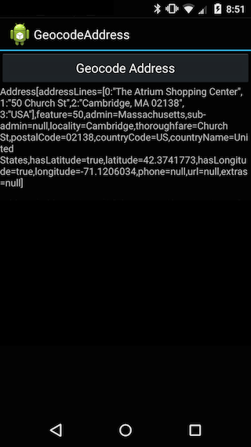

---
id:{CCB6BC87-C475-6B73-3B68-B52249C9481B}  
title:Geocode an Address  
brief:This recipe shows how use the Geocoder to get a latitude and longitude for an address.  
samplecode:[Browse on GitHub](https://github.com/xamarin/recipes/tree/master/android/os_device_resources/geocoder/geocode_an_address)  
article:[Maps and Location](/guides/android/platform_features/maps_and_location)  
sdk:[Geocoder API](http://developer.android.com/reference/android/location/Geocoder.html)  
---

<a name="Recipe" class="injected"></a>

# Recipe

 [ ](Images/Geocode.png)

Follow these steps to geocode an address.

1.  In Main.axml (or whatever layout file you wish) add the following XML.

```
<?xml version="1.0" encoding="utf-8"?>
<LinearLayout xmlns:android="http://schemas.android.com/apk/res/android"
    android:orientation="vertical"
    android:layout_width="fill_parent"
    android:layout_height="fill_parent"
    >
<Button
    android:id="@+id/geocodeButton"
    android:layout_width="fill_parent"
    android:layout_height="wrap_content"
    android:text="@string/geocodeButtonText"
    />
 <TextView
    android:id="@+id/addressText"
    android:layout_width="fill_parent"
    android:layout_height="fill_parent"
   />
</LinearLayout>
```

<ol start="2">
  <li>Add a string resource named geocodeButtonText to Strings.Xml.</li>
</ol>

```
<string name="geocodeButtonText">Geocode Address</string>
```

<ol start="3">
  <li>Add a click event handler for the button in the Activity’s <code>OnCreate</code> method.</li>
</ol>


```
var button = FindViewById<Button> (Resource.Id.geocodeButton);
button.Click += (sender, e) => { … }
```

<ol start="4">
  <li>Add the following code to the click event handler to call the <code>Geocoder</code> on a separate thread.</li>
</ol>

```
button.Click += (sender, e) => {
       new Thread (new ThreadStart (() => {
              var geo = new Geocoder (this);

              var addresses = geo.GetFromLocationName (
                      "50 Church St, Cambridge, MA", 1);

              RunOnUiThread (() => {
                      var addressText = FindViewById<TextView>
                             (Resource.Id.addressText);

                      addresses.ToList ().ForEach ((addr) => {
                             addressText.Append (addr.ToString () +
                                    "\r\n\r\n");
                      } );
              } );
       } )).Start ();
} ;
```

<ol start="5">
  <li>Running the application results in the address being displayed with location information as shown in the screenshot above.</li>
</ol>

 <a name="Additional_Information" class="injected"></a>


# Additional Information

This creates a `Geocoder` instance, which is in the `Andorid.Locations`
namespace. The `Geocoder` calls `GetFromLocationName` with the address to geocode.
When the result is returned, the code adds it to the UI inside a call to
`RunOnUiThread`. The result of the `Geocoder` is an address list. In this call 1
address is returned because that is the number passed into the second argument
of the `GetFromLocationName` call. The returned address contains a variety of
information about the location, including the latitude and longitude.