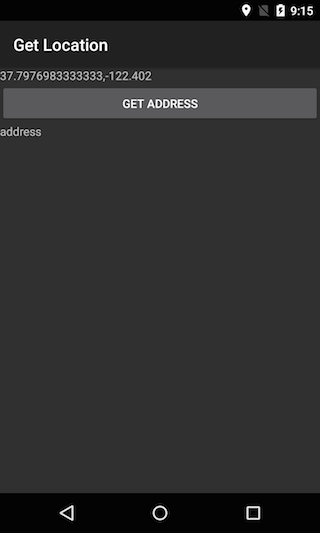

---
id:{D037BC0A-EEFB-7EAA-F023-4D8993EABFF6}
title:Get Current Device Location  
samplecode:[Browse on GitHub](https://github.com/xamarin/recipes/tree/master/android/os_device_resources/gps/get_current_device_location)  
article:[Maps and Location](/guides/android/platform_features/maps_and_location)  
article:[Reverse Geocode a Location](/recipes/android/os_device_resources/geocoder/reverse_geocode_a_location)  
article:[Geocode an Address](/recipes/android/os_device_resources/geocoder/geocode_an_address)  
sdk:[Obtaining User Location](http://developer.android.com/guide/topics/location/obtaining-user-location.html)  
sdk:[LocationManager](http://developer.android.com/reference/android/location/LocationManager.html)
dateupdated: 2016-01-04
---

This recipe will show how to get the location of the device. When a button on the activity is clicked by the user, then a street address that is close to the location will also be displayed.

 [ ](Images/GetLocation1.png)


# Recipe

1. Create a new Xamarin.Android application named **GetLocation**.

2. Edit **AssemblyInfo.cs**, and declare the permissions necessary to use the `LocationServices`:

        [assembly: UsesPermission(Manifest.Permission.AccessFineLocation)]
        [assembly: UsesPermission(Manifest.Permission.AccessCoarseLocation)]

3. Declare the permissions necessary to use the `Geocoder` class. This is not strictly necessary for obtaining the GPS coordinates of the device, but this example will attempt to provide a street address for the current location:

        [assembly: UsesPermission(Manifest.Permission.Internet)]

4. Edit **Main.axml** so that it contains two `TextView`s and a `Button`:

        <?xml version="1.0" encoding="utf-8"?>
        <LinearLayout xmlns:android="http://schemas.android.com/apk/res/android"
            android:orientation="vertical"
            android:layout_width="fill_parent"
            android:layout_height="fill_parent"
            android:paddingTop="20dp"
            android:paddingLeft="8dp"
            android:paddingRight="8dp">
            <TextView
                android:layout_width="fill_parent"
                android:textAppearance="?android:attr/textAppearanceMedium"
                android:layout_height="wrap_content"
                android:text="Location (when available)"
                android:id="@+id/location_text"
                android:layout_marginBottom="15dp" />
            <Button
                android:layout_width="fill_parent"
                android:textAppearance="?android:attr/textAppearanceMedium"
                android:layout_height="wrap_content"
                android:id="@+id/get_address_button"
                android:text="Get Address" />
            <TextView
                android:layout_width="fill_parent"
                android:textAppearance="?android:attr/textAppearanceMedium"
                android:layout_height="wrap_content"
                android:text="Address (when available)"
                android:id="@+id/address_text"
                android:layout_marginTop="10dp" />
        </LinearLayout>

<ol start="5">
  <li>Add some instance variables to <strong>Activity1.cs</strong>:</li>
</ol>

```
static readonly string TAG = "X:" + typeof (Activity1).Name;
TextView _addressText;
Location _currentLocation;
LocationManager _locationManager;

string _locationProvider;
TextView _locationText;
```

<ol start="6">
  <li>Change <code>OnCreate</code>:</li>
</ol>

```
protected override void OnCreate(Bundle bundle)
{
    base.OnCreate(bundle);
    SetContentView(Resource.Layout.Main);

    _addressText = FindViewById<TextView>(Resource.Id.address_text);
    _locationText = FindViewById<TextView>(Resource.Id.location_text);
    FindViewById<TextView>(Resource.Id.get_address_button).Click += AddressButton_OnClick;

    InitializeLocationManager();
}
```

The handler for button click will be covered below. The logic for initializing the `LocationManager` is placed in its own method for clarity.

<ol start="7">
  <li>Add a method called <code>InitializeLocationManager</code> to <strong>Activity1</strong>:</li>
</ol>

```
void InitializeLocationManager()
{
    _locationManager = (LocationManager) GetSystemService(LocationService);
    Criteria criteriaForLocationService = new Criteria
                                          {
                                              Accuracy = Accuracy.Fine
                                          };
    IList<string> acceptableLocationProviders = _locationManager.GetProviders(criteriaForLocationService, true);

    if (acceptableLocationProviders.Any())
    {
        _locationProvider = acceptableLocationProviders.First();
    }
    else
    {
        _locationProvider = string.Empty;
    }
    Log.Debug(TAG, "Using " + _locationProvider + ".");
}
```

The `LocationManager` class will listen for GPS updates from the device and notify the application by way of events. In this example we ask Android for the best location provider that matches a given set of `Criteria` and provide that provider to `LocationManager`.

<ol start="8">
  <li>Edit <strong>Activity1.cs</strong> and have it implement the interface <code>ILocationListener</code> and add in the methods required by that interface:</li>
</ol>

```
[Activity(Label = "Get Location", MainLauncher = true, Icon = "@drawable/icon")]
public class Activity1 : Activity, ILocationListener
{
    // removed code for clarity

    public void OnLocationChanged(Location location) {}

    public void OnProviderDisabled(string provider) {}

    public void OnProviderEnabled(string provider) {}

    public void OnStatusChanged(string provider, Availability status, Bundle extras) {}
}
```

<ol start="9">
  <li>Override <code>OnResume</code> so that <strong>Activity1</strong> will begin listening to the <code>LocationManager</code> when the activity comes into the foreground:</li>
</ol>

```
protected override void OnResume()
{
    base.OnResume();
    _locationManager.RequestLocationUpdates(_locationProvider, 0, 0, this);
}
```

<ol start="10">
  <li>Override <code>OnPause</code> and unsubscribe <strong>Activity1</strong> from the <code>LocationManager</code> when the activity goes into the background:</li>
</ol>

```
protected override void OnPause()
{
    base.OnPause();
    _locationManager.RemoveUpdates(this);
}
```

We reduce the demands on the battery by unsubscribing from the `LocationManager` when the activity goes into the background.

<ol start="11">
  <li>Add an event handler called <code>AddressButton_OnClick</code> to <strong>Activity1</strong>. This button allows the user to try and get the address from the latitude and longitude. The snippet below contains the code for <code>AddressButton_OnClick</code>:</li>
</ol>

```
async void AddressButton_OnClick(object sender, EventArgs eventArgs)
{
    if (_currentLocation == null)
    {
        _addressText.Text = "Can't determine the current address. Try again in a few minutes.";
        return;
    }

    Address address = await ReverseGeocodeCurrentLocation();
    DisplayAddress(address);
}

async Task<Address> ReverseGeocodeCurrentLocation()
{
    Geocoder geocoder = new Geocoder(this);
    IList<Address> addressList =
        await geocoder.GetFromLocationAsync(_currentLocation.Latitude, _currentLocation.Longitude, 10);

    Address address = addressList.FirstOrDefault();
    return address;
}

void DisplayAddress(Address address)
{
    if (address != null)
    {
        StringBuilder deviceAddress = new StringBuilder();
        for (int i = 0; i < address.MaxAddressLineIndex; i++)
        {
            deviceAddress.AppendLine(address.GetAddressLine(i));
        }
        // Remove the last comma from the end of the address.
        _addressText.Text = deviceAddress.ToString();
    }
    else
    {
        _addressText.Text = "Unable to determine the address. Try again in a few minutes.";
    }
}
```

The `ReverseGeocodeCurrentLocation` method will asynchronously lookup a collection of `Address` objects for the currrent location. Depending on factors such as the location and network availability, none, one, or multiple addresses will be returned. The first address (if possible) will be passed to the method `DisplayAddress` which will display the address in the Activity.  

<ol start="12">
  <li>Update the method <code>OnLocationChanged</code> to display the latitude and longitude when GPS updates are received and update the address:</li>
</ol>

```
public async void OnLocationChanged(Location location)
{
    _currentLocation = location;
    if (_currentLocation == null)
    {
        _locationText.Text = "Unable to determine your location. Try again in a short while.";
    }
    else
    {
        _locationText.Text = string.Format("{0:f6},{1:f6}", _currentLocation.Latitude, _currentLocation.Longitude);
        Address address = await ReverseGeocodeCurrentLocation();
        DisplayAddress(address);
    }
}
```

You will need to add the `System.Xml.Linq` assembly, this can be done by Right clicking on **Resources > Edit Resources** and selecting the correct assembly.

<ol start="13">
  <li>Run the application. After a short while, the location of the GPS should be displayed. Be patient it can take a little while to display the co-ordinates:</li>
</ol>

 

<ol start="14">
  <li>Click the button <strong>Get Address</strong>, and then the location should be translated into a street address:</li>
</ol>

 [ ](Images/GetLocation1.png)


# Additional Information

The `LocationManager` provides access to the system location services, while the `Geocoder` class is used to retrieve an address associated with the given latitude and longitude. The `Geocoder` class makes a network call to Google's server to lookup the address, so because of this the call should be performed asynchronously.