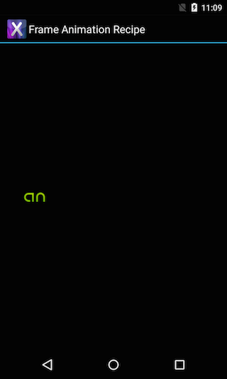
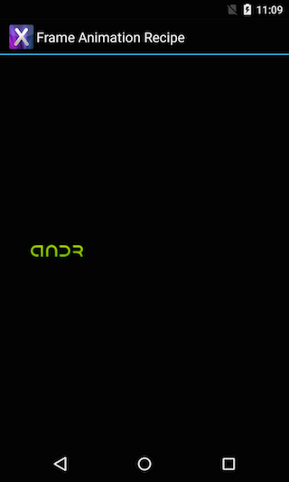
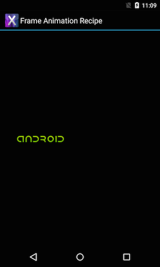

id:{408CDC0C-9F35-C30B-B4EC-DFB37F57A245}  
title:Frame Animation  
brief:This tutorial will show how to create a Frame Animation.  
samplecode:[Frame Animation](/samples/FrameAnimation/)  
sdk:[DrawableAnimation](http://developer.android.com/guide/topics/graphics/drawable-animation.html)  

<a name="Recipe" class="injected"></a>


# Recipe

1. Create a new Xamarin.Android project named
FrameAnimation.

2. Copy the images to be animated into the
Resource/Drawable directory. In the Properties window, each image should have
its build action set to AndroidResource.

3. Create an new resource file Resource/Anim/animate_android.xml to hold the animation list:

```
<?xml version="1.0" encoding="utf-8"?>
<animation-list xmlns:android="http://schemas.android.com/apk/res/android" android:oneshot="false">
  <item android:drawable="@drawable/android_1"
        android:duration="100" />
  <item android:drawable="@drawable/android_2"
        android:duration="100" />
  <item android:drawable="@drawable/android_3"
        android:duration="100" />
  <item android:drawable="@drawable/android_4"
        android:duration="100" />
  <item android:drawable="@drawable/android_5"
        android:duration="100" />
  <item android:drawable="@drawable/android_6"
        android:duration="100" />
  <item android:drawable="@drawable/android_7"
        android:duration="100" />
</animation-list>
```

The animation-list creates a list of images that are on Resources/Drawable
that will be cycled through in the <code>ImageView</code> to cycle through as part of
the animation.

<ol start="4">
  <li>Open the file Resources/Layout/Main.axml and change the layout such that it has a single <code>ImageView</code>:</li>
</ol>

```
<?xml version="1.0" encoding="utf-8"?>
<LinearLayout xmlns:android="http://schemas.android.com/apk/res/android"
              android:layout_width="fill_parent"
              android:layout_height="fill_parent"
              android:orientation="vertical" >
  <ImageView android:id="@+id/animated_android"
             android:layout_width="wrap_content"
             android:layout_height="wrap_content"
             android:src="@anim/animate_android"
  />
</LinearLayout>
```

<ol start="5">
  <li>Open MainActivity.cs, and insert the following code for the <code>OnCreate()</code> method:</li>
</ol>


```
protected override void OnCreate(Bundle bundle){
base.OnCreate(bundle);
  SetContentView(Resource.Layout.Main);
}
```

<ol start="6">
  <li>Now override the method <code>OnWindowFocusChanged()</code> in MainActivity.cs:</li>
</ol>

```
public override void OnWindowFocusChanged(bool hasFocus)
{
    if (hasFocus)
    {
        ImageView imageView = FindViewById<ImageView>(Resource.Id.animated_android);
        AnimationDrawable animation = (AnimationDrawable) imageView.Drawable;
        animation.Start();
    }
}
```

The AnimationDrawable class is the basis for loading drawable resources one
after another to create an animation. The drawable resources will be
loaded one after another, according to the instructions in the resource file `Resource/Anim/animate_android.xml`. Notice that the animation is not started in
OnCreate(), but in OnWindowFocusChanged(). This is because the
AnimationDrawable has not been fully attached to the window. By starting the
animation in OnWindowFocusChanged() the animation will start without any
interaction when Android brings the window into focus.

<ol start="7">
  <li>Run the application. You should see the word Android being animated similar to the following screen shots:</li>
</ol>

 [ ](Images/screen1.png) [ ](Images/screen2.png) [ ](Images/screen3.png)
