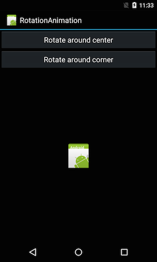
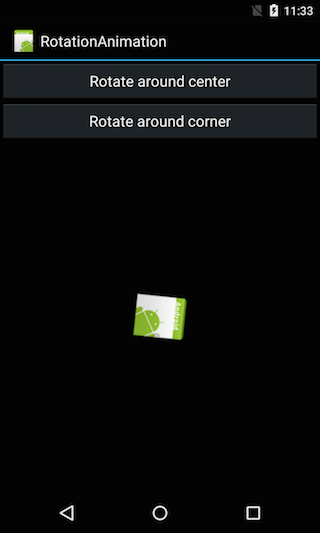
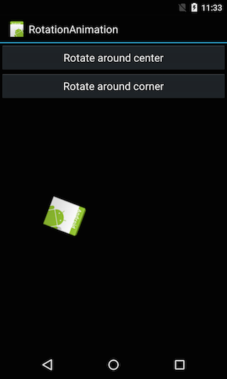

<a name="Recipe" class="injected"></a>


# Recipe

-  Create a new Xamarin.Android project named RotationAnimation.
-  Create the directory Resource/Anim in the project.
-  Create a new resource file Resource/Anim/rotate_centre.xml and modify it to contain the following: 


```
<?xml version="1.0" encoding="utf-8"?>
<set xmlns: android="http: //schemas.android.com/apk/res/android"
    android: interpolator="@android: anim/linear_interpolator">
  <rotate
      android: fromDegrees="0"
      android: toDegrees="360"
      android: pivotX="50%"
      android: pivotY="50%"
      android: duration="2000"
      android: startOffset="0"/>
</set>
```

This declares an animation that will rotate from 0 to 360 degrees. The
`android: pivotX` and `android: pivotY` specify the point on the image to rotate
about.

-  Create a new resource file Resources/Anim/rotate_corner.axml and modify it to contain the following: 


```
<?xml version="1.0" encoding="utf-8"?>
<set xmlns: android="http: //schemas.android.com/apk/res/android"
    android: interpolator="@android: anim/linear_interpolator">
  <rotate
      android: fromDegrees="0"
      android: toDegrees="360"
      android: pivotX="0%"
      android: pivotY="0%"
      android: duration="2000"
      android: startOffset="0"/>
</set>
```

-  Open up Layout/Main.axml, and modify it to the following: 


```
<?xml version="1.0" encoding="utf-8"?>
<LinearLayout xmlns: android="http: //schemas.android.com/apk/res/android"
    android: layout_width="fill_parent"
    android: layout_height="fill_parent"
    android: orientation="vertical" >

  <Button
      android: id="@+id/rotate_center_button"
      android: layout_width="fill_parent"
      android: layout_height="wrap_content"
      android: text="Rotate around center"/>
  <Button
      android: id="@+id/rotate_corner_button"
      android: layout_width="fill_parent"
      android: layout_height="wrap_content"
      android: text="Rotate around corner"/>
  <LinearLayout
      android: layout_width="fill_parent"
      android: layout_height="fill_parent"
      android: orientation="vertical"
      android: gravity="center">
    <ImageView
        android: id="@+id/floating_image"
        android: layout_width="wrap_content"
        android: layout_height="wrap_content"
        android: src="@drawable/icon" />
  </LinearLayout>

</LinearLayout>
```

-  Open MainActivity.cs, and insert the following code for the `OnCreate()` method: 


protected override void OnCreate(Bundle bundle)

```
{
    base.OnCreate(bundle);
    SetContentView(Resource.Layout.Main);

    var image = FindViewById<ImageView>(Resource.Id.floating_image);

    // Set things up so that when this button is clicked the image roates about a corner.
    var rotateAboutCornerButton = FindViewById<Button>(Resource.Id.rotate_corner_button);
    var rotateAboutCornerAnimation = AnimationUtils.LoadAnimation(this, Resource.Animation.rotate_corner);
    rotateAboutCornerButton.Click += (sender, args) => image.StartAnimation(rotateAboutCornerAnimation);

    // Setup things so that when this button is clicked the image rotates about it's center.
    var rotateAboutCenterButton = FindViewById<Button>(Resource.Id.rotate_center_button);
    var rotateAboutCenterAnimation = AnimationUtils.LoadAnimation(this, Resource.Animation.rotate_center);
    rotateAboutCenterButton.Click += (sender, args) => image.StartAnimation(rotateAboutCenterAnimation);
}
```

-  Run the application. You should initially see the following screen: 


 [ ](Images/screen1.png)

-  Click on the “Rotate around center”. The image should rotate about the center: 


 [ ](Images/screen2.png)

-  Click on the “Rotate around corner”. The image should rotate about the upper left hand corner: 


 [ ](Images/screen3.png)

 <a name="Additional_Information" class="injected"></a>


# Additional Information

This recipe demonstrates how to use the view animation system to perform
tween animation on Views. Tween animations perform transformation on a View
object, such as an ImageView or a TextView.