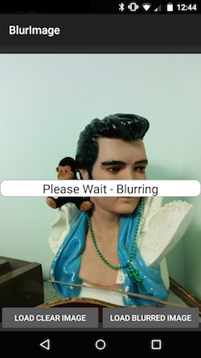
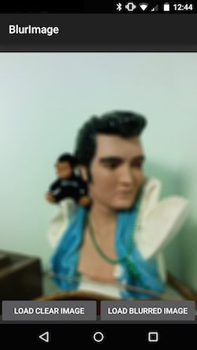

id:{f3bf0d4e-73b1-469e-91ce-9a90438fc73b}  
title:Blur an Image with Managed Code  
subtitle:Apply a Gaussian Blur with Managed Code  
brief:This recipe shows how to apply a Gaussian blur an image using managed code. This is managed code and will work on projects that must support Android 2.2 (API level 8).  
samplecode:[Browse on GitHub](https://github.com/xamarin/recipes/tree/master/android/other_ux/drawing/blur_an_image_with_managed_code)  
article:[Stack Blur: Fast But Goodlooking](http://incubator.quasimondo.com/processing/fast_blur_deluxe.php)  
recipe:[Blur an Image with Renderscript](/recipes/android/other_ux/drawing/blur_an_image_with_renderscript/)  
recipe:[Load Large Bitmaps Efficiently](/recipes/android/resources/general/load_large_bitmaps_efficiently/)  

This recipe demonstrates one way to blur an image using only C# code. This is not as quick as [using RenderScript](http://docs.xamarin.com/recipes/android/other_ux/drawing/blur_an_image_with_renderscript/). The code in this recipe should work on all Android API levels.

The code can be found inside the class `StackBlur`. It has a single method, described in the following interface:

```
interface IBlurImage
{
    Bitmap GetBlurredBitmap(Bitmap original, int radius);
}
```

The `GetBlurredBitmap` method will take a single `Android.Graphics.Bitmap` instance. The greater the value of the `radius` parameter, the more blurry the image will appear.

This code is a compromise between a Gaussian blur and a Box blur. The algorithm works by creating a moving stack of colors while scanning through the image. This "tower" controls the weights of the single pixels within the convolution kernel and gives the pixel in the center the highest weight.

When the user clicks on the <span class="uiitem">Load Blurred Image</span> button the application will load a bitmap, scale it a size that is appropriate for the device, and then apply a Gaussian blur to it. Blurring the image takes a noticeable amount of time (approximately 6 seconds on a Nexus 5), so the work is performed on a background thread. After the image is blurred it is displayed to the user, as demonstrated in the following screenshots:

  

 <a name="Recipe" class="injected"></a>


# Recipe

The event handler for the <span class="uiitem">Load Blurred Image</span> button is shown in the following code snippet:

```
_blurImageButton.Click += async delegate{
    try
    {
        using (Timer timer = new Timer("Blurring the image"))
        {
            _pleaseWaitTextView.Visibility = ViewStates.Visible;
            // The work of scaling and blurring the image is performed by the ImageHelper class
            Bitmap bm = await _imageHelper.GetBlurryResizedImageAsync(PictureName, _imageView.Width, _imageView.Height, BlurRadius);
            _imageView.SetImageBitmap(bm);
        }
    }
    catch (AggregateException aex)
    {
        Toast.MakeText(this, "There was an error blurring the bitmap.", ToastLength.Short).Show();
        _imageView.SetImageBitmap(null);
        Log.Error(TAG, aex.InnerException.ToString());
    }
    finally
    {
        _pleaseWaitTextView.Visibility = ViewStates.Gone;
    }
};
```

The variable `_imageHelper` is a helper class that combines the two tasks of scaling the image for the screen and then blurring the file. These two tasks take a noticeable amount of time so the work is performed asynchronously by the method `GetBlurryResizedImageAsync`:

```
public async Task<Bitmap> GetBlurryResizedImageAsync(string path, int width, int height, int blurRadius)
{
    if (_blurredBitmap != null)
    {
        return _blurredBitmap;
    }

    if (_originalBitmap == null)
    {
        _originalBitmap = await GetResizedBitmapAsync(path, width, height);
    }
    _blurredBitmap = await Task.Run(() => _stackBlur.GetBlurredBitmap(_originalBitmap, blurRadius));
    return _blurredBitmap;
}
```

Scaling the image to a smaller size is [covered by another recipe](http://docs.xamarin.com/recipes/android/resources/general/load_large_bitmaps_efficiently/).

 <a name="Summary" class="injected"></a>


# Summary

This recipe provided some sample code that will apply a blurring effect to a bitmap in Android using only C# code. Although slower than using RenderScript, it will work on Android 2.2 and above.
