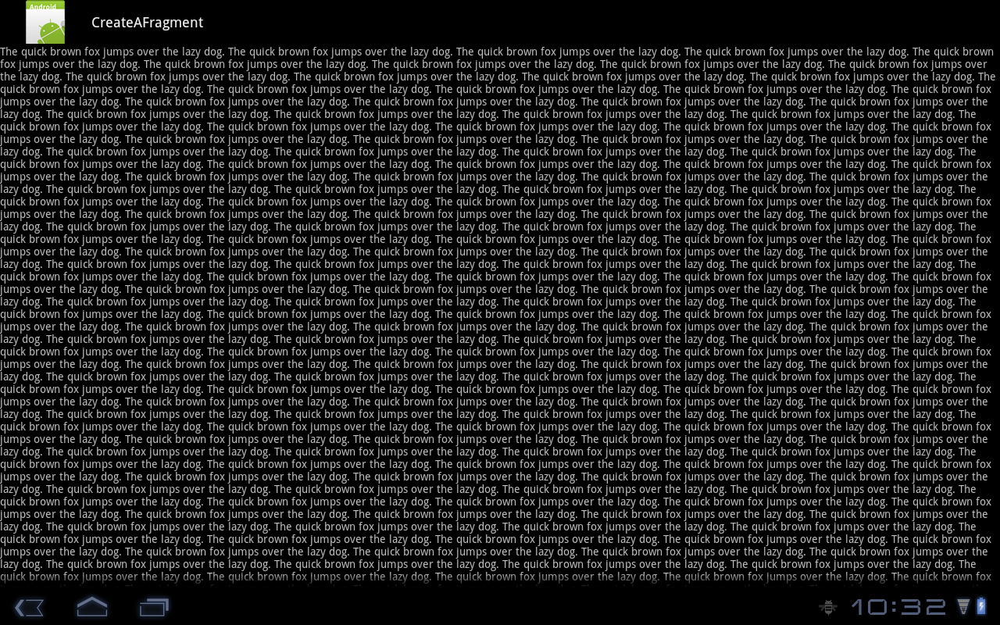

---
id:{776535D4-B422-BC44-9167-73767A22D441}  
title:Create a Fragment  
brief:Fragments are a new UI component originally introduced in Android 3.0 (API level 11) and later and require Mono for Android 4.0 or higher. To use Fragments in older versions of Android requires the Android Support Package and Xamarin.Android 4.2, which is covered in an another HOW-TO. This recipe will show how to create a simple Fragment.  
samplecode:[Browse on GitHub](https://github.com/xamarin/recipes/tree/master/android/other_ux/fragment/create_a_fragment)  
article:[Fragments](/guides/android/platform_features/fragments)  
article:[Fragments Walkthrough](/guides/android/platform_features/fragments/fragments_walkthrough)  
sdk:[Fragments](http://developer.android.com/guide/topics/fundamentals/fragments.html)  
---

<a name="Recipe" class="injected"></a>


# Recipe

Follow these steps to update and query the device profile.

1.  Start a new Xamarin.Android Project.
2.  Double-click the project in Xamarin Studio's solution pad, or open project Properties in Visual Studio.
3.  Select Build &gt; General in the Project Options dialog or Properties navigator.
4.  Ensure that the Target Framework is at least Android 3.1 (Honeycomb).
5.  Select Build &gt; Android Application.
6.  Set the Minimum Android version to API Level 12 (Android 3.1).
7.  Select OK to close the Project Options.
8.  Select File &gt; New &gt; Android &gt; Android Class, and name the class MyFragment, and click New.
9.  Edit the new class you created, inheriting from Android.App.Fragment:


```
public class MyFragment : Fragment
{
}
```

<ol start="10">
  <li>Edit the new class, and override <code>OnCreateView</code> to inflate the layout file that the fragment will use, and to display some text in the layout:</li>
</ol>

```
public override View OnCreateView(LayoutInflater inflater, ViewGroup container, Bundle savedInstanceState)
{
    var textToDisplay = new StringBuilder().Insert(0, "The quick brown fox jumps over the lazy dog. ", 450).ToString();
    var view = inflater.Inflate(Resource.Layout.MyFragment, container, false);
    var textView = view.FindViewById<TextView>(Resource.Id.text_view);
    textView.Text = textToDisplay;

    return view;
}
```

Now it is time to display the fragment inside of an Activity. There are two
ways to do so: programmatically or via the layout file.

-   **Adding the fragment programmatically -** go to step #11 below.
-   **Adding the fragment via a layout -** proceed directly to step #13 below. Skip steps #11 and #12.


<ol start="11">
  <li>To add a fragment programmatically, first edit the layout file Main.axml, and add a FrameLayout to host MyFragment:</li>
</ol>

```
<?xml version="1.0" encoding="utf-8"?>
<FrameLayout xmlns:android="http://schemas.android.com/apk/res/android"
    android:id="@+id/fragment_container"
    android:orientation="horizontal"
    android:layout_width="match_parent"
    android:layout_height="match_parent">
</FrameLayout>
```

<ol start="12">
  <li>Edit the file MainActivity.cs, and modify <code>OnCreate</code> to instantiate a new instance of MyFragment and then add that instance to the FrameLayout that was declared above in step # inside of a FragmentTransaction:</li>
</ol>


```
protected override void OnCreate (Bundle bundle)
{
    base.OnCreate (bundle);
    SetContentView (Resource.Layout.Main);

    var newFragment = new MyFragment ();
    var ft = FragmentManager.BeginTransaction ();
    ft.Add (Resource.Id.fragment_container, newFragment);
    ft.Commit ();
}
```

<ol start="13">
  <li>Proceed to step #15 below. Skip step #14 below.</li>
  <li>To add a fragment via a layout, modify Main.axml to reference the fragment directly. It is very important to notice that the package name of MyFragment is lower-case. If it is not lower-case, then an <code>Android.View.InflateException</code> will be thrown.</li>
</ol>

```
<?xml version="1.0" encoding="utf-8"?>
<LinearLayout xmlns:android="http://schemas.android.com/apk/res/android"
    android:id="@+id/fragment_container"
    android:orientation="horizontal"
    android:layout_width="fill_parent"
    android:layout_height="fill_parent">
    <fragment class="createafragment.MyFragment"
          android:id="@+id/my_fragment"
          android:layout_width="match_parent"
          android:layout_height="match_parent" />
</LinearLayout>
```

<ol start="15">
  <li>Run the application. It should now look something like:</li>
</ol>

 [ ](Images/CreateAFragment.png)

 <a name="Additional_Information" class="injected"></a>


# Additional Information

Fragments cannot exist independently; they must be hosted inside another
ViewGroup such as an Activity. Fragments are available on API level 11 (Android
3.0 / Honeycomb) or higher (Android 4.0). It is possible to use fragments on
older version of Android by using the Android Support Package.

It is very important to remember that when adding a fragment to a layout
file, that Android expects the package name to be lower-case. If the package
name is upper-case then an Android.Views.InflateException will be thrown.