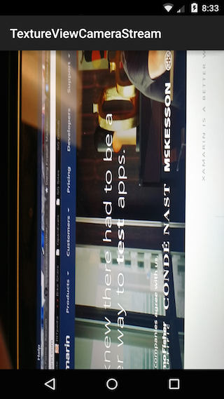

id:{43B5B3F8-8258-1A69-38E1-C9FCE7681990}  
title:Display a stream from the camera  
brief:This recipe shows how to display a stream from the camera using a TextureView.  
samplecode:[Browse on GitHub](https://github.com/xamarin/recipes/tree/master/android/other_ux/textureview/display_a_stream_from_the_camera)  
article:[Introduction to Ice Cream Sandwich](/guides/android/platform_features/introduction_to_ice_cream_sandwich)  
sdk:[Android 4.0 Graphics and Animations](http://android-developers.blogspot.com/2011/11/android-40-graphics-and-animations.html)  

<a name="Recipe" class="injected"></a>


# Recipe
 [ ](Images/textureview.png)

Follow these steps to display a camera stream with a TextureView.

1.  Double-click the project in Xamarin Studio solution pad or navigate to the project Properties in Visual Studio.
2.  Select Build &gt; Android Application.
3.  Click the Add Android Manifest button.
4.  Under Required permissions set the `CAMERA` permission.
5.  Set the Minimum Android version to API Level 14 (Android 4.0).
6.  Select Build &gt; General and set the Target framework to Android 4.0 (Ice Cream Sandwich).
7.  Select OK to close the Project Options.
8.  Under the Properties folder, open the AndroidManifest.xml and add the `android:hardwareAccelerated=”true”` attribute to the application element as shown below.


```
<application android:label="TextureViewCameraStream"
      android:hardwareAccelerated="true"/>
```
<ol start="9">
  <li>Add <code>TextureView.ISurfaceTextureListener</code> to an <code>Activity</code> subclass.</li>
</ol>

```
public class Activity1 : Activity, TextureView.ISurfaceTextureListener
```

<ol start="10">
  <li>Declare class variable for the <code>Camera</code> and <code>TextureView</code>.</li>
</ol>

```
Camera _camera;
TextureView _textureView;
```

<ol start="11">
  <li>Create a <code>TextureView</code>, set its <code>SurfaceTextureListener</code> to the <code>Activity</code> instance, and set the <code>TextureView</code> as the content view. </li>
</ol>

```
protected override void OnCreate (Bundle bundle)
{
       base.OnCreate (bundle);

       _textureView = new TextureView (this);
       _textureView.SurfaceTextureListener = this;

       SetContentView (_textureView);
}
```

<ol start="12">
  <li>Implement <code>ISurfaceTextureListener.OnSurfaceTextureAvailable</code> to set the camera’s preview texture to the surface texture.</li>
</ol>

```
public void OnSurfaceTextureAvailable (
       Android.Graphics.SurfaceTexture surface, int w, int h)
{
       _camera = Camera.Open ();

       _textureView.LayoutParameters =
              new FrameLayout.LayoutParams (w, h);

       try {
              _camera.SetPreviewTexture (surface);
              _camera.StartPreview ();

       }  catch (Java.IO.IOException ex) {
              Console.WriteLine (ex.Message);
       }
}
```

<ol start="13">
  <li>Implement <code>ISurfaceTextureListener.OnSurfaceTextureDestroyed</code> to release the camera.</li>
</ol>

```
public bool OnSurfaceTextureDestroyed (
       Android.Graphics.SurfaceTexture surface)
{
       _camera.StopPreview ();
       _camera.Release ();

       return true;
}
```

 <a name="Additional_Information" class="injected"></a>


# Additional Information

`TextureView` requires hardware acceleration so it will not work in the
emulator. Also, it is only available in Ice Cream Sandwich or later.
