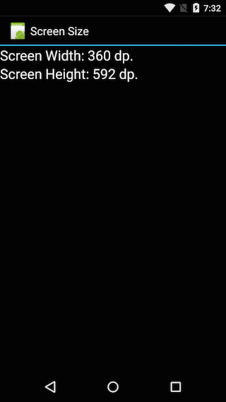
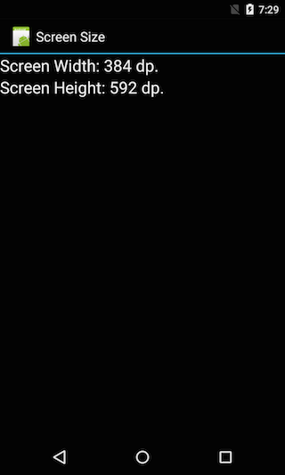

id:{AC297FB9-C012-4D0C-744C-7E9D1F6FDF83}  
title:Detect Screen Size  
samplecode:[Browse on GitHub](https://github.com/xamarin/recipes/tree/master/android/resources/device_specific/detect_screen_size)  
article:[Creating Resources for Varying Screens](/guides/android/application_fundamentals/resources_in_android/part_4_-_creating_resources_for_varying_screens)  
sdk:[Supporting Multiple Screens](http://developer.android.com/guide/practices/screens_support.html)  
sdk:[Display Metrics<](http://developer.android.com/reference/android/util/DisplayMetrics.html)  

This recipe will show how to detect the screen size of a device, in
density-independent pixels.

 [ ](Images/Nexus1.png)

 <a name="Recipe" class="injected"></a>


# Recipe

1.  Create a new Xamarin.Android application named  `ScreenSize` .
2.  Edit  `Main.axml` so that it contains two TextViews:


```
<?xml version="1.0" encoding="utf-8"?>
<LinearLayout xmlns:android="http://schemas.android.com/apk/res/android"
    android:orientation="vertical"
    android:layout_width="fill_parent"
    android:layout_height="fill_parent">
    <TextView
        android:text="Screen Width:"
        android:textAppearance="?android:attr/textAppearanceLarge"
        android:layout_width="fill_parent"
        android:layout_height="wrap_content"
        android:id="@+id/screenWidthDp" />
    <TextView
        android:text="Screen Height:"
        android:textAppearance="?android:attr/textAppearanceLarge"
        android:layout_width="fill_parent"
        android:layout_height="wrap_content"
        android:id="@+id/screenHeightDp" />
</LinearLayout>
```

<ol start="3">
  <li>Edit `Activity1.cs`, change the code in `OnCreate` to the following:</li>
</ol>

```
protected override void OnCreate(Bundle bundle)
{
    base.OnCreate(bundle);
    SetContentView(Resource.Layout.Main);

    var metrics = Resources.DisplayMetrics;
    var widthInDp = ConvertPixelsToDp(metrics.WidthPixels);
    var heightInDp = ConvertPixelsToDp(metrics.HeightPixels);

    FindViewById<TextView>(Resource.Id.screenWidthDp).Text = "Screen Width: " + widthInDp + " dp.";
    FindViewById<TextView>(Resource.Id.screenHeightDp).Text = "Screen Height: " + heightInDp + " dp.";
}
```

<ol start="4">
  <li>After `OnCreate`, add the following helper to convert the pixels into density-independent pixels:</li>
</ol>

```
private int ConvertPixelsToDp(float pixelValue)
{
    var dp = (int) ((pixelValue)/Resources.DisplayMetrics.Density);
    return dp;
}
```

<ol start="5">
  <li>Run the application. Depending on the device, it will display the screen height and width. The following screen shot is from a Nexus 4:</li>
</ol>

 [ ](Images/GalaxyNexus.png)

 <a name="Additional_Information" class="injected"></a>


# Additional Information

The structure [DisplayMetrics](http://developer.android.com/reference/android/util/DisplayMetrics.html) contains general information about a
device’s display. `DisplayMetrics.Width` and `DisplayMetrics.Height` will return the width and height of a screen
in pixels. The appearance of a user interface is influenced by not only by the
resolution in pixels, but the physical screen size and the density of the
pixels. To help deal with this complexity, Android has a virtual unit of
measurement called *density-independent pixels* (dp). Using
density-independent pixels allows an Android application to render elements of
the UI so that they appear the same on all screens.

 [DisplayMetrics.Density](http://developer.android.com/reference/android/util/DisplayMetrics.html#density) is a scaling factor that can be used
to convert from pixels to density-independent pixels.
