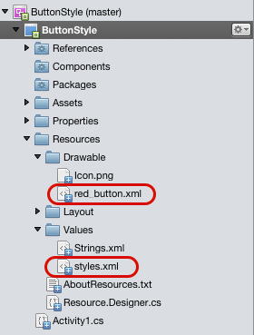

<a name="Recipe" class="injected"></a>


# Recipe

1. Create a new Xamarin.Android application named
StyleAButton.

2. Edit MainActivity.cs: 

```
[Activity(Label = "ButtonStyle", MainLauncher = true, Icon = "@drawable/icon")]
public class Activity1 :  Activity
{
    protected override void OnCreate(Bundle bundle)
    {
        base.OnCreate(bundle);
        SetContentView(Resource.Layout.Main);
    }
}
```

<ol start="3">
  <li>Alter Main.axml: </li>
</ol>

```
<?xml version="1.0" encoding="utf-8"?>
<LinearLayout xmlns: android="http: //schemas.android.com/apk/res/android"
    android: orientation="vertical"
    android: layout_width="fill_parent"
    android: layout_height="fill_parent">
    <Button
        android: text="Unstyled Button"
        android: layout_width="fill_parent"
        android: layout_height="wrap_content"
        android: id="@+id/button2" />
    <Button
        android: background="@drawable/red_button"
        android: id="@+id/button1"
        android: layout_width="fill_parent"
        android: layout_height="wrap_content"
        android: text="Styled Button"
        style="@style/button_text" />
</LinearLayout>
```

<ol start="4">
  <li>Add a new resource to the Drawable folder as an XML file called red_button.xml: </li>
</ol>

```
<?xml version="1.0" encoding="utf-8" ?>
<selector xmlns: android="http: //schemas.android.com/apk/res/android">
  <item android: state_pressed="true" >
    <shape>
      <solid
          android: color="#ef4444" />
      <stroke
          android: width="1dp"
          android: color="#992f2f" />
      <corners
          android: radius="6dp" />
      <padding
          android: left="10dp"
          android: top="10dp"
          android: right="10dp"
          android: bottom="10dp" />
    </shape>
  </item>
  <item>
    <shape>
      <gradient
          android: startColor="#ef4444"
          android: endColor="#992f2f"
          android: angle="270" />
      <stroke
          android: width="1dp"
          android: color="#992f2f" />
      <corners
          android: radius="6dp" />
      <padding
          android: left="10dp"
          android: top="10dp"
          android: right="10dp"
          android: bottom="10dp" />
    </shape>
  </item>
</selector>
```

<ol start="5">
  <li>Create a new resource in the Values directory called styles.xml: </li>
</ol>

```
<?xml version="1.0" encoding="utf-8" ?>
<resources>
  <style name="button_text" >
    <item name="android: layout_width" >fill_parent</item>
    <item name="android: layout_height" >wrap_content</item>
    <item name="android: textColor" >#ffffff</item>
    <item name="android: gravity" >center</item>
    <item name="android: layout_margin" >3dp</item>
    <item name="android: textSize" >30dp</item>
    <item name="android: textStyle" >bold</item>
    <item name="android: shadowColor" >#000000</item>
    <item name="android: shadowDx" >1</item>
    <item name="android: shadowDy" >1</item>
    <item name="android: shadowRadius" >2</item>
  </style>
</resources>
```

<ol start="6">
  <li>At this point the project should have two new XML files created, one in the Drawable folder, and another in the Values folder: </li>
</ol>

 

<ol start="7">
  <li>Run the application on a device, and two buttons should appear. One appears as the default system button, while the other is a red button with rounded corners and large white text: </li>
</ol>

 [ ](Images/style_buttons.png)

When the styled button is pressed, it will change color slightly from a
darker red to a bright red: 

 [ ](Images/style_buttons.png)

 <a name="Additional_Information" class="injected"></a>


# Additional Information

This example created a style called `button_text` to specify the look and format
of the button. A style is a collection of properties that specify the look and
format for a View or window. A style can specify properties such as height,
padding, font color, font size, background color, and much more. A style is
defined in an XML resource that is separate from the XML that specifies the
layout.

In order to change the appearance of the button it was necessary to create a
custom shape drawable, and then assign that to the background attribute of the
Button.