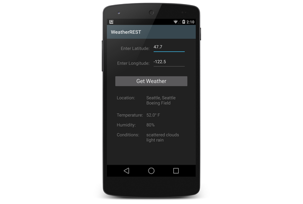
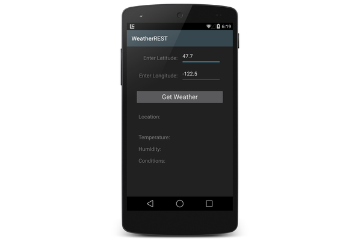

# Recipe

In this recipe, we'll create an app that reports weather information,
such as temperature, humidity, and current conditions. This app issues 
a request to a REST service to get weather data, parses the response, 
and displays the results on the screen. The user keys in global 
latitude and longitude coordinates before pressing a **Get Weather** 
button to view information about the weather at that location. 

[ ](Images/1-example-screenshot.png)

Our example app will send latitude and longitude information to 
*geonames.org* in an HTTP request. The resulting weather information is 
returned in JSON format. When the HTTP response is received, our app 
will parse the results and display a subset of the weather information 
in `TextBox` fields in the lower half of the screen (as shown in the 
above screenshot). A more advanced version of this app could use GPS to 
determine the current latitude and longitude of the device, but that is 
beyond the scope of this article. 

Follow these steps to create an app that issues a REST request to an 
HTTP server, parses the results, and displays the results on the 
screen. 

-   First, we'll create a new Xamarin.Android app. The example 
    screenshots in this article were taken using the Android L 
    Developer Preview, but an earlier Android version such as KitKat 
    (API level 19) can be used. If you are new to Android development 
    with Xamarin, see 
    [Hello, Android](/guides/android/getting_started/hello,android/) 
    to learn how to create Xamarin.Android applications. 

-   Next, we'll use the Xamarin.Android Designer to create a UI (see 
    [Designer Overview](/guides/android/user_interface/designer_overview/) if 
    you are not familiar with the Android interface designer). Let's 
    start by replacing the contents of **Resources/layout/Main.axml** 
    with the XML example below. This code begins the GUI layout with 
    two `EditText` elements. These elements allow the user to enter 
    longitude and latitude values. Let's use the id's `latText` and 
    `longText` for these `EditBox` elements: 

```xml
<?xml version="1.0" encoding="utf-8"?>
<LinearLayout xmlns:android="http://schemas.android.com/apk/res/android"
    android:orientation="vertical"
    android:layout_width="fill_parent"
    android:layout_height="fill_parent">
    <LinearLayout
        android:orientation="horizontal"
        android:layout_marginTop="10dp"
        android:layout_width="match_parent"
        android:layout_height="wrap_content"
        android:gravity="center_horizontal"
        android:id="@+id/latSection">
        <TextView
            android:text="Enter Latitude:"
            android:textAppearance="?android:attr/textAppearanceMedium"
            android:layout_width="140dp"
            android:layout_height="40dp"
            android:gravity="right"
            android:id="@+id/latLabel" />
        <EditText
            android:text="47.7"
            android:layout_width="150dp"
            android:layout_height="50dp"
            android:id="@+id/latText"
            android:textAppearance="?android:attr/textAppearanceMedium"
            android:layout_marginLeft="5dp" />
    </LinearLayout>
    <LinearLayout
        android:orientation="horizontal"
        android:layout_marginTop="10dp"
        android:layout_width="match_parent"
        android:layout_height="wrap_content"
        android:gravity="center_horizontal"
        android:id="@+id/longSection">
        <TextView
            android:text="Enter Longitude:"
            android:textAppearance="?android:attr/textAppearanceMedium"
            android:layout_width="140dp"
            android:layout_height="40dp"
            android:gravity="right"
            android:id="@+id/longLabel" />
        <EditText
            android:text="-122.5"
            android:layout_width="150dp"
            android:layout_height="50dp"
            android:id="@+id/longText"
            android:textAppearance="?android:attr/textAppearanceMedium"
            android:layout_marginLeft="5dp" />
    </LinearLayout>
```

-   Next, let's add a button that the user can press to get the 
    weather. Let's give this button the id `getWeatherButton`. Append 
    the following XML to layout in **Resources/layout/Main.axml** 
    (started above): 

```xml
    <LinearLayout
        android:orientation="vertical"
        android:layout_marginTop="28dp"
        android:layout_width="match_parent"
        android:layout_height="wrap_content"
        android:gravity="center_horizontal"
        android:id="@+id/getSection">
        <Button
            android:id="@+id/getWeatherButton"
            android:layout_width="300dp"
            android:layout_height="wrap_content"
            android:gravity="center_horizontal"
            android:textAppearance="?android:attr/textAppearanceLarge"
            android:text="Get Weather" />
    </LinearLayout>
```

-   Let's add four `TextView` elements for reporting location name, 
    temperature, humidity, and current conditions; let's assign 
    the id's `locationText`, `tempText`, `humidText`, and `condText`, 
    respectively. Append the following XML to 
    **Resources/layout/Main.axml**: 

```xml
    <LinearLayout
        android:orientation="horizontal"
        android:layout_marginTop="30dp"
        android:layout_marginLeft="40dp"
        android:layout_marginRight="40dp"
        android:layout_width="match_parent"
        android:layout_height="wrap_content"
        android:id="@+id/locSection">
        <TextView
            android:text="Location:"
            android:textAppearance="?android:attr/textAppearanceMedium"
            android:layout_width="120dp"
            android:layout_height="30dp"
            android:gravity="left"
            android:id="@+id/locLabel" />
        <TextView
            android:text=""
            android:textAppearance="?android:attr/textAppearanceMedium"
            android:layout_width="wrap_content"
            android:layout_height="60dp"
            android:gravity="left"
            android:id="@+id/locationText" />
    </LinearLayout>
    <LinearLayout
        android:orientation="horizontal"
        android:layout_marginTop="10dp"
        android:layout_marginLeft="40dp"
        android:layout_marginRight="40dp"
        android:layout_width="match_parent"
        android:layout_height="wrap_content"
        android:id="@+id/tempSection">
        <TextView
            android:text="Temperature:"
            android:textAppearance="?android:attr/textAppearanceMedium"
            android:layout_width="120dp"
            android:layout_height="30dp"
            android:gravity="left"
            android:id="@+id/tempLabel" />
        <TextView
            android:text=""
            android:textAppearance="?android:attr/textAppearanceMedium"
            android:layout_width="wrap_content"
            android:layout_height="30dp"
            android:gravity="left"
            android:id="@+id/tempText" />
    </LinearLayout>
    <LinearLayout
        android:orientation="horizontal"
        android:layout_marginTop="10dp"
        android:layout_marginLeft="40dp"
        android:layout_marginRight="40dp"
        android:layout_width="match_parent"
        android:layout_height="wrap_content"
        android:id="@+id/humidSection">
        <TextView
            android:text="Humidity:"
            android:textAppearance="?android:attr/textAppearanceMedium"
            android:layout_width="120dp"
            android:layout_height="30dp"
            android:gravity="left"
            android:id="@+id/humidLabel" />
        <TextView
            android:text=""
            android:textAppearance="?android:attr/textAppearanceMedium"
            android:layout_width="wrap_content"
            android:layout_height="30dp"
            android:gravity="left"
            android:id="@+id/humidText" />
    </LinearLayout>
    <LinearLayout
        android:orientation="horizontal"
        android:layout_marginTop="10dp"
        android:layout_marginLeft="40dp"
        android:layout_marginRight="40dp"
        android:layout_width="match_parent"
        android:layout_height="wrap_content"
        android:id="@+id/condSection">
        <TextView
            android:text="Conditions:"
            android:textAppearance="?android:attr/textAppearanceMedium"
            android:layout_width="120dp"
            android:layout_height="30dp"
            android:gravity="left"
            android:id="@+id/condLabel" />
        <TextView
            android:text=""
            android:textAppearance="?android:attr/textAppearanceMedium"
            android:layout_width="wrap_content"
            android:layout_height="60dp"
            android:gravity="left"
            android:id="@+id/condText" />
    </LinearLayout>
</LinearLayout>
```

-   Let's save our layout and exit the designer. Here is an example of how
    the UI looks after we add the above XML code sections: 

    [ ](Images/2-display-elements.png)


-   In our `MainActivity` subclass, let's add the following code to the 
    `OnCreate` method. This code gets the user-entered latitude and 
    longitude values from the UI, packages these values in an HTTP 
    request, fetches the data, parses the result, and updates the
    screen. We'll create the `FetchWeatherAsync` and `ParseAndDisplay` 
    methods in subsequent steps. 

```
// Set our view from the "main" layout resource
SetContentView(Resource.Layout.Main);

// Get the latitude/longitude EditBox and button resources:
EditText latitude = FindViewById<EditText>(Resource.Id.latText);
EditText longitude = FindViewById<EditText>(Resource.Id.longText);
Button button = FindViewById<Button>(Resource.Id.getWeatherButton);

// When the user clicks the button ...
button.Click += async (sender, e) => {

    // Get the latitude and longitude entered by the user and create a query.
    string url = "http://api.geonames.org/findNearByWeatherJSON?lat=" +
                 latitude.Text +
                 "&lng=" +
                 longitude.Text +
                 "&username=demo";

    // Fetch the weather information asynchronously, 
    // parse the results, then update the screen:
    JsonValue json = await FetchWeatherAsync (url);
    // ParseAndDisplay (json);
};
```

-   Before we send the HTTP request to the server, we must be prepared 
    to wait for the HTTP response, which &ndash; depending on the 
    latency of the network connection &ndash; could come back quickly 
    or could take many seconds to return. During this wait, we don't 
    want the application UI to freeze up while the UI thread waits for 
    a response. Therefore, the HTTP request must be an *asynchronous* 
    HTTP request. We use `async`/`await` to keep the UI thread 
    responsive to user input while the app waits for the HTTP request 
    and response to complete. For more about asynchronous programming 
    techniques, see 
    [Writing Reponsive Applications](/guides/android/advanced_topics/writing_responsive_applications). 

    Let's add the following method after the `OnCreate` method. This 
    method issues the HTTP request, waits for a response, and returns
    the response to the caller:

```
// Gets weather data from the passed URL.
private async Task<JsonValue> FetchWeatherAsync (string url)
{
    // Create an HTTP web request using the URL:
    HttpWebRequest request = (HttpWebRequest)HttpWebRequest.Create (new Uri (url));
    request.ContentType = "application/json";
    request.Method = "GET";

    // Send the request to the server and wait for the response:
    using (WebResponse response = await request.GetResponseAsync ())
    {
        // Get a stream representation of the HTTP web response:
        using (Stream stream = response.GetResponseStream ())
        {
            // Use this stream to build a JSON document object:
            JsonValue jsonDoc = await Task.Run (() => JsonObject.Load (stream));
            Console.Out.WriteLine("Response: {0}", jsonDoc.ToString ());

            // Return the JSON document:
            return jsonDoc;
        }
    }
}
```

-   The above example converts the HTTP response stream into a 
    `JsonValue` object &mdash; this makes it easier for us to extract the 
    weather information that we will need in later steps. Because we 
    will be using `System.Json` to parse the response, we must add a 
    reference to `System.Json` to our project: 

    -   In Xamarin Studio, right-click the project's **References** 
        node, select **Edit References&hellip;**, click the **All** tab, 
        and enter **System.Json** into the search field. Next, select 
        the **System.Json** assembly when it appears and then click **OK**. 

    -   In Visual Studio, right-click the project's **References** node, 
        select **Add Reference&hellip;**, and enter **System.Json** into 
        the search field. Next, select the **System.Json** assembly when 
        it appears and click **OK**. 

    Note that, for clarity, this example omits exception handlers. 
    Parsing operations can throw exceptions (if, for example, the 
    expected field name is not found during a name/value lookup). Also, 
    network connection errors can generate exceptions. In a production 
    app, these code paths should be wrapped with exception handlers to 
    handle real-life error conditions. 

-   Next, we'll build and run our app, testing it to see if we can get 
    a response to our HTTP request. When the app launches, we'll enter 
    latitude and longitude information into its UI (or use the default 
    coordinates) and press the **Get Weather** button. If the HTTP 
    request and response succeeds, we should get a JSON-formatted HTTP 
    response that resembles the following example (the JSON response 
    string should be visible in the IDE debug output): 

```
{
    "weatherObservation": {
        "ICAO": "KBFI",
        "clouds": "broken clouds",
        "cloudsCode": "BKN",
        "countryCode": "US",
        "datetime": "2014-12-05 22:53:00",
        "dewPoint": "8.3",
        "elevation": 4,
        "humidity": 79,
        "lat": 47.55,
        "lng": -122.31666666666666,
        "observation": "KBFI 052253Z 32003KT 10SM BKN070 BKN090 12/08 A2989 RMK AO2 SLP122 T01170083",
        "seaLevelPressure": 1012.2,
        "stationName": "Seattle, Seattle Boeing Field",
        "temperature": "11.7",
        "weatherCondition": "n/a",
        "windDirection": 320,
        "windSpeed": "03"
    }
}
```

-   Now that we have successfully sent an HTTP response that elicits a 
    valid response, we'll parse the `JsonValue` object to extract the 
    weather information that we want to display. In the example JSON 
    response shown above, we want to extract the `stationName`, 
    `temperature`, `humidity`, `clouds`, and `weatherCondition` 
    name/value pairs, using this information to fill out the bottom 
    portion of the weather app display. Let's add the following method 
    after the `FetchWeatherAsync` method: 

```
// Parse the weather data, then write temperature, humidity, 
// conditions, and location to the screen.
private void ParseAndDisplay (JsonValue json)
{
    // Get the weather reporting fields from the layout resource:
    TextView location = FindViewById<TextView>(Resource.Id.locationText);
    TextView temperature = FindViewById<TextView>(Resource.Id.tempText);
    TextView humidity = FindViewById<TextView>(Resource.Id.humidText);
    TextView conditions = FindViewById<TextView>(Resource.Id.condText);

    // Extract the array of name/value results for the field name "weatherObservation". 
    JsonValue weatherResults = json["weatherObservation"];

    // Extract the "stationName" (location string) and write it to the location TextBox:
    location.Text = weatherResults["stationName"];

    // The temperature is expressed in Celsius:
    double temp = weatherResults["temperature"];
    // Convert it to Fahrenheit:
    temp = ((9.0 / 5.0) * temp) + 32;
    // Write the temperature (one decimal place) to the temperature TextBox:
    temperature.Text = String.Format("{0:F1}", temp) + "° F";

    // Get the percent humidity and write it to the humidity TextBox:
    double humidPercent = weatherResults["humidity"];
    humidity.Text = humidPercent.ToString() + "%";

    // Get the "clouds" and "weatherConditions" strings and 
    // combine them. Ignore strings that are reported as "n/a":
    string cloudy = weatherResults["clouds"];
    if (cloudy.Equals ("n/a"))
        cloudy = "";
    string cond = weatherResults["weatherCondition"];
    if (cond.Equals ("n/a"))
        cond = "";

    // Write the result to the conditions TextBox:
    conditions.Text = cloudy + " " + cond;
}
``` 

-   In the `OnCreate` method, let's uncomment the call to 
    `ParseAndDisplay` so that it will run. Next, let's build and run 
    our app again, testing it to see if the results are successfully 
    parsed and written to the screen. If everything works as expected, 
    we should see a result that is similar to the first screenshot, 
    above. 

    Note that this sample uses a *geonames.org* demo account, which 
    supports a limited number of accesses. If an exception is generated 
    or the display does not report weather information, check your IDE 
    output window to view the HTTP response. If the response contains a 
    "daily limit has been exceeded" message, you will have to try the 
    test again later. 


# Additional Information

The `HttpWebRequest` class allows apps to interact directly with 
servers using HTTP. The `System.Json` class can be used to parse JSON 
results from an HTTP request. Because HTTP interaction is handled 
asynchronously via `async`/`await`, the app is responsive to user
input during network operations. 

For more information about integrating with web services, 
[Introduction to Web Services](/guides/cross-platform/application_fundamentals/web_services/) 
explains how to integrate REST, WCF, and SOAP web service technologies 
with Xamarin mobile applications. 