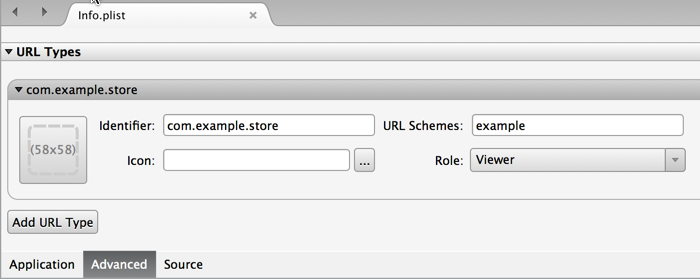

---
id:{30EFAE6F-8AF4-4D5D-9F06-328D76423581}  
title:App Links for iOS  
subtitle:How to Link to other apps and Handle Incoming links using App Links  
dateupdated:2016-06-08
brief:This recipe will show you how to link to other apps using App Links, as well as register your app to receive and parse incoming App Links.  
samplecode:[Browse on GitHub](https://github.com/xamarin/recipes/tree/master/cross-platform/app-links/app-links-ios)  
article:[Creating Connected App Experiences with App Links](http://blog.xamarin.com/creating-connected-app-experiences-with-app-links-and-rivets-with-xamarin/)  
article:[Rivets Xamarin Component](http://components.xamarin.com/view/rivets)  
article:[Official App Links Documentation](http://applinks.org/documentation/)  
---

<a name="Overview" class="injected"></a>


# Overview

App Links is an open standard for deep-linking between mobile apps.

There are two main parts to implementing App Links in your apps

1.  **Linking to other apps** - Instead of opening a web link in a browser directly, you should let the App Links navigation take care of how to open a link
1.  **Handling incoming links from other apps** - You can advertise on web page links App Link metadata which tells other apps how to deep link to the same content in your app.


 <a name="Linking to other Apps" class="injected"></a>


# Linking to other Apps

-  Install the  **Rivets** component from the Component Store.
-  Find any instances where you navigate to a URL in your app (either by  `UIApplication.OpenUrl` or by loading the page into a custom web view) and replace them with this:


```
Rivets.AppLinks.Navigator.Navigate(&quot;http://any.old.url&quot;)
```

-  Your app will now attempt to Navigate to another installed app for the URL using App Links, or will fall back to using  `UIApplication.OpenUrl` if no App Link meta data is found, or no apps for the metadata are installed.


 <a name="Handling Incoming Links" class="injected"></a>


# Handling Incoming Links

-  Install the  **Rivets** component from the Component Store if you haven&#39;t already done so.


-  <ide name="xs">Open your app&#39;s  `Info.plist` file, and under the  **Advanced** tab, in the  **URL Types** section, add a new URL Type like:<br/> </ide><ide name="vs">Manually edit your <code>Info.plist</code> file and add the following section:<br/><pre><code>
&lt;key&gt;CFBundleURLTypes&lt;/key&gt;
	&lt;array&gt;
		&lt;dict&gt;
			&lt;key&gt;CFBundleURLName&lt;/key&gt;
			&lt;string&gt;com.example.store&lt;/string&gt;
			&lt;key&gt;CFBundleURLTypes&lt;/key&gt;
			&lt;string&gt;Viewer&lt;/string&gt;
			&lt;key&gt;CFBundleURLSchemes&lt;/key&gt;
			&lt;array&gt;
				&lt;string&gt;example&lt;/string&gt;
			&lt;/array&gt;
		&lt;/dict&gt;
	&lt;/array&gt;
</code></pre></ide>

-  In your  `AppDelegate` , setup your app to have a Navigation controller which is your window&#39;s root view controller, like this:
  
```
UINavigationController navController;

public override bool FinishedLaunching (UIApplication app, NSDictionary options)
{
    window = new UIWindow (UIScreen.MainScreen.Bounds);

    navController = new UINavigationController ();
    window.RootViewController = navController;

    window.MakeKeyAndVisible ();
    return true;
}
```

-  Create a view controller to display your product:


```
public partial class ProductViewController : UIViewController
{
    public ProductViewController (string productId) : base ()
    {
        ProductId = productId;
    }

    public string ProductId { get; set; }

    public override void ViewDidLoad()
    {
        var label = new UILabel(new RectangleF(10, 10, 100, 30));
        label.Text = ProductId ?? &quot;No Product ID Found&quot;;

        View.AddSubview(label);
    }
}
```

-  In your  `AppDelegate` add the following code:


```
public override bool OpenUrl (UIApplication app, NSUrl url, string sourceApp, NSObject annotation)
{
    var rurl = new Rivets.AppLinkUrl (url.ToString ());

    var id = string.Empty;

    if (rurl.InputQueryParameters.ContainsKey(&quot;id&quot;))
        id = rurl.InputQueryParameters [&quot;id&quot;];

    if (rurl.InputUrl.Host.Equals (&quot;products&quot;) &amp;&amp; !string.IsNullOrEmpty (id)) {
        var c = new ProductViewController (id);
        navController.PushViewController (c, true);
        return true;
    } else {
        navController.PopToRootViewController (true);
        return true;
    }
}
```

-  When your app is opened with the url  `example://products?id=12345` the product view controller will be displayed and you should see the id  `12345` from the query string displayed.


-  Create an HTML page with the following HTML:


```
<html>
 <head>
  <title>Product 12345</title>
  <meta property=&quot;al:ios:url&quot; content=&quot;example://products?id=12345&quot; />
 </head>
 <body>
  <h1>Product 12345</h1>
  <p>This could be a page about Product 12345</p>
 </body>
</html>
```

-  Publish this page somewhere on the internet, or at a location your iOS app can reach.


-  Test navigating using App Links from your iOS app by calling this method somewhere:


```
Rivets.AppLinks.Navigator.Navigate(&quot;http://location/of/your/html/file.html&quot;);
```

 <a name="Summary" class="injected"></a>


# Summary

This recipe will show you how to link to other apps using App Links, as well as register your app to receive and parse incoming App Links.