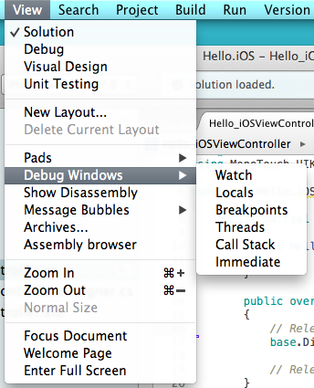
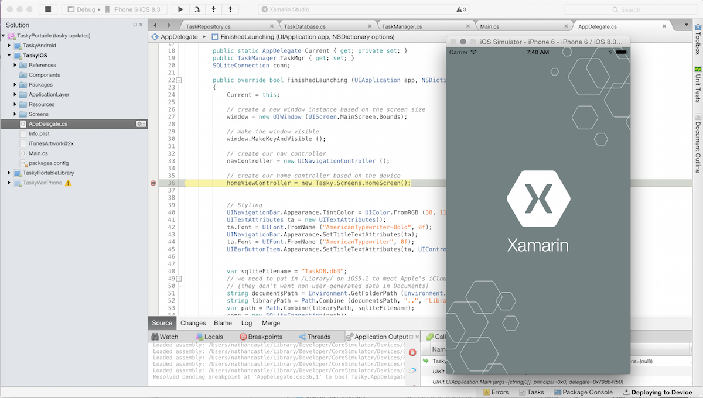
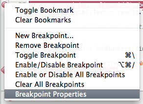
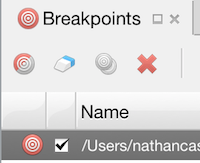
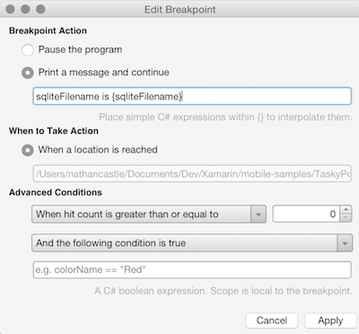
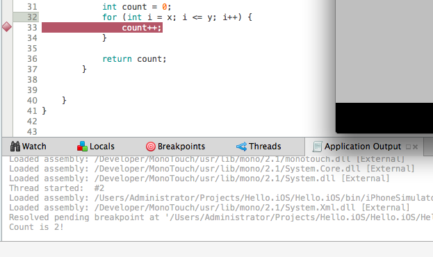

---
id:{B7BF4DCC-49BC-3C46-48C1-40B37223954A}  
title:Set A Breakpoint  
brief:This recipe shows how to set regular and conditional breakpoints.  
article:[Debugging](/guides/ios/deployment,_testing,_and_metrics/debugging_in_xamarin_ios)  
---

# Recipe

To begin debugging your project, put Xamarin Studio in its Debug view. This
opens up a set of helpful tools that let you set breakpoints, watch variables,
view the call stack, and more:

 

You can configure which tools you see in the Debug
view by selecting View > Debug Windows:

 

To set a breakpoint, simply click to the left of the line number at the
place in your code that you need to troubleshoot. You will see the breakpoint appear in the Breakpoints window:

 

To debug the application, first choose the mode and target location from
the menu at the top of the IDE. Then, hit the Play button to start the
process. You can also hit <kbd>Command + return</kbd> to launch the
debugger.

When a breakpoint is hit, it will light up yellow. You can use the
other debugging tools to get more information about what is happening in your
code at that moment:

 

 

### Set a Conditional Breakpoint

You can use breakpoints to get valuable information about
variables in your code. Adding rules for when a breakpoint is hit is known as
setting a conditional breakpoint.

To set a conditional
breakpoint, you need to access the breakpoint properties window. There are
several ways to toggle this:

1.   Right click on the space to the left of the line number where you want to set the breakpoint, and select  New Breakpoint :

  

1.   For an existing breakpoint, right click on the breakpoint and select  Breakpoint Properties :

  

1.   For an existing breakpoint, select the breakpoint in the  Breakpoints window, and hit the wrench icon:

  

This will
bring up the breakpoint properties window:

 

Add conditions to your breakpoint. In our case, our log window will
print a message telling us when `count` has reached a certain value:

 

# Additional Information

To set a breakpoint in Visual Studio, refer to the [Visual Studio documentation](http://msdn.microsoft.com/en-us/library/ktf38f66%28v=vs.90%29.aspx).