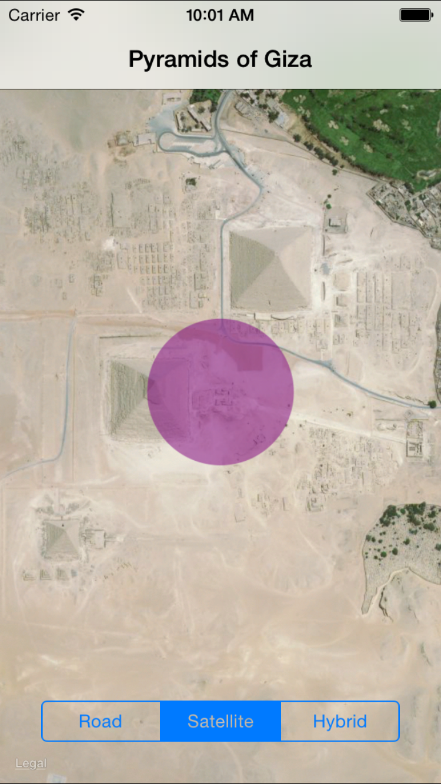

<a name="Recipe" class="injected"></a>


# Recipe

An overlay lets you ‘draw’ over a map. To add an overlay to a
MKMapView: 

1. Start with an existing `MKMapView` or review the  [Displaying a Location](/recipes/ios/content_controls/map_view/display_device_location) recipe. </li>

<ol start="2">
	<li>Declare class-level variables for the overlay and its renderer: </li>
</ol>

```
MKCircle circleOverlay;
MKCircleRenderer circleRenderer;
```

<ol start="3">
	<li>Implement MKMapView.OverlayRenderer to provide a renderer for the overlay:  </li>
</ol>

```
mapView.OverlayRenderer = (m, o) => {
    if(circleRenderer == null) {
        circleRenderer = new MKCircleRenderer(o as MKCircle);
        circleRenderer.FillColor = UIColor.Purple;
        circleRenderer.Alpha = 0.5f;
    }
    return circleRenderer;
};
```

<ol start="4">
	<li>Create an overlay, in this case a circle positioned near the Pyramids of Giza, and add it to the map:  </li>
</ol>

```
var coords = new CLLocationCoordinate2D(29.976111, 31.132778); //giza
circleOverlay = MKCircle.Circle (coords, 200);
mapView.AddOverlay (circleOverlay);
```

 

 <a name="Additional_Information" class="injected"></a>


# Additional Information

The `OverlayRenderer` method must be assigned to prior to adding the `MKOverlay` to the `MKMapView`. If this is not done, the overlay will not appear until the map is moved or scaled in some way.

The `MilesToLatitudeDegrees` and `MilesToLongitudeDegrees` helper methods can be
found in the [Displaying a Location](/recipes/ios/content_controls/map_view/display_device_location) recipe.