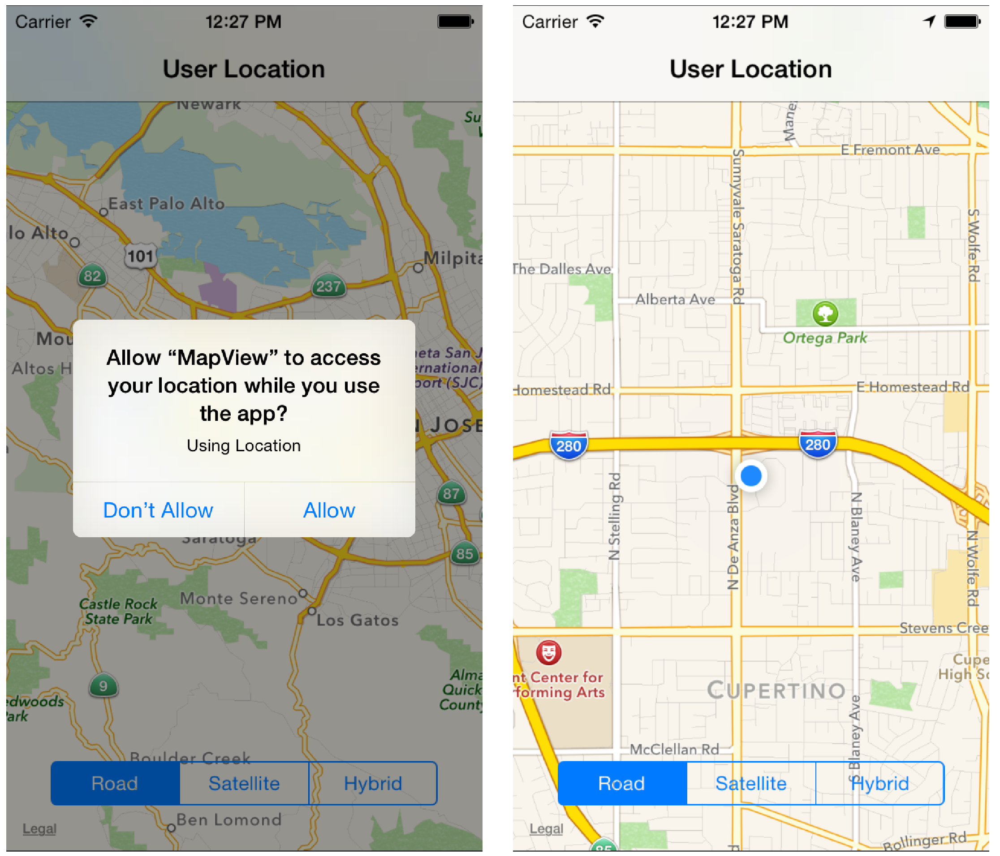

---
id:{1CAC14D3-0FCB-286B-DC5C-C50E1271595C}  
title:Display Device Location  
brief:This recipe shows how to display the current location of the device on a map.  
samplecode:[Browse on GitHub](https://github.com/xamarin/recipes/tree/master/ios/content_controls/map_view/display_device_location)  
sdk:[MKMapView Class Reference](https://developer.apple.com/library/ios/#documentation/MapKit/Reference/MKMapView_Class/MKMapView/MKMapView.html)  
---

<a name="Recipe" class="injected"></a>


# Recipe

To show device location on a map in a MKMapView:&nbsp;

-  Create a MKMapView and add it to a view.
-  Set an NSLocationWhenInUseUsageDescription in Info.plist.
-  On iOS 8.0 and above, Create an instance of the `CLLocationManager` class and call `RequestLocationWhenInUse`.
-  To display the ‘blue dot’ that indicates the device’s location, set the `ShowsUserLocation` property to true:


```
CLLocationManager locationManager = new CLLocationManager();
locationManager.RequestWhenInUseAuthorization();
mapView.ShowsUserLocation = true;
```

Accessing the user's location also requires modifications to Info.plist. The following keys relating to location data should be set:

* **NSLocationWhenInUseUsageDescription** - For when you are accessing the user's location while they are interacting with your app.
* **NSLocationAlwaysUsageDescription** - For when your app accesses the user's location in the background.

The first time this screen is displayed, calling `RequestWhenInUseAuthorization()` on an instance of `CLLocationManager` will cause iOS to prompt the user for permission to access location data. If the user selects Don’t Allow then the map cannot display the location. Failure to call `RequestWhenInUseAuthorization` won't cause an error, but will cause you to not have access to the user's location.

 [ ](Images/DeviceLocation.png)

If the user grants permission, the map will then display the blue dot
indicating the device’s location. Setting ShowsUserLocation does not
automatically cause the map to track the user, the blue dot will only be visible
if the map’s view is already encompassing their location.

 <a name="Additional_Information" class="injected"></a>


# Additional Information

To center the map on the user’s location, add the following code. Each time
the device detects a change in the user’s location it, this event is triggered
and the map is re-centered on the new location.

```
mapView.DidUpdateUserLocation += (sender, e) => {
    if (mapView.UserLocation != null) {
        CLLocationCoordinate2D coords = mapView.UserLocation.Coordinate;
        MKCoordinateSpan span = new MKCoordinateSpan(MilesToLatitudeDegrees(2), MilesToLongitudeDegrees(2, coords.Latitude));
        mapView.Region = new MKCoordinateRegion(coords, span);
    }
};
```

If the user denies access to their location data, you should implement a
fallback (otherwise the map will display coordinates 0,0).&nbsp;

```
if (!mapView.UserLocationVisible) {
    // user denied permission, or device doesn't have GPS/location ability
    CLLocationCoordinate2D coords = new CLLocationCoordinate2D(37.33233141,-122.0312186); // cupertino
    MKCoordinateSpan span = new MKCoordinateSpan(MilesToLatitudeDegrees(20), MilesToLongitudeDegrees(20, coords.Latitude));
    mapView.Region = new MKCoordinateRegion(coords, span);
}
```