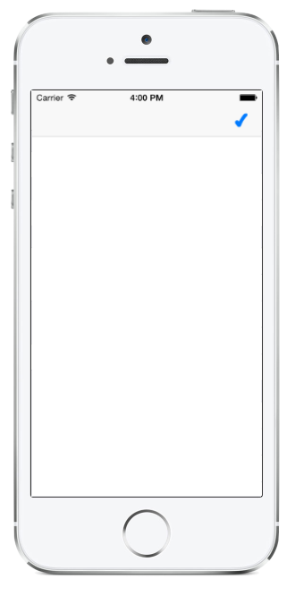

id:{06249BAE-8BB7-F128-B8BC-348F703941F0}  
title:Add an Image to a Nav Bar Button  
brief:This recipe shows how to add an image to UIBarButtonItem that is added to a navigation bar.  
samplecode:[Browse on GitHub](https://github.com/xamarin/recipes/tree/master/ios/content_controls/navigation_controller/add_an_image_to_a_nav_bar_button)  
sdk:[UINavigationBar Class Reference](http://developer.apple.com/library/ios/#documentation/UIKit/Reference/UINavigationBar_Class/Reference/UINavigationBar.html)  
sdk:[UIBarButtonItem Class Reference](https://developer.apple.com/library/ios/#documentation/UIKit/Reference/UIBarButtonItem_Class/Reference/Reference.html)  

<a name="Recipe" class="injected"></a>


# Recipe

We’re going to add a button with a checkmark as shown in the screenshot
below:

 [ ](Images/UIBarButtonItemWithImage.png)

<ol>
  <li>First, create a <code>UINavigationController</code> and add a <code>UIViewController</code> subclass to it in the <code>FinishedLaunching</code> method of the <code>AppDelegate</code>. The example below sets the RootViewController to an instance of <code>UIBarButtonItemWithImageViewController</code> – a [class](https://github.com/xamarin/recipes/blob/master/ios/content_controls/navigation_controller/add_an_image_to_a_nav_bar_button/UIBarButtonItemWithImage/UIBarButtonItemWithImageViewController.cs) which we implemented in our project :</li>
</ol>

```
public partial class AppDelegate : UIApplicationDelegate
{
    UIWindow window;
    UIBarButtonItemWithImageViewController viewController;
    UINavigationController nav;
    public override bool FinishedLaunching (UIApplication app, NSDictionary options)
    {
        window = new UIWindow (UIScreen.MainScreen.Bounds);
        viewController = new UIBarButtonItemWithImageViewController ();
        nav = new UINavigationController (viewController);
        window.RootViewController = nav;
        window.MakeKeyAndVisible ();
        return true;
    }
}
```

<ol start="2">
  <li>Add an image to the solution (named “image.png” in this case) to be used in the button.</li>

  <li>In the implementation of the <code>UIBarButtonItemWithImageViewController</code>, add a class variable for the <code>UIBarButtonItem</code>. Create the <code>UIBarButtonItem</code> instance passing it a <code>UIImage</code> created from the “image.png” file:</li>
</ol>

```
UIBarButtonItem customButton;
…
public override void ViewDidLoad ()
{
    base.ViewDidLoad ();
    customButton = new UIBarButtonItem (
    UIImage.FromFile ("image.png"),
    UIBarButtonItemStyle.Plain,
    (s, e) => {
    System.Diagnostics.Debug.WriteLine ("button tapped"); }
    );
    NavigationItem.RightBarButtonItem = customButton;
}
```

 <a name="Additional_Information" class="injected"></a>


# Additional Information

The image must have a build action of <strong>Content</strong> and be included with the solution.
