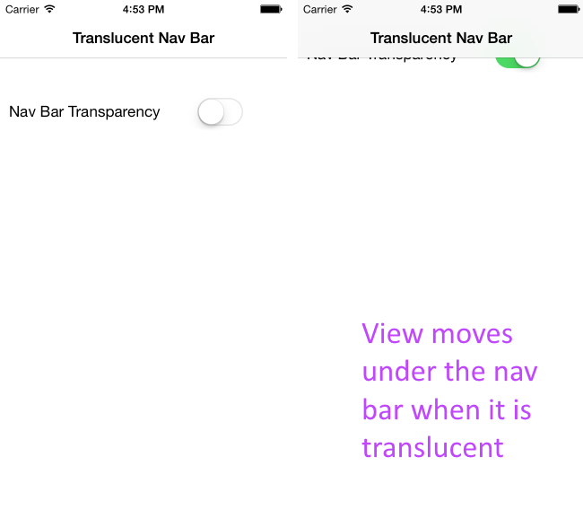

id:{D94E6E1C-A6AF-F274-5468-2ED601AC6FA1}  
title:Change the Nav Bar Transparency  
brief:This recipe shows how to change the transparency of the navigation bar.  
samplecode:[Browse on GitHub](https://github.com/xamarin/recipes/tree/master/ios/content_controls/navigation_controller/change_the_nav_bar_transparency)  
sdk:[UINavigationBar Class Reference](https://developer.apple.com/library/ios/#documentation/UIKit/Reference/UINavigationBar_Class/Reference/UINavigationBar.html)  

<a name="Recipe" class="injected"></a>


# Recipe

To make the navigation bar transparent, set the Translucent property of the
UINavigationBar:

```
this.NavigationController.NavigationBar.Translucent = true;
```

To return it to the default, set the property to false:

```
this.NavigationController.NavigationBar.Translucent = false;
```

 <a name="Additional_Information" class="injected"></a>


# Additional Information

When the navigation bar is transparent, content in the underlying view can be
seen beneath it. This means the visible content area expands to include the area
‘underneath’ the navigation bar.

The navigation bar does not allow you to interact with the controls
underneath, so avoid placing buttons or other input controls completely beneath
it.

 [ ](Images/Picture_1.png)
