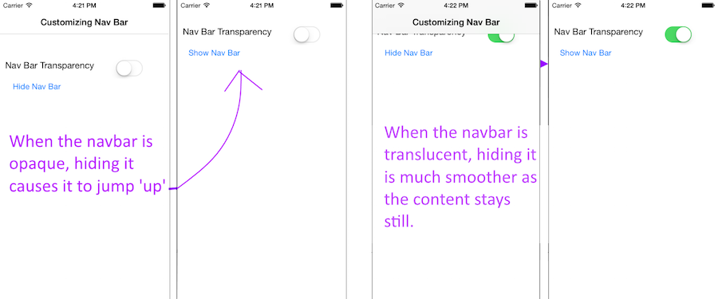

id:{FF97701A-984A-44A2-8AAF-C2F821F0FE07}  
title:Make the Nav Bar Disappear  
brief:This recipe shows how to hide the navigation bar.  
samplecode:[Browse on GitHub](https://github.com/xamarin/recipes/tree/master/ios/content_controls/navigation_controller/make_the_nav_bar_disappear)  
sdk:[UINavigationBar Class Reference](https://developer.apple.com/library/ios/#documentation/UIKit/Reference/UINavigationBar_Class/Reference/UINavigationBar.html)  

<a name="Recipe" class="injected"></a>


# Recipe

<ol>
  <li>To hide the Navigation Bar use <code>SetNavigationBarHidden</code> (the first parameter controls visibility, the second parameter indicates whether the change should be animated): </li>
</ol>


```
NavigationController.SetNavigationBarHidden (true, true);
```

<ol start="2"><li> To show the Navigation Bar: </li></ol>


```
NavigationController.SetNavigationBarHidden (false, true);
```

These screenshots of the sample code show the Nav Bar disappearing. The
behavior is slightly different depending on whether the Nav Bar is opaque or translucent

[ ](Images/NavBarDisappear.png)

 <a name="Additional_Information" class="injected"></a>


# Additional Information

Sometimes when you want to hide the Nav Bar you might also want to hide the
Status Bar (where the carrier, time and battery info is displayed). To hide the
Status Bar with animation:

```
UIApplication.SharedApplication.SetStatusBarHidden (true, true);
```

To show it again:

```
UIApplication.SharedApplication.SetStatusBarHidden (false, true);
```
