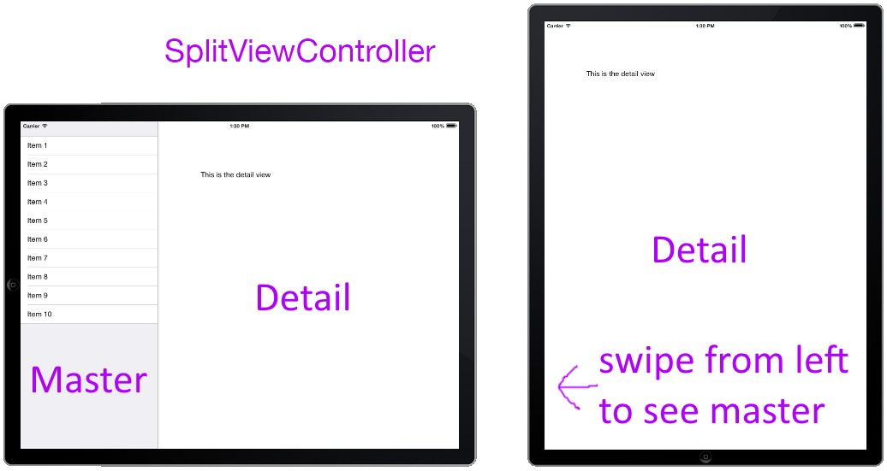

<a name="Recipe" class="injected"></a>


# Recipe

There are three components required to make a split view work:  the master
view, the detail view and the split view that encapsulates them both.

 [ ](Images/Picture_1.png)

To create these views and wire them up: 

<ol>
  <li>Create a subclass of <code>DialogViewController</code> for the master view: </li>
</ol>


```
public class MasterViewController :  DialogViewController {
    public MasterViewController () :  base (null)
    {
       Root = new RootElement ("Items") {
          new Section () {
             from num in Enumerable.Range (1, 10)
             select (Element) new StringElement("Item " + num)
          }  
       };
    }

    public override bool ShouldAutorotateToInterfaceOrientation
      (UIInterfaceOrientation toInterfaceOrientation)
    {
       return true;
    }
}
```

<ol start="2">
  <li>Create a subclass of <code>UIViewController</code> for the detail view: </li>
</ol>


```
public class DetailViewController :  UIViewController
{
    UILabel label;
    public DetailViewController () :  base()
    {
        View.BackgroundColor = UIColor.White;
        label = new UILabel(new CGRect(100,100,300,50));
        label.Text = "This is the detail view";
        View.AddSubview (label);
    }

    public override bool ShouldAutorotateToInterfaceOrientation (UIInterfaceOrientation toInterfaceOrientation)
    {
        return true;
    }
}
```

<ol start="3">
  <li>Create a subclass of <code>UISplitViewController</code>, and assign the master and detail classes to its <code>ViewControllers</code> property.</li>
</ol>


```
public class SplitViewContoller :  UISplitViewController
{
    UIViewController masterView, detailView;

    public SplitViewContoller () :  base()
    {
        // create our master and detail views
        masterView = new MasterViewController ();
        detailView = new DetailViewController ();
        // create an array of controllers from them and then
        // assign it to the controllers property
        ViewControllers = new UIViewController[]
                { masterView, detailView }; // order is important
    }

    public override bool ShouldAutorotateToInterfaceOrientation
        (UIInterfaceOrientation toInterfaceOrientation)
    {
        return true;
    }
}
```

<ol start="4">
  <li>Finally create and assign the <code>SplitViewController</code> in the <code>AppDelegate</code>: </li>
</ol>


```
splitView = new SplitViewContoller();
window.RootViewController = splitView;
```

 <a name="Additional_Information" class="injected"></a>


# Additional Information

The example above does not include any interaction between the views. See the
[Communicating Between Detail and Master Controllers] recipe. It also does not
allow you to view the master view in portrait orientation, which is explained in
the [Showing and Hiding the Master View Button (SplitView)] recipe.

You can also force the master view to appear in portrait
orientation, by implementing the following delegate in the
`SplitViewController`: 

```
ShouldHideViewController = (svc, viewController, inOrientation) => {
    return false; // default behaviour is true
};
```


 &nbsp;