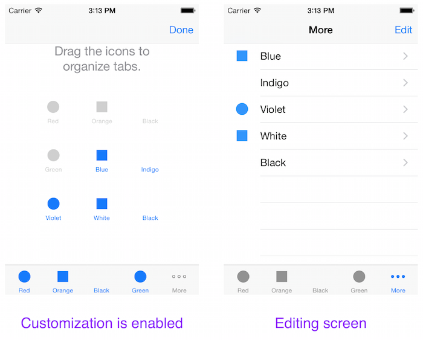

<a name="Recipe" class="injected"></a>


# Recipe

When a Tab Bar has more options than can fit on the screen, you can allow the
user to edit the order of the tabs.

 [ ](Images/Picture_1.png)

To enable Tab Bar customization: 

<ol start="1">
	<li>Create a tab bar and create more tabs than your device can display (five on an iPhone/iPod, eight on an iPad). For example:  </li>
</ol>

```
tab1 = new UIViewController();
tab1.Title = "Red";
tab1.TabBarItem = new UITabBarItem ("Red", UIImage.FromFile("Images/first.png"), 0);
tab1.View.BackgroundColor = UIColor.Red;

tab2 = new UIViewController();
tab2.Title = "Orange";
tab2.TabBarItem = new UITabBarItem ("Orange", UIImage.FromFile("Images/second.png"), 1);
tab2.View.BackgroundColor = UIColor.Orange;

tab3 = new UIViewController();
tab3.Title = "Yellow";
tab3.TabBarItem = new UITabBarItem ("Yellow", UIImage.FromFile("Images/third.png"), 2);
tab3.View.BackgroundColor = UIColor.Yellow;

tab4 = new UIViewController();
tab4.Title = "Yellow";
tab4.TabBarItem = new UITabBarItem ("Green", UIImage.FromFile("Images/fourth.png"), 3);
tab4.View.BackgroundColor = UIColor.Green;

tab5 = new UIViewController();
tab5.Title = "Blue";
tab5.TabBarItem = new UITabBarItem ("Blue", UIImage.FromFile("Images/fifth.png"), 4);
tab5.View.BackgroundColor = UIColor.Blue;

tab6 = new UIViewController();
tab6.Title = "Indigo";
tab6.TabBarItem = new UITabBarItem ("Indigo", UIImage.FromFile("Images/sixth.png"), 5);
tab6.View.BackgroundColor = UIColor.FromRGB(75, 0, 130);

tab7 = new UIViewController();
tab7.Title = "Violet";
tab7.TabBarItem = new UITabBarItem ("Violet", UIImage.FromFile("Images/seventh.png"), 6);
tab7.View.BackgroundColor = UIColor.FromRGB(143, 0, 255);

tab8 = new UIViewController();
tab8.Title = "White";
tab8.TabBarItem = new UITabBarItem ("White", UIImage.FromFile("Images/eighth.png"), 7);
tab8.View.BackgroundColor = UIColor.White;

tab9 = new UIViewController();
tab9.Title = "Black";
tab9.TabBarItem = new UITabBarItem ("Black", UIImage.FromFile("Images/ninth.png"), 8);
tab9.View.BackgroundColor = UIColor.Black;
```

<ol start="2">
	<li>Create an array with the tabs in their default order, and assign it to the <code>UITableController</code>’s <code>ViewControllers</code> property. This creates the tabs in the tab bar.</li>
</ol>


```
var tabs = new UIViewController[] {
	tab1, tab2, tab3, tab4, tab5, tab6, tab7, tab8, tab9
};

ViewControllers = tabs;
```

<ol start="3">
	<li>By default, your tab bar will automatically be customizable and allow all the tabs to be moved around. To restrict which tabs can be moved, create another array that contains only the tabs that are. Assign this array to the <code>CustomizableViewControllers</code> property.</li>
</ol>

```
var customizableControllers = new UIViewController[] {
	   tab3, tab4, tab5, tab6, tab7, tab8, tab9
}; // missing tab1, tab2

CustomizableViewControllers = customizableControllers;
```

<ol start="4">
	<li>Now when the user presses the More button on the tab bar, an Edit button will appear that allows them to drag the tabs around. Because tab1, tab2 were not present in the <code>CustomizableViewControllers</code> array, they will not be moveable.</li>
</ol>


 <a name="Additional_Information" class="injected"></a>


# Additional Information

 <a name="Disabling_Tab_Bar_Customization" class="injected"></a>


#### Disabling Tab Bar Customization

To disable customization, set the <code>CustomizableViewControllers</code> property to
null.

```
CustomizableViewControllers = null;
```

 <a name="Saving_Customization" class="injected"></a>


#### Saving Customization

The recipe above shows how to allow tab bar customization, however any
changes made will not be remembered the next time your app starts.

See recipe [Persisting Customized Tab Bar Buttons](/recipes/ios/content_controls/tab_bar/persist_customized_tab_bar_buttons) to learn how to save and re-load customized tab
positions.