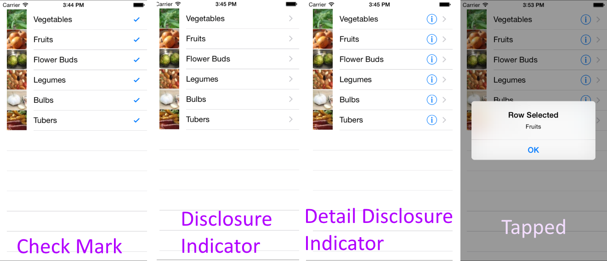

id:{D46015D4-83E4-4C26-63C5-12FAE181772B}  
title:Add a Cell Accessory  
brief:This recipe shows you how to set an accessory to display on the right side of a row.  
samplecode:[Browse on GitHub](https://github.com/xamarin/recipes/tree/master/ios/content_controls/tables/add_a_cell_accessory)  
sdk:[UITableView Class Reference](http://developer.apple.com/library/ios/#documentation/uikit/reference/UITableView_Class/Reference/Reference.html)  
sdk:[UITableViewCell Class Reference](http://developer.apple.com/library/ios/#documentation/uikit/reference/UITableViewCell_Class/Reference/Reference.html)  
sdk:[UITableViewDelegate](http://developer.apple.com/library/ios/#documentation/uikit/reference/UITableViewDelegate_Protocol/Reference/Reference.html)  
sdk:[UITableViewDataSource](http://developer.apple.com/library/ios/#documentation/uikit/reference/UITableViewDataSource_Protocol/Reference/Reference.html)  

<a name="Recipe" class="injected"></a>


# Recipe

There are three accessory types:

 **Checkmark** – displays a tick in the row.

 **DisclosureIndicator** – displays a grey arrow, usually to
indicate that another level of navigation will be displayed.

 **DetailDisclosureIndicator** – displays a blue and white
arrow, which is ‘clickable’ separately from the rest of the row.

These screenshots show the difference between them. The data and images shown
below are included in the sample code.


 [ ](Images/Add_a_Cell_Accessory.png)


 To specify an accessory to be displayed in a cell:

-  Update the `UITableViewCell` constructor in the `GetCell` method to set the `Accessory` property of each cell (uncomment one of the values in this example):


```
public override UITableViewCell GetCell (UITableView tableView, NSIndexPath indexPath)
{
    // request a recycled cell to save memory
    UITableViewCell cell = tableView.DequeueReusableCell (cellIdentifier);
    // if there are no cells to reuse, create a new one
    if (cell == null) {
        cell = new UITableViewCell (UITableViewCellStyle.Default, cellIdentifier);
    }

    cell.TextLabel.Text = tableItems[indexPath.Row];
    cell.Accessory = UITableViewCellAccessory.Checkmark;
    //cell.Accessory = UITableViewCellAccessory.DisclosureIndicator;
    //cell.Accessory = UITableViewCellAccessory.DetailDisclosureButton;

    // implement AccessoryButtonTapped
    //cell.Accessory = UITableViewCellAccessory.None; // to clear the accessory
    return cell;
}
```

-  If using the `DetailDisclosureIndicator`, override the `AccessoryButtonTapped` method to provide some behavior when it is touched:


```
public override void AccessoryButtonTapped (UITableView tableView, NSIndexPath indexPath)
{
	UIAlertController okAlertController = UIAlertController.Create ("DetailDisclosureButton Touched", tableItems[indexPath.Row].Heading, UIAlertControllerStyle.Alert);
	okAlertController.AddAction(UIAlertAction.Create("OK", UIAlertActionStyle.Default, null));
	owner.PresentViewController (okAlertController, true, null);

	tableView.DeselectRow (indexPath, true);
}
```

-  Each row can have a different accessory (or none at all), however usually only the Checkmark is selectively displayed. Use the `NSIndexPath` parameter of `GetCell` to determine which row is being displayed and set the accessory accordingly.


 <a name="Additional_Information" class="injected"></a>


# Additional Information

The full source for the `UITableViewSource` subclass is shown here for
reference:

```
public class TableSource : UITableViewSource {
		List<TableItem> tableItems;
		 string cellIdentifier = "TableCell";
		HomeScreen owner;
	
		public TableSource (List<TableItem> items, HomeScreen owner)
		{
			tableItems = items;
			this.owner = owner;
		}
	
		/// <summary>
		/// Called by the TableView to determine how many cells to create for that particular section.
		/// </summary>
		public override nint RowsInSection (UITableView tableview, nint section)
		{
			return tableItems.Count;
		}
		
		/// <summary>
		/// Called when a row is touched
		/// </summary>
		public override void RowSelected (UITableView tableView, NSIndexPath indexPath)
		{
			UIAlertController okAlertController = UIAlertController.Create ("Row Selected", tableItems[indexPath.Row].Heading, UIAlertControllerStyle.Alert);
			okAlertController.AddAction(UIAlertAction.Create("OK", UIAlertActionStyle.Default, null));
			owner.PresentViewController (okAlertController, true, null);

			tableView.DeselectRow (indexPath, true);
		}
		
		/// <summary>
		/// Called when the DetailDisclosureButton is touched.
		/// Does nothing if DetailDisclosureButton isn't in the cell
		/// </summary>
		public override void AccessoryButtonTapped (UITableView tableView, NSIndexPath indexPath)
		{
			new UIAlertView("DetailDisclosureButton Touched"
				, tableItems[indexPath.Row].Heading, null, "OK", null).Show();
		}

		/// <summary>
		/// Called by the TableView to get the actual UITableViewCell to render for the particular row
		/// </summary>
		public override UITableViewCell GetCell (UITableView tableView, NSIndexPath indexPath)
		{
			// request a recycled cell to save memory
			UITableViewCell cell = tableView.DequeueReusableCell (cellIdentifier);
			// UNCOMMENT one of these to use that style
			var cellStyle = UITableViewCellStyle.Default;
//			var cellStyle = UITableViewCellStyle.Subtitle;
//			var cellStyle = UITableViewCellStyle.Value1;
//			var cellStyle = UITableViewCellStyle.Value2;

			// if there are no cells to reuse, create a new one
			if (cell == null) {
				cell = new UITableViewCell (cellStyle, cellIdentifier);
			}
			
			// UNCOMMENT one of these to see that accessory
			cell.Accessory = UITableViewCellAccessory.Checkmark;
			//cell.Accessory = UITableViewCellAccessory.DisclosureIndicator;
			//cell.Accessory = UITableViewCellAccessory.DetailDisclosureButton;  // implement AccessoryButtonTapped
			//cell.Accessory = UITableViewCellAccessory.None; // to clear the accessory

			
			


			cell.TextLabel.Text = tableItems[indexPath.Row].Heading;
			
			// Default style doesn't support Subtitle
			if (cellStyle == UITableViewCellStyle.Subtitle 
			   || cellStyle == UITableViewCellStyle.Value1
			   || cellStyle == UITableViewCellStyle.Value2) {
				cell.DetailTextLabel.Text = tableItems[indexPath.Row].SubHeading;
			}
			
			// Value2 style doesn't support an image
			if (cellStyle != UITableViewCellStyle.Value2)
				cell.ImageView.Image = UIImage.FromFile ("Images/" +tableItems[indexPath.Row].ImageName);
			
			return cell;
		}
	}
```
