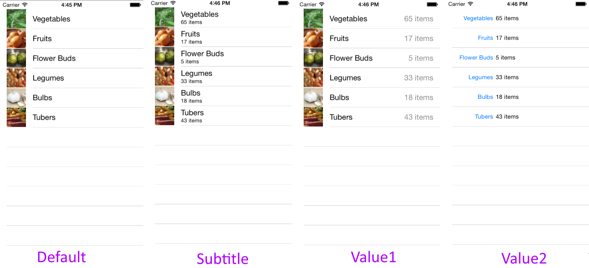

<a name="Recipe" class="injected"></a>


# Recipe

There are four built-in cell types: 


 [ ](Images/Specify_the_Cell_Type.png)

These screenshots show the difference between them. Images are optional. The
data and images shown below are included in the sample code.

To specify a different cell type: 

-  Update the `UITableViewCell` constructor in the `GetCell` method, passing in a different `UITableViewCellStyle` (uncomment one of the values in this example): 


```
public override UITableViewCell GetCell (UITableView tableView, Foundation.NSIndexPath indexPath)
{
    // request a recycled cell to save memory
    UITableViewCell cell = tableView.DequeueReusableCell (cellIdentifier);
    // if there are no cells to reuse, create a new one
    if (cell == null) {
        cell = new UITableViewCell (UITableViewCellStyle.Default, cellIdentifier);
        //cell = new UITableViewCell (UITableViewCellStyle.Subtitle, cellIdentifier);
        //cell = new UITableViewCell (UITableViewCellStyle.Value1, cellIdentifier);
        //cell = new UITableViewCell (UITableViewCellStyle.Value2, cellIdentifier);
    }
    cell.TextLabel.Text = tableItems[indexPath.Row];
    // optionally set the other text and image properties here
    return cell;
}
```

-  If the cell style supports a second line of text, set it like this: 


```
cell.DetailTextLabel.Text = "99 items"; // some text from the data source
```

-  If the cell style supports an image, set it like this: 


```
cell.ImageView.Image = UIImage.FromFile("Images/somePicture.jpg"); // image filename from the data source
```