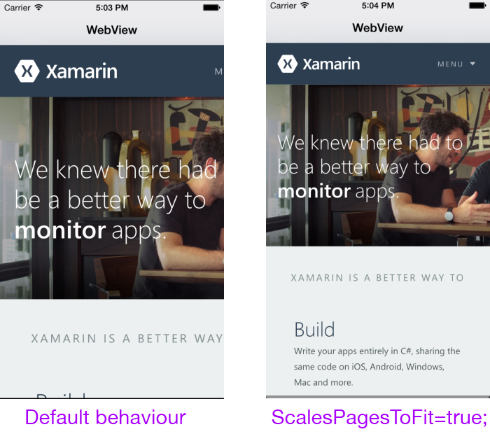

# Recipe

To show a secure web page: 

<ol><li>Create a <code>UIWebView</code> and add it to a view: </li></ol>

```
webView = new UIWebView (View.Bounds);
View.AddSubview(webView);
```

<ol start="2">
  <li>Load a URL using <code>NSUrl</code> and <code>NSUrlRequest</code> classes: </li>
</ol>


```
var url = "https: //xamarin.com"; // NOTE:  https secure request
webView.LoadRequest(new NSUrlRequest(new NSUrl(url)));
```


## iOS 9 App Transport Security

The example code above uses an HTTPS URL. If the code was changed to the following: 

```
var url = "http: //xamarin.com"; // NOTE:  http insecure request
```

Then the following error would appear (on iOS 9 and above) in the
**Application Output** (if debugging) and the web view would remain blank: 

```
App Transport Security has blocked a cleartext HTTP (http: //) resource load since it is insecure.
Temporary exceptions can be configured via your app's Info.plist file.
```

To get around this issue you *must* use secure URLs or learn how to
[configure exceptions to App Transport Security (ATS)](http: //developer.xamarin.com/guides/ios/platform_features/introduction_to_ios9/ats/)
in the **Info.plist** file.

*iOS 8 and earlier versions of iOS do not implement ATS. HTTP URLs will continue
to work on earlier versions of iOS, and the **Info.plist** changes made for
iOS 9 will be ignored.*

# Additional Information

By default the web page will open at its normal resolution. To scale it down
so that the entire page width is visible set the ScalesPagesToFit property.

```
webView.ScalesPageToFit = true;
```

 [ ](Images/WebView_1.png)