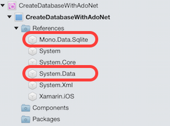
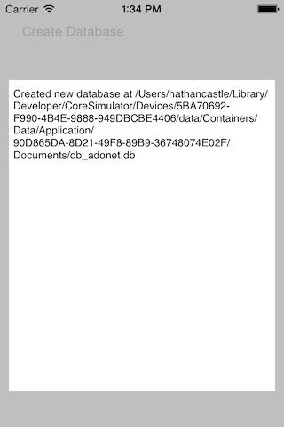

<a name="Recipe" class="injected"></a>


# Recipe

Xamarin.iOS has an ADO.NET implementation of SQLite inside the assembly
Mono.Data.SQLite

<ol start="1"><li>Add a reference to <strong>System.Data</strong> and to <strong>Mono.Data.SQLite</strong>: </li></ol>


 

<ol start="2"><li>To create a new database use the <code>SqliteConnection</code> class and call the static <code>CreateFile</code> method with the path to the database as a
parameter, as shown in the following snippet: </li></ol>

```
var documents = Environment.GetFolderPath(Environment.SpecialFolder.Personal);
var pathToDatabase = Path.Combine(documents, "db_adonet.db");
SqliteConnection.CreateFile(pathToDatabase);
```

<ol start="3"><li>To create the schema for the SQLite database, create and execute DDL
commands against an SQLite database connection. This snippet will create a new
table called <strong>People</strong>: </li></ol>

```
var connectionString = String.Format("Data Source={0};Version=3;", pathToDatabase);
using (var conn= new SqliteConnection(connectionString))
{
    conn.Open();
    using (var cmd = conn.CreateCommand())
    {
        cmd.CommandText = "CREATE TABLE People (PersonID INTEGER PRIMARY KEY AUTOINCREMENT , FirstName ntext, LastName ntext)";
        cmd.CommandType = CommandType.Text;
        cmd.ExecuteNonQuery();
    }
}
```

When the button is pushed, a new database and table is created, and the user
is notified: 

 