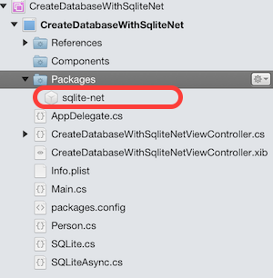
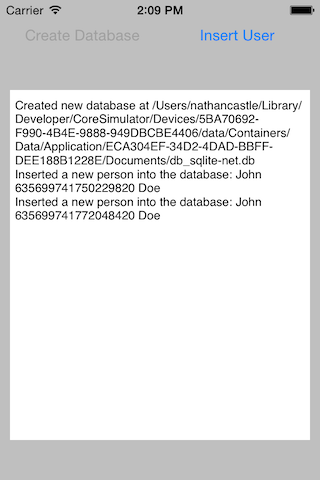

---
id:{9A6AF59E-BAEE-03B3-03A4-94A235C27CBF}  
title:Create a Database with SQLiteNET  
brief:This recipe will demonstrate how to create an SQLite database with SQLite-NET.  
samplecode:[Browse on GitHub](https://github.com/xamarin/recipes/tree/master/ios/data/sqlite/create_a_database_with_sqlitenet)  
---

<a name="Recipe" class="injected"></a>


# Recipe

The following recipe provide some sample code for using SQLite-NET to create
a database with a single table and then inserting rows into that table,
highlighting the relevant parts.

<ol start="1">
  <li>Create a new Xamarin.iOS application called <code>CreateDatabaseWithSqlitenet</code>.</li>
</ol>

<ol start="2">
  <li>Add a reference to <code>System.Data</code> and <code>Mono.Data.SQLite</code></li>
</ol>

<ol start="3">
  <li>Add the Nuget package sqlite-net by Frank Krueger to your project by right-clicking on the <strong>Packages</strong> folder and selecting <strong>Add Packages</strong>. In the window that opens, search for SQLite.Net, select the package and click *Add Package*.
 </li>
 </ol>
 [](Images/nuget_install_big.png) 

<ol start="4">
  <li>Create a <code>Person</code> class that will represent a row inside an SQLite table named <code>Person</code> table:</li>
</ol>

```
public class Person
{
   [PrimaryKey, AutoIncrement]
   public int ID { get; set; }
   public string FirstName { get; set; }
   public string LastName { get; set; }
}
```

SQLite-NET will create a table that will hold a Person object, with columns
in the table for each of the properties in the Person class. The <code>ID</code> property of the class is adorned with the attributes <code>PrimaryKey</code> and <code>AutoIncrement</code>. These attributes are by SQLite-NET to generate the proper DDL statements to create the <code>Person</code> table.

<ol start="5">

  <li>The snippet for creating the database with a <code>Person</code> table can be see in the file <strong>CreateDatabaseWithSqliteNet.cs</strong>, lines 82-85:</li>
</ol>

```
using (var conn= new SQLite.SQLiteConnection(_pathToDatabase))
{
   conn.CreateTable<Person>();
}
```
<ol start="6">
  <li>The code for inserting a new <code>Person</code> row into the person table can be the file <strong>CreateDatabaseWithSqliteNet.cs</strong>, lines 98-102:</li>
</ol>

```
var person = new Person { FirstName = "John " + DateTime.Now.Ticks, LastName = "Doe"};
using (var db = new SQLite.SQLiteConnection(_pathToDatabase ))
{
    db.Insert(person);
}
```

<ol start="7">
  <li>Run the application. First click on the <strong>Create Database</strong> button to create the database and the schema:</li>
</ol>

 

<ol start="8">
  <li>Now each time the <strong>Insert User</strong> button is clicked, another row is added to the <span class="s1">Person</span> table:</li>
</ol>

 