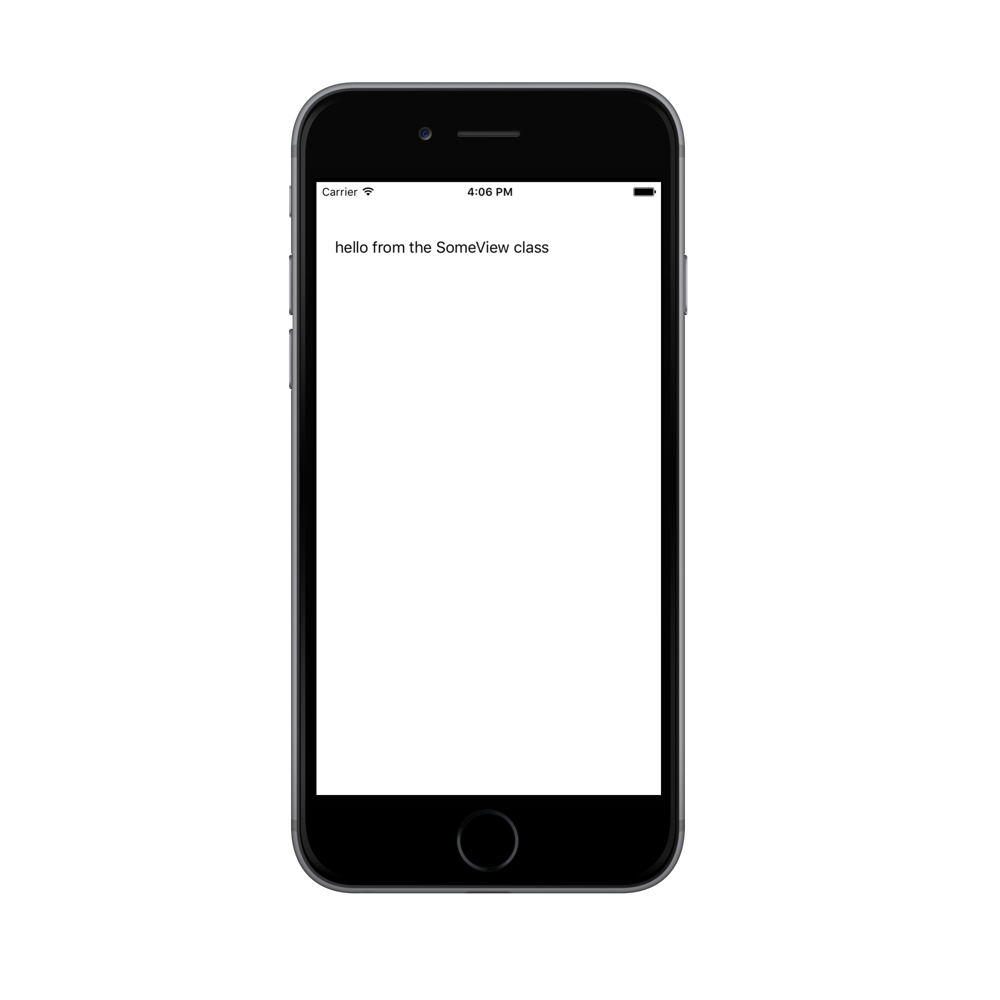

id:{B805993C-671E-286C-5C82-4004BFD65C1C}  
title: Using the View .xib Template 
brief:The iOS View XIB template in allows adding a stand-alone .xib file that can be attached to some backing class. This allows a reusable views to be designed in Xamarin Designer for iOS. However, to use such a view requires manually creating a backing view class. This recipe demonstrates creating a view in the iOS Designer and connecting it to a backing C# class in your IDE.  
samplecode:[Browse on GitHub](https://github.com/xamarin/recipes/tree/master/ios/general/templates/using_the_ios_view_xib_template)  
xamu: [Creating a XIB-based Launch Screen](https://university.xamarin.com/lightninglectures/using-the-ios-designer-to-create-a-launch-screen)

<a name="Recipe" class="injected"></a>


# Recipe

First, create a new solution named `TestApp` using the <span class="UIItem">Single View Application</span> template, and add a new file to it called `SomeView` using the <span class="UIItem">View</span> file template,
as shown below:

<ide name="xs">
<a href="Images/image01.png"></a>
</ide>

<ide name="vs">
<a href="Images/xib2.png"></a>
</ide>

This creates a new file called `SomeView.xib`.

Double-click `SomeView.xib` to open it in the Xamarin Designer for iOS.

At this point controls can be added to the .xib. As an example, search the toolbox for **label** drag a `UILabel` onto the design surface as shown below:

<ide name="xs">
<a href="Images/image02.png"></a>
</ide>

<ide name="vs">
<a href="Images/xib3.png"></a>
</ide>

However, since the .xib has not been connected to any backing class, we cannot
yet manage properties nor handle events on the controls in the view. For example buttons should have behaviour that responds to the user's touch, and labels may need to be updated based on user input. To interact with the .xib programmatically we need to have two files:

* **View partial class** – This class handles everything that happens in the view from the frame size, event handling, and contains the constructor that describes the view whenever it is instantiated. 
* **Designer partial class** – This maps the .xib controls to C# objects and is the glue that makes the controls we defined in the .xib available in the View partial class. The designer file is auto-generated by Xamarin Studio. It should never be edited by hand as Xamarin Studio will just overwrite manual changes the next time the .xib is updated.

To create these new C# class for our .xib file, select the root view on the [design surface](/guides/ios/user_interface/designer/introduction/#Designer_Features), and under *Widget > Identity* set the **Class** to `SomeView` and press **Enter**:

<ide name="xs">
<a href="Images/image03.png"></a>
</ide>

<ide name="vs">
<a href="Images/xib4.png"></a>
</ide>
	
This will create the two classes – `SomeView.cs` and `SomeView.designer.cs` – in our solution :

<ide name="xs">
<a href="Images/image04.png"></a>
</ide>

<ide name="vs">
<a href="Images/xib5.png"></a>
</ide>

The result will be a reusable view that can be included in any view hierarchy as with any other view.

This differs from the ViewController template, whose Storyboard file comes already connected to a backing class that is auto-generated by Xamarin Studio when the project is created. In that case, the class is a `UIViewController`. 

We can now manage the properties of the controls in the view, such as the label we added earlier. To interact with our UILabel control using code, we must give it a unique identifier so that it can be accessed in the C# backing code for the view. To do this select the label on the designer surface, and under *Widget > Identity > Name* in the **Properties Pad** enter `MyLabel`:

<ide name="xs">
<a href="Images/image05.png"></a>
</ide>

<ide name="vs">
<a href="Images/xib6.png"></a>
</ide>

If we open **SomeView.designer.cs**, we can see that the label has been defined:

```
[Register ("SomeView")]
	partial class SomeView
	{
		[Outlet]
		[GeneratedCode ("iOS Designer", "1.0")]
		UILabel MyLabel { get; set; }

		void ReleaseDesignerOutlets ()
		{
			if (MyLabel != null) {
				MyLabel.Dispose ();
				MyLabel = null;
			}
		}
	}
``` 

Now that we have everything connected, we can add code to create the View.

In the `SomeView` class add the following namespaces and constructors to load
the view from the XIB file we just created:

```
using Foundation;
using System;
using System.CodeDom.Compiler;
using UIKit;
using ObjCRuntime;

namespace TestApp
{
	partial class SomeView : UIView
	{
		public SomeView (IntPtr handle) : base (handle)
		{
			
		}

		public static SomeView Create()
		{
			
			var arr = NSBundle.MainBundle.LoadNib ("SomeView", null, null);
			var v = Runtime.GetNSObject<SomeView> (arr.ValueAt(0));
		
			return v;
		}

		public override void AwakeFromNib(){

			MyLabel.Text = "hello from the SomeView class";
		}
	}

}
```

Here we also loaded the view from the XIB in the `Create` method and edited the `Text` property of the label.

The `SomeView` class in now ready to use. In the `ViewController` class, create an instance of `SomeView` by calling the `Create` method and add it to the view hierarchy, as shown below:

```
public partial class ViewController : UIViewController
{
	SomeView v;

	public ViewController (IntPtr handle) : base (handle)
	{
	}

	public override void ViewDidLoad ()
	{
		base.ViewDidLoad ();
		// Perform any additional setup after loading the view, typically from a nib.

		v = SomeView.Create();
		v.Frame = View.Frame;
		View.AddSubview (v);
	}
	
	...
}
```

Run the application now and the view from the .xib is loaded and
displayed:

[ ](Images/image06.png)

 <a name="Summary" class="injected"></a>


# Summary

The iOS View template allow custom view to be designed in Xamarin Designer for iOS.
