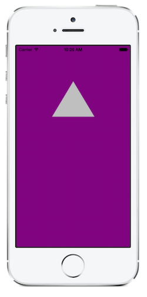

---
id:{9ad2acd2-6477-4b8d-8ccc-b80b658b6866}  
title:Create a Transparent Region in a View  
brief:This recipe shows how to create a transparent region within a view.  
samplecode:[TransparentRegionInView](https://github.com/xamarin/recipes/tree/master/ios/graphics_and_drawing/core_graphics/transparent_region_view/  
article: [Core Graphics guide](/guides/ios/application_fundamentals/graphics_animation_ios/core_graphics/)
sdk:[Quartz 2D Programming Guide](https://developer.apple.com/library/ios/#documentation/GraphicsImaging/Conceptual/drawingwithquartz2d/Introduction/Introduction.html)  
---


# Recipe

[ ](Images/Core_Graphics.png)

The following `UIView` subclass fills a path transparently, creating
  a cutout that displays the superview within the fill area of the
  path (which is a triangle in this case):

```
public class TransparentRegionView : UIView
{
  public TransparentRegionView ()
  {
    BackgroundColor = UIColor.Clear;
    Opaque = false;
  }

  public override void Draw (CGRect rect)
  {
    base.Draw (rect);

    var gctx = UIGraphics.GetCurrentContext ();

    // setting blend mode to clear and filling with
    // a clear color results in a transparent fill
    gctx.SetFillColor (UIColor.Purple.CGColor);
    gctx.FillRect (rect);

    gctx.SetBlendMode (CGBlendMode.Clear);
    UIColor.Clear.SetColor ();

    // create some cutout geometry
	var path = new CGPath ();	
	path.AddLines(new CGPoint[]{
		new CGPoint(100,200),
		new CGPoint(160,100), 
		new CGPoint(220,200)});	
	path.CloseSubpath();

    gctx.AddPath(path);
    gctx.DrawPath(CGPathDrawingMode.Fill);  
  }
}
```


# Additional Information

Using `CGBlendMode.Clear` together with setting a clear
  color results in the transparent fill, as shown in the example.