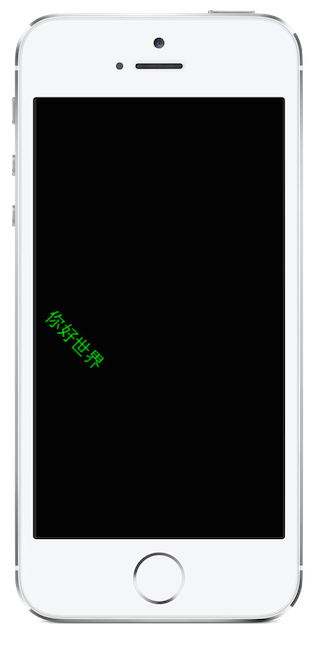

id:{42E062A0-761A-4C3F-00D0-D8A2E1D1BA0C}  
title:Draw Unicode Text with CoreText  
brief:This recipe shows how to draw text using Core Text.  
samplecode:[Draw Unicode Text with Core Text](https://github.com/xamarin/recipes/tree/master/ios/graphics_and_drawing/core_text/draw_unicode_text_with_coretext/)  
sdk:[Core Text Programming Guide](https://developer.apple.com/library/mac/#documentation/StringsTextFonts/Conceptual/CoreText_Programming/Introduction/Introduction.html)  

<a name="Recipe" class="injected"></a>


# Recipe

 [ ](Images/Core_Text.png)

1. In a `UIView` subclass override `Draw` and set graphics context state.

  ```
  var gctx = UIGraphics.GetCurrentContext ();
  gctx.TranslateCTM (10, 0.5f * Bounds.Height);
  gctx.ScaleCTM (1, -1);
  gctx.RotateCTM ((float)Math.PI * 315 / 180);
  gctx.SetFillColor (UIColor.Green.CGColor);
  ```


<ol start="2"><li>Create a Unicode text string.</li></ol>


```
string someText = "你好世界";
```

<ol start="3"><li>Create an <code>NSAttributedString</code>.</li></ol>


```
var attributedString = new NSAttributedString (someText,
       new CTStringAttributes{
	      ForegroundColorFromContext =  true,
	      Font = new CTFont ("Arial", 24)
});
```

<ol start="4">
  <li>Pass the <code>NSAttributedString</code> to a <code>CTLine</code> and draw the CTLine.</li>
</ol>


```
using (var textLine = new CTLine (attributedString)) {
       textLine.Draw (gctx);
}
```

 <a name="Additional_Information" class="injected"></a>


# Additional Information

You can draw text using the **Core Text framework** by creating an
`NSAttributedString` instance; passing it to a `CTLine` instance and calling `Draw` on the `CTLine`. Otherwise, normal **Core Graphics** techniques such as obtaining a
graphics context and manipulating the current transformation matrix apply. This
example draws text of a given font and color and rotates it as shown
above.
