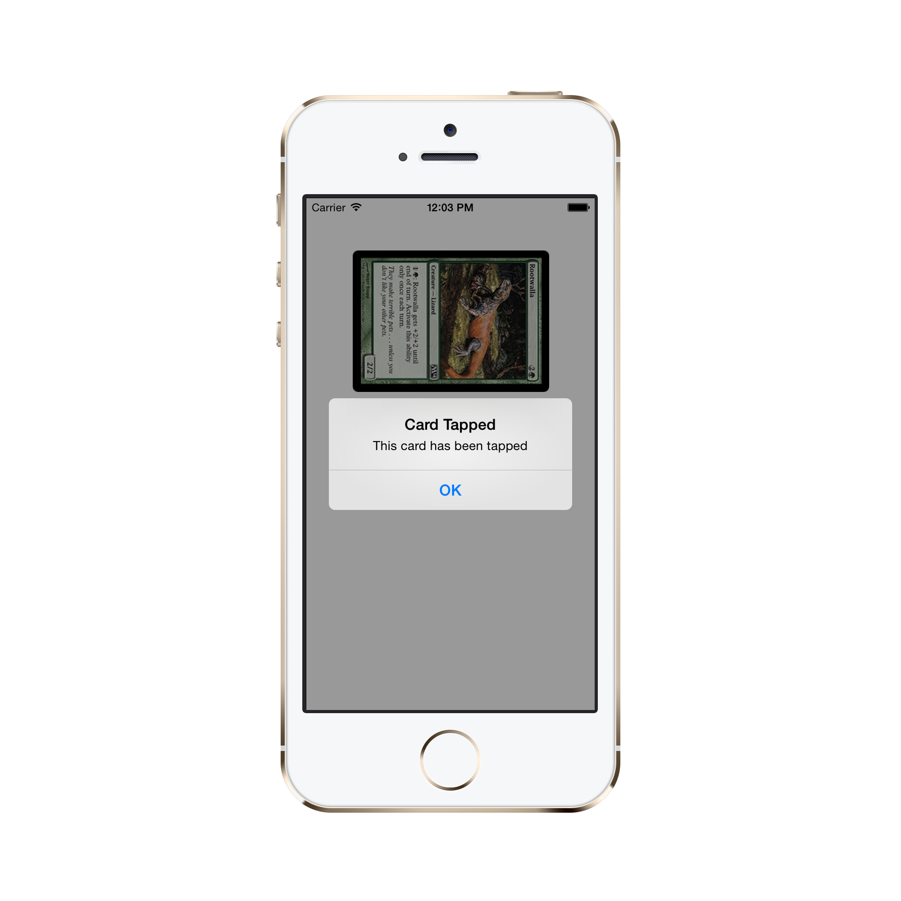
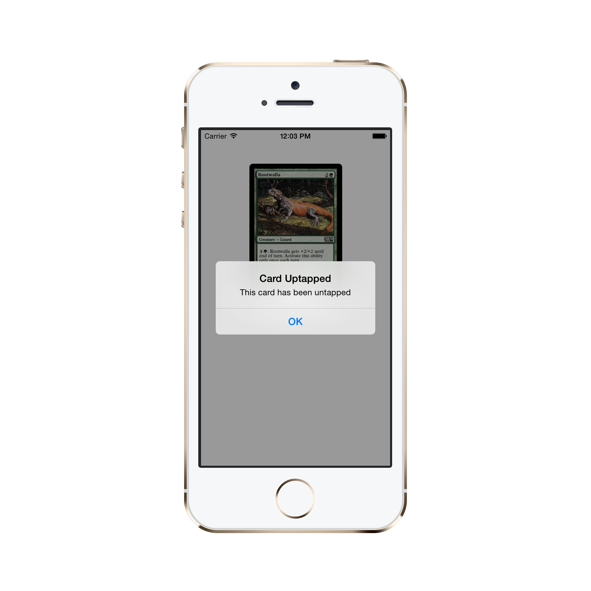

id:{754edcd7-9555-4ff2-b031-9ba7a5b6e43f}
title:Use a Tap Gesture
brief:In iOS, tap gestures are registered with the UITapGestureRecognizer class. This recipe demonstrates how to use this class to recognize single and multiple tap gestures.
samplecode:[Browse on GitHub](https://github.com/xamarin/recipes/tree/master/ios/input/touch/tap-gesture)
sdk:[UITapGestureRecognizer](https://developer.apple.com/library/ios/documentation/UIKit/Reference/UITapGestureRecognizer_Class/)

# Recipe

 

<ol>

	<li>
First, let's enable user interaction on the UI element that's going to receive the taps. We can do that by setting the <code>UserInteractionEnabled</code> property to true:

		<pre><code>imageView.UserInteractionEnabled = true;</code></pre>
		
We can do this inside the <code>ViewDidLoad</code> method of the <code>ViewController</code>, or whatever method you are using to manipulate the UI element.

	</li>
	<li>
Next we'll create a new <code>UITapGestureRecognizer</code>, passing in the name of the Action that will handle the tap gesture:

		<pre><code>UITapGestureRecognizer tapGesture = new UITapGestureRecognizer (TapThat);</code></pre>
	</li>
	<li>
Next we'll create the Action to handle the tap gesture. In our example, we're using a method called <code>TapThat</code> to rotate the View 90 degrees clockwise and show an alert view:

		<pre><code>tap.View.Transform *= CGAffineTransform.MakeRotation ((float)Math.PI / 2);
				tapped = true;
				alert = UIAlertController.Create ("Card Tapped", "This card has been tapped", UIAlertControllerStyle.Alert);
				alert.AddAction (UIAlertAction.Create ("OK", UIAlertActionStyle.Default, null));
				PresentViewController (alert, true, null);</code></pre>
	</li>
	<li>
Finally, we can add the gesture recognizer to our UI element:

		<pre><code>imageView.AddGestureRecognizer (tapGesture);</code></pre>
	</li>
</ol>

# Additional Information

We can control the number of taps our gesture recognizer responds to by editing the <code>NumberOfTapsRequired</code> property of the tap gesture recognizer. For example, we could change the code above to respond to two taps with the following code:

<pre><code>tapGesture.NumberOfTapsRequired = 2;</code></pre>

The default number of taps required is 1.
