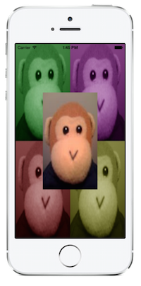

---
id:{145134BE-FD78-42DB-139D-FE4F54505499}  
title:Merge Images  
samplecode:[Browse on GitHub](https://github.com/xamarin/recipes/tree/master/ios/media/images/merge_images)  
article:[Working with Images](/guides/ios/application_fundamentals/working_with_images)  
sdk:[Quartz 2D Programming Guide](https://developer.apple.com/library/mac/#documentation/graphicsimaging/conceptual/drawingwithquartz2d/Introduction/Introduction.html)  
---

This recipe shows how to merge images together using an image context.

 <a name="Recipe" class="injected"></a>


# Recipe

 [ ](Images/MergedImage.png)

1.  Create a new Single View Application called MergeImages.
1.  Add two images named monkey1.png and monkey2.png to the project with a Build Action of BundleResource. See the sample project that goes with this recipe for sample images.
1.  For simplicity here, we’ll just work within the `AppDelegate`. Add the following class variables to the AppDelegate.


```
UIImage image1;
UIImage image2;
UIImage combinedImage;
UIImageView combinedImageView;
```

<ol start="4">
  <li>In the FinishedLaunching method, load the two <code>UIImage</code> instances from the files added earlier.</li>
</ol>

```
image1 = UIImage.FromFile ("monkey1.png");
image2 = UIImage.FromFile ("monkey2.png");
```

<ol start="5">
  <li>Draw both images to an image context and retrieve the merged image by
  calling <code>UIGraphics.GetImageFromCurrentContext</code>.</li>
</ol>

```
image1.Draw (new CoreCraphics.CGRect (
                0, 0, UIScreen.MainScreen.Bounds.Width, UIScreen.MainScreen.Bounds.Height));

image2.Draw (new CoreCraphics.CGRect (
UIScreen.MainScreen.Bounds.Width / 4,
UIScreen.MainScreen.Bounds.Height / 4,
UIScreen.MainScreen.Bounds.Width / 2,
UIScreen.MainScreen.Bounds.Height / 2));

combinedImage = UIGraphics.GetImageFromCurrentImageContext ();
UIGraphics.EndImageContext ();
```

<ol start="6">
  <li>To display the image, create an <code>ImageView</code> and set its <code>Image</code> property to the merged image. Then add the <code>ImageView</code> as a sub view of the controller’s view.
  </li>
</ol>

```
combinedImageView = new UIImageView (
new CoreCraphics.CGRect (0, 0, UIScreen.MainScreen.Bounds.Width,
UIScreen.MainScreen.Bounds.Height));  

combinedImageView.Image = combinedImage;

viewController.View.AddSubview (combinedImageView);
```

 <a name="Additional_Information" class="injected"></a>


### Additional Information

The `UIGraphics.GetImageFromCurrentImageContext` method returns a `UIImage` for
whatever has been drawn to the current graphics context.