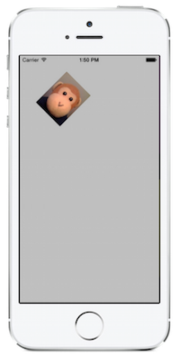

id:{0E44C0E9-241F-506F-9358-36BEA3DB4665}  
title:Rotate An Image  
brief:This recipe shows how to rotate an image on the screen using a UIImageView and a CGAffineTransform.  
samplecode:[Browse on GitHub](https://github.com/xamarin/recipes/tree/master/ios/media/images/rotate_an_image)  
article:[Working with Images](/guides/ios/application_fundamentals/working_with_images)  
sdk:[Quartz 2D Programming Guide](https://developer.apple.com/library/mac/#documentation/graphicsimaging/conceptual/drawingwithquartz2d/Introduction/Introduction.html)  

<a name="Recipe" class="injected"></a>


# Recipe

 [ ](Images/RotateImage.png)

1.  Add a sample image named monkey.png.
1.  In a UIViewController subclass, add class variables for a UIImage and UIImageView.


```
UIImage _image;
UIImageView _imageView;
```

<ol start="3">
  <li>In the ViewDidLoad method create the UIImage and the UIImageView.</li>
</ol>

```
_image = UIImage.FromFile("monkey.png");
_imageView = new UIImageView(new CGRect(50,50,100,100));
_imageView.ContentMode = UIViewContentMode.ScaleAspectFit;
_imageView.Image = _image;
```

<ol start="4">
  <li>Set the Transform property of the UIImageView and add it as a sub view.</li>
</ol>

```
_imageView.Transform = CGAffineTransform.MakeRotation((float)Math.PI/4);
View.AddSubview (_imageView);
```

 <a name="Additional_Information" class="injected"></a>


# Additional Information

The CGAffineTransform has helper functions to return various affine
transforms such as rotation, scale and translation. Setting a CGAffineTransform
to the Transform property of a UIView applies the transformation matrix to the
view.
