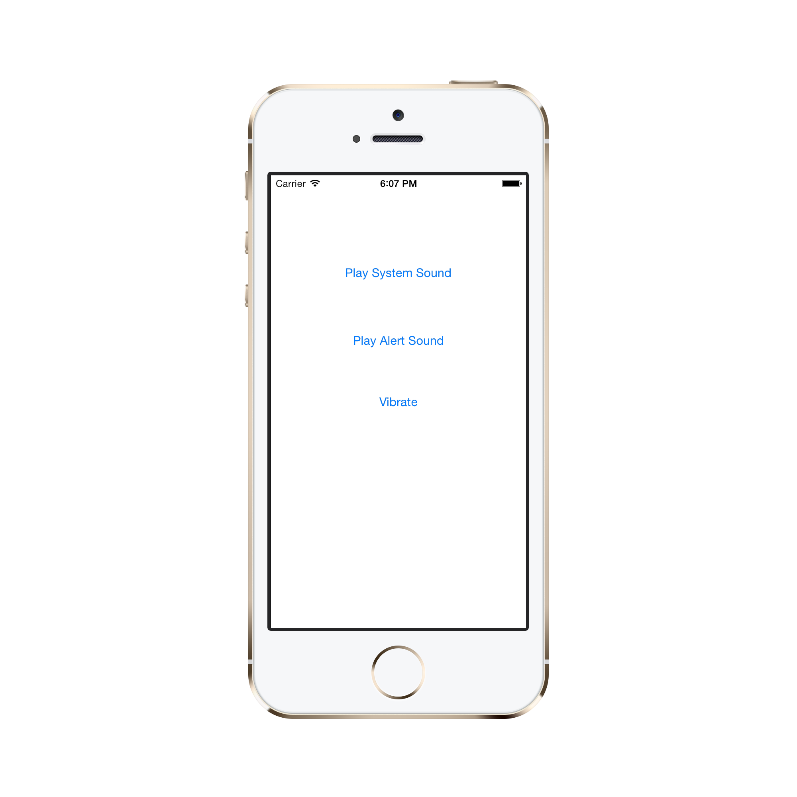

# Recipe

First, create a Single View Application for Xamarin.iOS.

This will create a template application which includes a Storyboard called `MainStoryboard.storyboard`. Let's use this to create three buttons. Drag three buttons from the Toolbox, and give them the following **Name** and **Title**: 

* playSystemButton / Play System Sound
* playAlertButton / Play Alert Sound
* VibrateButton / Vibrate

Next, add your desired sound file to the project directory, making sure to set the **Build Action** to `BundleResource`.

Declare a `NSUrl` variable and a `SystemSound` variable in our `MainViewController` class, as shown below: 

```
NSUrl url;
SystemSound systemSound;
```

Once the variables are declared, assign your sound file to the `url` variable using the `NSUrl` object to reference your sound file in your `ViewDidLoad()` method: 

```
url = NSUrl.FromFilename ("Sounds/tap.aif");
```

Next, generate a `SystemSound` instance to `systemSound` using our `url` variable: 

```  
systemSound = new SystemSound (url);
```

To play the sound when the `playSystemButton` is pressed, call `PlaySystemSound()` on our `SystemSound` instance on the button's TouchUpInside event.

```
systemSound.PlaySystemSound ();
```

To play an alert, which plays the sound as well as vibrates the device, call `PlayAlertSound()` on our `SystemSound` instance on the `playAlertButton`'s `TouchUpInside` event.

```
systemSound.PlayAlertSound ()
```

To simply vibrate the device, call the `PlaySystemSound()` method on the `Vibrate` field of the `SystemSound` class, on the `VibrateButton`'s `TouchUpInside` event.

```
SystemSound.Vibrate.PlaySystemSound ();
```


# Additional Information


System Sound Services is meant to be used for UI sound effects and user alerts, rather than for sound effects in games. For devices that do not have a vibration element, the vibration constant does nothing. Additionally, the simulator does not handle vibration.