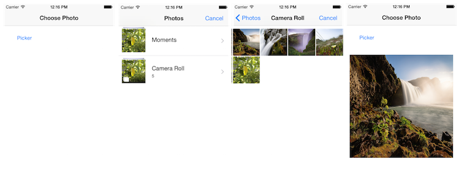

id:{7E4AC573-02D6-D998-D552-7521229C3715}  
title:Choose a Photo From the Gallery  
brief:This recipe shows how to let the user choose a photo from their gallery.  
samplecode:[Choose_a_Photo_from_the_Gallery](https://github.com/xamarin/recipes/tree/master/ios/media/video_and_photos/choose_a_photo_from_the_gallery)  
sdk:[UIImagePickerController Class Reference](https://developer.apple.com/library/ios/#documentation/UIKit/Reference/UIImagePickerController_Class/UIImagePickerController/UIImagePickerController.html)  

# iOS Recipe

Applications can ask the user to choose a photo (or video) from their Photo
Albums using UIImagePickerController. The sample code screens look like
this:

 [ ](Images/photo_screens_big.png)

To implement the photo picker:

<ol><li>Create the image picker control:</li></ol>


```
imagePicker = new UIImagePickerController ();
```

<ol start="2"><li>Set the source and media type:</li></ol>


```
imagePicker.SourceType = UIImagePickerControllerSourceType.PhotoLibrary;
imagePicker.MediaTypes = UIImagePickerController.AvailableMediaTypes (UIImagePickerControllerSourceType.PhotoLibrary);
```

<ol start="3"><li>Assign delegate handler&nbsp; (to be implemented in steps 5 and 6):</li></ol>

```
imagePicker.FinishedPickingMedia += Handle_FinishedPickingMedia;
imagePicker.Canceled += Handle_Canceled;
```

<ol start="4"><li>Display the controller:</li></ol>

```
NavigationController.PresentModalViewController(imagePicker, true);
```

<ol start="5"><li>Implement the handler method that checks the kind of file the user selected, and if it is an image displays it:</li></ol>

```
protected void Handle_FinishedPickingMedia (object sender, UIImagePickerMediaPickedEventArgs e)
{
    // determine what was selected, video or image
    bool isImage = false;
    switch(e.Info[UIImagePickerController.MediaType].ToString()) {
        case "public.image":
            Console.WriteLine("Image selected");
            isImage = true;
            break;
        case "public.video":
            Console.WriteLine("Video selected");
            break;
    }

    // get common info (shared between images and video)
    NSUrl referenceURL = e.Info[new NSString("UIImagePickerControllerReferenceUrl")] as NSUrl;
    if (referenceURL != null)
        Console.WriteLine("Url:"+referenceURL.ToString ());

    // if it was an image, get the other image info
    if(isImage) {
        // get the original image
        UIImage originalImage = e.Info[UIImagePickerController.OriginalImage] as UIImage;
        if(originalImage != null) {
            // do something with the image
            Console.WriteLine ("got the original image");
            imageView.Image = originalImage; // display
        }
    } else { // if it's a video
        // get video url
        NSUrl mediaURL = e.Info[UIImagePickerController.MediaURL] as NSUrl;
        if(mediaURL != null) {
            Console.WriteLine(mediaURL.ToString());
        }
    }
    // dismiss the picker
    imagePicker.DismissModalViewControllerAnimated (true);
}
```

<ol start="6"><li>Implement the cancellation handler method so that the picker will disappear:</li></ol>


```
void Handle_Canceled (object sender, EventArgs e) {
       imagePicker.DismissModalViewControllerAnimated(true);
}
```

# Additional Information

In the finished handler you can also access additional properties of the
image (such as whether there is an edited version):

```
// get the edited image
UIImage editedImage = e.Info[UIImagePickerController.EditedImage] as UIImage;
if(editedImage != null) {
    // do something with the image
    Console.WriteLine ("got the edited image");
    imageView.Image = editedImage; // display
}
```
