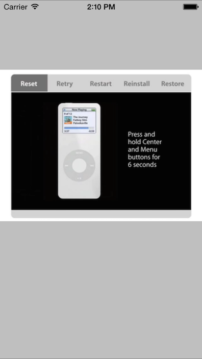

---
id:{A88F34E5-EF29-0F57-9505-1D9AF21E8BE6}  
title:Play a Video Using AVPlayer  
brief:This recipe shows how to play a video using an AVPlayer and AVPlayerLayer.  
samplecode:[AVPlayerDemo](https://github.com/xamarin/recipes/tree/master/ios/media/video_and_photos/play_a_video_using_avplayer)  
sdk:[AVFoundation Programming Guide](https://developer.apple.com/library/ios/#documentation/AudioVideo/Conceptual/AVFoundationPG/Articles/00_Introduction.html)  
---

<a name="Recipe" class="injected"></a>


# Recipe

 [ ](Images/avplayer.png)

1.  Add the following class variable in a UIViewController subclass.


```
AVPlayer _player;
AVPlayerLayer _playerLayer;
AVAsset _asset;
AVPlayerItem _playerItem;
```

2.  Add a movie file named sample.m4v to the project in Xamarin or Visual Studio. There is a sample file included in the project download for this recipe.
3.  Ensure that the file's **Build Action** is set to **Content**. You can do this by right-clicking on the file and selecting **Build Action** from the context menu that appears. 
4.  In the ViewDidLoad method, create an AVAsset and pass it to an AVPlayerItem.


```
_asset = AVAsset.FromUrl (NSUrl.FromFilename ("sample.m4v"));
_playerItem = new AVPlayerItem (_asset);
```

5.  Create an AVPlayer and pass it the AVPlayerItem created above.


```
_player = new AVPlayer (_playerItem);
```

6.  Create an AVPlayerLayer from the AVPlayer instance and add as a sublayer to the view’s layer.


```
_playerLayer = AVPlayerLayer.FromPlayer (_player);
_playerLayer.Frame = View.Frame;
View.Layer.AddSublayer (_playerLayer);
```

7.  Call the Play method of the AVPlayer instance to play the video.


```
_player.Play ();
```

 <a name="Additional_Information" class="injected"></a>


# Additional Information

The `AVPlayer` is part of the `AVFoundation` framework and is available in the A`VFoundation` namespace.