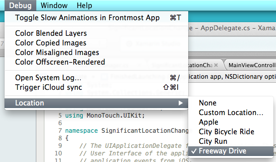
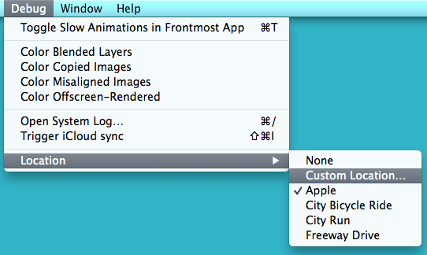
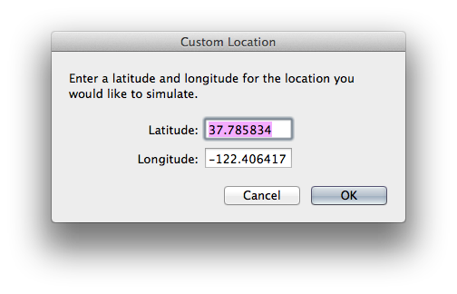

---
id:{8e393aee-2cef-44f1-9706-e681c39616f4}  
title:Test Location Changes in Simulator  
brief:Some location APIs such as Significant Location Change and Geofences require big changes in location to trigger events. The iOS Simulator offers an easy way to test location APIs without leaving your desk.  
---

# Recipe

1.  Launch the iOS Simulator. Then, open the iOS Simulator's  Debug menu and select  Location > Freeway Drive . This will simulate a coastal drive up California's highway 280:

  

2.   Deploy the application to the simulator. The simulator will begin feeding sample data to the application, which should respond appropriately. For example, running the  [Track Significant Location Change](http://docs.xamarin.com/recipes/ios/multitasking/track_significant_location_change/) code in the simulator produces the following application log:

  

3.  If your application requires a custom location to test, choose the  Location > Custom Location... option from the  Debug menu, and specify your own latitude and longitude to test:

   

4.   You can check the device's simulated location by opening Google Maps in Safari on the simulator. Navigate to  <kbd>maps.google.com</kbd> and make sure the location matches what you set:

  

Of course, testing on the simulator does not prove that your app will work as intended on an actual device. Before you ship your app, Xamarin recommends that you buy a plane ticket and make the drive yourself just to be sure.