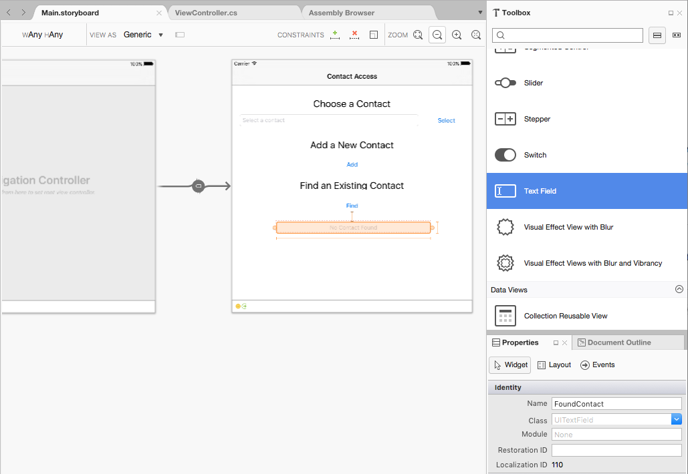

---
id:{0ED963F7-8955-A19E-5863-07974B82C75A}  
title:Find a Contact  
brief:This recipe shows how to find a contact using the ABAddressBook class.  
dateupdated:2016-06-08  
article:[Contacts and ContactUI](/guides/ios/platform_features/introduction_to_ios9/contacts/)    
---

<a name="Recipe" class="injected"></a>
# Recipe

By using an instance of the `CNContactStore` class, you can fetch contact information from the user's contacts database. The `CNContactStore` contains all of the methods required for fetching or updating contacts and groups from the database.

<a name="Design-your-UI" class="injected"></a>
## Design your UI

Design your app's User Interface that will be used to find the Contact and present it. For example, a `UIButton` to find the Contact and a `UITextField` to present it:

[ ](Images/Find02.png)

<a name="Find-an-Existing-Contact" class="injected"></a>
## Find an Existing Contact

Find an existing Contact and present it when the user clicks the button. For example:

```
using System;
using Foundation;
using Contacts;
using ContactsUI;
using UIKit;

namespace ContactAccess
{
	public partial class ViewController : UIViewController
	{
		protected ViewController (IntPtr handle) : base (handle)
		{
			
		}

		public override void ViewDidLoad ()
		{
			base.ViewDidLoad ();
		}

		partial void FindContact_TouchUpInside (UIButton sender)
		{
			// Create predicate to locate requested contact
			var predicate = CNContact.GetPredicateForContacts ("Appleseed");

			// Define fields to be searched
			var fetchKeys = new NSString [] { CNContactKey.GivenName, CNContactKey.FamilyName };

			// Grab matching contacts
			var store = new CNContactStore ();
			NSError error;
			var contacts = store.GetUnifiedContacts (predicate, fetchKeys, out error);

			// Found?
			if (contacts.Length > 0) {
				// Get the first matching contact
				var contact = contacts [0];

				// Display it
				FoundContact.Text = string.Format ("{0} {1}", contact.GivenName, contact.FamilyName);
			} else {
				// Not found
				FoundContact.Text = "";
			}
		}
	}
}
```

Let's look at this code in detail:

1. First, it defines what to search for in a Contact (`CNContact.GetPredicateForContacts ("Appleseed")`). In this case, it is hunting for any Contact that contains the text `Appleseed`.
2. Next, define what values to return: `var fetchKeys = new NSString [] { CNContactKey.GivenName, CNContactKey.FamilyName }`.
3. Then it accesses the Contact Store (`CNContactStore`) and fetches the matching contacts: `var contacts = store.GetUnifiedContacts (predicate, fetchKeys, out error)`.
4. Finally, it displays the first Contact found.

<a name="Additional_Information" class="injected"></a>
# Additional Information

For more information, please see our [Contacts and ContactUI](/guides/ios/platform_features/introduction_to_ios9/contacts/) documentation.