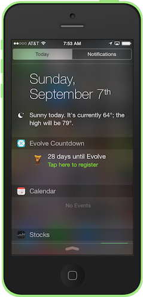

---
id:{647756af-afea-44e7-a5c9-a3701f3506f3}  
title:Today Widget  
brief:This recipe shows you how to create a today widget in iOS 8
sample:[ExtensionsDemo](/samples/ExtensionsDemo)
---

<a name="Recipe" class="injected"></a>

# Recipe

- Create a new Unified API > iPhone Single View Application named ExtensionsDemo.

- Register a URL scheme in the Info.plist

```
<key>CFBundleURLTypes</key>
	<array>
		<dict>
			<key>CFBundleURLSchemes</key>
			<array>
				<string>evolveCountdown</string>
			</array>
			<key>CFBundleURLName</key>
			<string>com.xamarin.ExtensionsDemo</string>
		</dict>
	</array>
```

- Add a new Unified API > Extensions > Today Extension project named EvolveCountdownWidget to the solution and reference it form the ExtensionsDemo project.

- Update the Extension's Info.plist as follows:

```
<?xml version="1.0" encoding="UTF-8"?>
<!DOCTYPE plist PUBLIC "-//Apple//DTD PLIST 1.0//EN" "http://www.apple.com/DTDs/PropertyList-1.0.dtd">
<plist version="1.0">
<dict>
	<key>CFBundleDevelopmentRegion</key>
	<string>en</string>
	<key>CFBundleExecutable</key>
	<string>EvolveCountdownWidget</string>
	<key>CFBundleIdentifier</key>
	<string>com.xamarin.ExtensionsDemo.EvolveCountdownWidget</string>
	<key>CFBundleInfoDictionaryVersion</key>
	<string>6.0</string>
	<key>CFBundleName</key>
	<string>com.xamarin.EvolveCountdownWidget</string>
	<key>CFBundlePackageType</key>
	<string>XPC!</string>
	<key>CFBundleShortVersionString</key>
	<string>1.0</string>
	<key>CFBundleSignature</key>
	<string>????</string>
	<key>CFBundleVersion</key>
	<string>1</string>
	<key>NSExtension</key>
	<dict>
		<key>NSExtensionMainStoryboard</key>
		<string>MainInterface</string>
		<key>NSExtensionPointIdentifier</key>
		<string>com.apple.widget-extension</string>
	</dict>
	<key>MinimumOSVersion</key>
	<string>8.0</string>
	<key>CFBundleDisplayName</key>
	<string>Evolve Countdown</string>
</dict>
</plist>
```

- In the Extension's MainStoryboard.storyboard wire up a `UILabel`, `UIButton` and `UIImageView` named WidgetTitle, WidgetButton and WidgetImage respectively.

- Add an image to the project (compile action: BundleResource) and set the image view to that image.

- Open the EvolveCountdownViewController and add the following code:

```
using System;
using NotificationCenter;
using Foundation;
using UIKit;
using CoreGraphics;

namespace EvolveCountdownWidget
{
	public partial class EvolveCountdownViewController : UIViewController, INCWidgetProviding
	{
		public EvolveCountdownViewController (IntPtr handle) : base (handle)
		{
		}

		public override void ViewDidLoad ()
		{
			base.ViewDidLoad ();

			PreferredContentSize = new CGSize (PreferredContentSize.Width, 55f);
            var evolveStartDate = new DateTime (2014, 10, 6);
            var numDays = (evolveStartDate - DateTime.Now).Days;

            WidgetTitle.Text = String.Format ("{0} days until Evolve", numDays);

            WidgetButton.SetTitle ("Tap here to register", UIControlState.Normal);

            WidgetButton.TouchUpInside += (sender, e) =>
            	UIApplication.SharedApplication.OpenUrl (new NSUrl ("evolveCountdown://"));
		}

		public void WidgetPerformUpdate (Action<NCUpdateResult> completionHandler)
		{
			WidgetTitle.Text = "updated title";

			completionHandler (NCUpdateResult.NewData);
		}
	}
}
```

- Back in the ExtensionsDemo project, open the `ExtensionsDemoViewController` and add the following code:

```
using System;
using Foundation;
using UIKit;
using NotificationCenter;
using WebKit;

namespace ExtensionsDemo
{
	public partial class ExtensionsDemoViewController : UIViewController
	{
        WKWebView webView;

		public ExtensionsDemoViewController (IntPtr handle) : base (handle)
		{
		}

		public override void ViewWillAppear (bool animated)
		{
			base.ViewWillAppear (animated);

			var controller = NCWidgetController.GetWidgetController ();
            controller.SetHasContent (true, "com.xamarin.ExtensionsDemo.EvolveCountdownWidget");
		}

        public override void ViewDidLoad ()
        {
            base.ViewDidLoad ();

            webView = new WKWebView (View.Frame, new WKWebViewConfiguration ());
            View.AddSubview (webView);

            var url = new NSUrl ("https://evolve.xamarin.com");
            var request = new NSUrlRequest (url);
            webView.LoadRequest (request);
        }
	}
}
```

- Run the application and add the extension on the notification screen.

 [ ](Images/todaywidget.png)