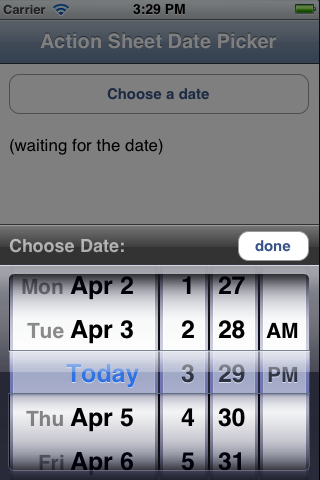

<div class="note">WARNING:  <code>UIActionSheet</code> is <a href="https: //developer.apple.com/library/ios/documentation/UIKit/Reference/UIActionSheet_Class/">deprecated in iOS 8</a>, and has been replaced with UIAlertController. You can find a recipe on how to implement an Action Sheet in iOS <a href="/recipes/ios/standard_controls/alertcontroller/">here</a>.</br></br> <a href="https: //developer.apple.com/library/ios/documentation/uikit/reference/uiactionsheet_class/index.html">Apple says: </a> "To create and manage action sheets in iOS 8 and later, instead use <code>UIAlertController</code> with a <code>preferredStyle</code> of <code>UIAlertControllerStyleActionSheet</code>."</div>

<a name="Recipe" class="injected"></a>
# Recipe

An Action Sheet is a convenient way to modally request input from the user.
This recipe shows you how to use an Action Sheet to allow the user to input a
date.

 

To display an Action Sheet that selects a date: 

1.&nbsp;The sample code includes a custom class <span class="s2">ActionSheetDatePicker</span> that will be used in this recipe. It contains
a custom <span class="s2">UIActionSheet</span> implementation that contains a <span class="s2">UIDatePicker</span>, <span class="s2">UILabel</span> and <span class="s2">UIButton</span>.

2.&nbsp; <span class="s3">Create the</span> ActionSheetDatePicker <span class="s3">and set the</span> Title <span class="s3">: </span>

```
actionSheetDatePicker = new ActionSheetDatePicker (this.View);
actionSheetDatePicker.Title = "Choose Date: ";
```

3.&nbsp;Set the type and validation properties of the <span class="s2">UIDatePicker</span> property: 

```
actionSheetDatePicker.DatePicker.Mode = UIDatePickerMode.DateAndTime;
actionSheetDatePicker.DatePicker.MinimumDate = DateTime.Today.AddDays (-7);
actionSheetDatePicker.DatePicker.MaximumDate = DateTime.Today.AddDays (7);
```

4.&nbsp;Handle the <span class="s2">UIDatePicker</span> value changing (in
this case, we apply the selected date directly to the <span class="s2">UILabel</span>): 

```
actionSheetDatePicker.DatePicker.ValueChanged += (s, e) => {
   dateLabel.Text = (s as UIDatePicker).Date.ToString ();
};
```

5.&nbsp;In the <span class="s4"><strong>Choose a date</strong></span> button <span class="s2">TouchUpInside</span> handler call <span class="s2">Show</span>
to display the Action Sheet: 

```
actionSheetDatePicker.Show ();
```

 <a name="Additional_Information" class="injected"></a>


# Additional Information

The sample includes a custom <span class="s2">ActionSheetDatePicker</span>
class that works by creating a <span class="s2">UIActionSheet</span> and adding
other subviews directly to it.