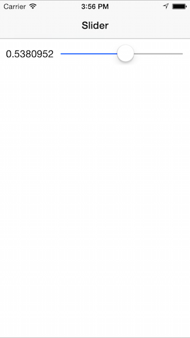

id:{416B02DC-AA38-B2CD-27C7-0E4FB007BEAA}  
title:Specify Slider Value  
brief:This recipe shows how to specify the range of a slider and access its value.
samplecode:[Browse on GitHub](https://github.com/xamarin/recipes/tree/master/ios/standard_controls/sliders/specify_slider_value)  
sdk:[UISlider Class Reference](https://developer.apple.com/library/ios/#documentation/UIKit/Reference/UISlider_Class/Reference/Reference.html)  

<a name="Recipe" class="injected"></a>


# Recipe

To create a slider and set its initial value:

1. Create a `UISlider` and add it to the View:

```
slider = new UISlider(new CGRect(100,  30, 210, 20));
View.Add (slider);
```

<ol start="2">
  <li>Set the slider minimum, maximum and initial value:</li>
</ol>

```
slider.MinValue = 0f;
slider.MaxValue = 1f;
slider.Value = 0.5f; // initial value
```

<ol start="3">
  <li>Attach an event to respond to any changes in the slider:</li>
</ol>

```
slider.ValueChanged += HandleValueChanged; // defined below
```

<ol start="4">
  <li>Create a method to handle the changed value. In the example the value is displayed in a label as the slider is dragged:</li>
</ol>

```
void HandleValueChanged (object sender, EventArgs e)
{   // display the value in a label
   label.Text = slider.Value.ToString ();
};
```

The sample looks like this when running:

 
