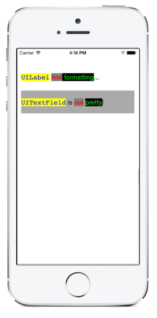

<a name="Recipe" class="injected"></a>


# Recipe

Text can be styled in the `UITextField` (and also the `UILabel`) using the `NSMutableAttributedString` class and applying `UIStringAttributes`. The styled text is set on the `AttributedText` property of the `UITextField` control.

 <a name="Create_String_Attributes" class="injected"></a>


## Create String Attributes

String attributes objects contain a style definition that will be applied to some text. Here are three different examples of `UIStringAttributes` objects: 

```
var firstAttributes = new UIStringAttributes {
	ForegroundColor = UIColor.Blue,
	BackgroundColor = UIColor.Yellow,
	Font = UIFont.FromName("Courier", 18f)
};

var secondAttributes = new UIStringAttributes {
	ForegroundColor = UIColor.Red,
	BackgroundColor = UIColor.Gray,
	StrikethroughStyle = NSUnderlineStyle.Single
};

var thirdAttributes = new UIStringAttributes {
	ForegroundColor = UIColor.Green,
	BackgroundColor = UIColor.Black
};
```

 <a name="Via_a_Button" class="injected"></a>


## Apply to Text Field

The same styling can be applied to the entire contents of the text field by creating a single `NSAttributedString` object: 

```
textField1.AttributedText = new NSAttributedString("UITextField is pretty!", firstAttributes);
```

Alternatively different parts can be styled differently using an `NSMutableAttributedString` instance, which allows differently styling attributes to be set on specific ranges of text.

```
// create the text field
textField1 = new UITextField (new CoreGraphics.CGRect (10, 60, 300, 60));
textField1.BackgroundColor = UIColor.LightGray;
View.Add (textField1);

// set different ranges to different styling!
var prettyString = new NSMutableAttributedString ("UITextField is not pretty!");
prettyString.SetAttributes (firstAttributes.Dictionary, new NSRange (0, 11));
prettyString.SetAttributes (secondAttributes.Dictionary, new NSRange (15, 3));
prettyString.SetAttributes (thirdAttributes.Dictionary, new NSRange (19, 6));

// assign the styled text
textField1.AttributedText = prettyString;
```

The result is the following: 

 [ ](Images/01-styled-text.png)