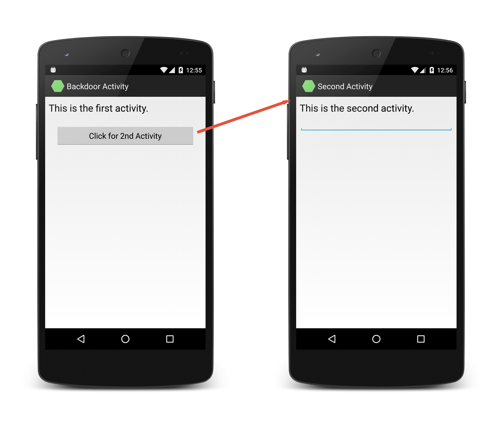
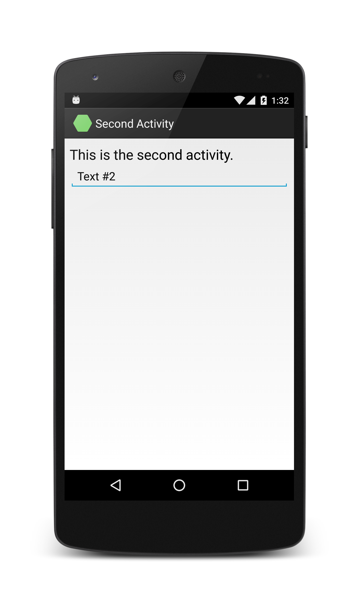

id:{EFEE45D1-EB98-4858-ABE4-C31CD85A416E}
title: Start Activity with a Backdoor
dateupdated: 2016-03-22
article: [Working With Backdoors](/guides/testcloud/uitest/working-with/backdoors/)
link:[Sample App on Github](https://github.com/xamarin/test-cloud-samples/tree/master/android/BackdoorActivity)
api:[IApp.Invoke](http://api.xamarin.com/?link=M%3aXamarin.UITest.IApp.Invoke%28System.String%2cSystem.Object%29)
api:[Java.Interop.ExportAttribute](http://androidapi.xamarin.com/?link=T%3aJava.Interop.ExportAttribute)

# Overview

For an Android app with multiple Activities, a _backdoor_ (a special method in the app being tested that can be invoked directly by a Xamarin.UITest) can be used to directly start an Activity other than the MainLauncher.

The sample application has two Activities. The second Activity can be accessed by clicking a button, as demonstrated by the following screenshot:



While it would be straightforward to write a UITest to tap the button on the first activity and display the second activity, this approach may not be practical for a variety of different reasons. This recipe will demonstrate the use of a backdoor to launch an Activity and test it.

A sample Xamarin.Android application with UITests may be [found on Github](https://github.com/xamarin/test-cloud-samples/tree/master/android/BackdoorActivity).

# Add a Backdoor method to the Startup Activity

The first step is to create the backdoor method and adorn it with the `Java.Interop.Export` attribute. This attribute will expose the C# method to Android. The backdoor method will contain code to execute on behalf of your test. This snippet is a sample of a backdoor method that is added to the startup Activity:

```
#if DEBUG
[Java.Interop.Export("StartActivityTwo")]
public void StartActivityTwo()
{
    Intent i = new Intent(this, typeof(SecondActivity));
    StartActivity(i);
}
#endif
```

The `Java.Interop.Export` attribute will expose this method to the Xamarin Test Cloud Agent under the name `StartActivityTwo`. The next section will demonstrate how to invoke this method from a UITest. The method is wrapped in conditional compilation directives so that it is only available in DEBUG builds of the application. This is done to prevent a possible security issue in the RELEASE build of an application.

<div class="note"><p>It may be necessary to add a reference to the <strong>Mono.Android.Export.dll</strong> assembly in the Xamarin.Android project.</p></div>

# Call the Backdoor in A UITest

Once the backdoor has been added to the Android application `IApp.Invoke` method is used to execute the method from a UITest: 

```
[Test]
public void Use_backdoor_for_second_activity()
{
    // Arrange
    app.WaitForElement(c => c.Marked("button1"));
    app.Invoke("StartActivityTwo");

    // Act 
    EnterTextOnActivityTwo("Text #2");

    //Assert
    AssertTextHasBeenEnteredOnSecondActivity("Text #2");
}
```

This snippet will first wait for the first Activity to finish loading, then it will `Invoke` the backdoor method. The method `EnterTextOnActivityTwo` will then interact with the Activity, filling the EditText widget with **Text #2**:



# Summary

This recipe demonstrated how a Xamarin.UITest may start an Activity for testing using a backdoor. For more information about using backdoors in Xamarin.UITest, please consult **[UITest > Working With > Backdoors](/guides/testcloud/uitest/working-with/backdoors/)**. The code for a [sample application may be found on Github](https://github.com/xamarin/test-cloud-samples/tree/master/android/BackdoorActivity).
