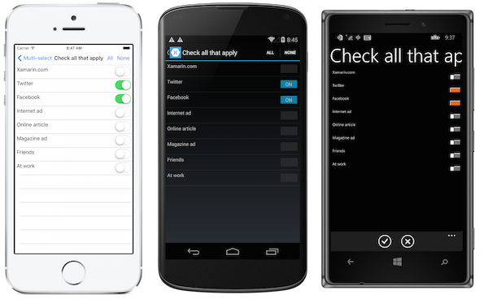

---
id:{4e1ad66b-4902-4f85-a886-c03716ba2b87}
title:Multi-select ListView
brief:Add the ability to track multiple selections in a ListView
samplecode:[Multiselect Sample](https://github.com/xamarin/recipes/tree/master/cross-platform/xamarin-forms/Controls/multiselect)
---

The Xamarin.Forms [`ListView`](/api/type/Xamarin.Forms.ListView/)
control only has a single `SelectedItem`, and cannot represent selection of
mulitple rows.

To extend `ListView` to support multiple-selection we need:
* a way to represent the *selection* of multiple rows,
* a way to track which rows are selected, and
* a control to select and deselect rows.

The [code sample](https://github.com/xamarin/recipes/tree/master/cross-platform/xamarin-forms/Controls/multiselect)
for this recipe includes a simple base class
[`SelectMultipleBasePage<T>`](#source)
that renders a `ListView` which adds these features:
* selection state is stored in a `WrappedSelection<T>` object for each
  data item in your list,
* the selected rows can be queried using the `GetSelection` method,
* each row uses a `Switch` to enable (and display) selection status.

[ ](Images/All.png)

To use the `SelectMultipleBasePage<T>` pass in a `List<T>` of the
objects you want to list (by default the `Name` property is used for the
row text) to a new instance, and push it onto a `NavigationPage` stack:

```
var items = new List<CheckItem>();
items.Add (new CheckItem{ Name="Xamarin.com"});
items.Add (new CheckItem{ Name="Twitter"});
// ...
items.Add (new CheckItem{ Name="At work"});

multiPage = new SelectMultipleBasePage<CheckItem> (items){ Title = "Check all that apply" };
await Navigation.PushAsync (multiPage);
```

To find out which rows have been selected, call the `GetSelection` method:

```
var answers = multiPage.GetSelection();
```

## Possible Enhancements

The generic base class provides the `WrappedSelection<T>` class so that your
data model doesn't need to be aware of the selection state; but you could
update the code so that selecting an item in the list automatically sets
a `bool` property on your model.

The `WrappedItemSelectionTemplate` is provided as the default rendering
for each row: it binds a `Name` property (if found) to display in each row,
along with a `Switch` control. You can edit this template to change the
way each row is displayed.

Xamarin.Forms doesn't have a built-in checkbox control, so this sample
uses the `Switch`. You could replace the switch with your own custom
code, which could use images or the background color or some alternate
way to represent the selected state visually.

The base class expects to be hosted inside a `NavigationPage` because
it populates the `ToolbarItems` collection with the **All** and **None**
buttons. You could add an alternate user-interface for these features
so that the control could be hosted in a modal page.


# Summary

This recipe provides a simple base class to build a multi-select-capable
`ListView`. It also lists some enhancements that are possible.

## Credits

`SelectMultipleBasePage<T>` was written by Glenn Stephens from Xamarin University!

<a name="source" />
## Complete Source

The complete source for `SelectMultipleBasePage<T>` is shown below:

```
using System;

using Xamarin.Forms;
using System.ComponentModel;
using System.Collections.Generic;
using System.Linq;

namespace Multiselect
{
	/*
	* based on
	* https://gist.github.com/glennstephens/76e7e347ca6c19d4ef15
	*/
	public class SelectMultipleBasePage<T> : ContentPage
	{
		public class WrappedSelection<T> : INotifyPropertyChanged
		{
			public T Item { get; set; }
			bool isSelected = false;
			public bool IsSelected {
				get {
					return isSelected;
				}
				set
				{
					if (isSelected != value) {
						isSelected = value;
						PropertyChanged (this, new PropertyChangedEventArgs ("IsSelected"));
//						PropertyChanged (this, new PropertyChangedEventArgs (nameof (IsSelected))); // C# 6
					}
				}
			}
			public event PropertyChangedEventHandler PropertyChanged = delegate {};
		}
		public class WrappedItemSelectionTemplate : ViewCell
		{
			public WrappedItemSelectionTemplate() : base ()
			{
				Label name = new Label();
				name.SetBinding(Label.TextProperty, new Binding("Item.Name"));
				Switch mainSwitch = new Switch();
				mainSwitch.SetBinding(Switch.IsToggledProperty, new Binding("IsSelected"));
				RelativeLayout layout = new RelativeLayout();
				layout.Children.Add (name,
					Constraint.Constant (5),
					Constraint.Constant (5),
					Constraint.RelativeToParent (p => p.Width - 60),
					Constraint.RelativeToParent (p => p.Height - 10)
				);
				layout.Children.Add (mainSwitch,
					Constraint.RelativeToParent (p => p.Width - 55),
					Constraint.Constant (5),
					Constraint.Constant (50),
					Constraint.RelativeToParent (p => p.Height - 10)
				);
				View = layout;
			}
		}
		public List<WrappedSelection<T>> WrappedItems = new List<WrappedSelection<T>>();
		public SelectMultipleBasePage(List<T> items)
		{
			WrappedItems = items.Select (item => new WrappedSelection<T> () { Item = item, IsSelected = false }).ToList ();
			ListView mainList = new ListView () {
				ItemsSource = WrappedItems,
				ItemTemplate = new DataTemplate (typeof(WrappedItemSelectionTemplate)),
			};
			mainList.ItemSelected += (sender, e) => {
				if (e.SelectedItem == null) return;
				var o = (WrappedSelection<T>)e.SelectedItem;
				o.IsSelected = !o.IsSelected;
				((ListView)sender).SelectedItem = null; //de-select
			};
			Content = mainList;
			ToolbarItems.Add (new ToolbarItem ("All", null, SelectAll, ToolbarItemOrder.Primary));
			ToolbarItems.Add (new ToolbarItem ("None", null, SelectNone, ToolbarItemOrder.Primary));
		}
		void SelectAll ()
		{
			foreach (var wi in WrappedItems) {
				wi.IsSelected = true;
			}
		}
		void SelectNone ()
		{
			foreach (var wi in WrappedItems) {
				wi.IsSelected = false;
			}
		}
		public List<T> GetSelection()
		{
			return WrappedItems.Where (item => item.IsSelected).Select (wrappedItem => wrappedItem.Item).ToList ();
		}
	}
}
```