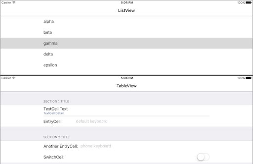
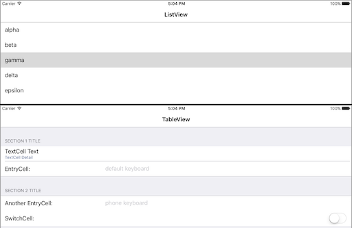

---
id:{4ed7ea00-1b24-4962-b2a4-fe9bffc1e652}
title:Fixing ListView and TableView width on iPad
samplecode:[Browse on Github](https://github.com/xamarin/recipes/tree/master/cross-platform/xamarin-forms/iOS/ipad-listview/)
article:[Custom Renderers](/guides/xamarin-forms/custom-renderer/)
api:[ListView](/api/type/Xamarin.Forms.ListView/)
api:[TableView](/api/type/Xamarin.Forms.TableView/)
dateupdated:2015-12-18
---

In iOS 9 Apple introduced a new feature in `UITableView` that prevents
cells from stretching to the full width of the screen to aid in readability.
This means that on all iPads in landscape mode (and also in portrait on the 
iPad Pro) the `ListView` and `TableView` cells in Xamarin.Forms do not
expand to the full width of the screen.

The screenshot snippets below show how cells are centered and indented
from the sides of the screen:

[ ](Images/before.png)

To disable this behavior the new iOS property `CellLayoutMarginsFollowReadableWidth` needs to be set to `false`. 
This can be done with a simple custom renderer as shown for `ListView`
in the code below:


```
[assembly: ExportRenderer (typeof(ListView), typeof(CustomListViewRenderer))]
namespace iPadFormatting.iOS
{
	public class CustomListViewRenderer : ListViewRenderer
	{
		protected override void OnElementChanged (ElementChangedEventArgs<Xamarin.Forms.ListView> e)
		{
			base.OnElementChanged (e);
			if (e.NewElement != null) {
				var listView = Control as UITableView;
				listView.CellLayoutMarginsFollowReadableWidth = false;
			}
		}
	}
}
```

The [sample code](https://github.com/xamarin/recipes/tree/master/cross-platform/xamarin-forms/iOS/ipad-listview/) includes the `TableView` example as well.

The controls after adding these custom renderers are shown below - now each
cell expands to the full width of the screen:

[ ](Images/after.png)


## Android & Windows Platforms

The other platforms do not automatically restrict the width of the `ListView`
or `TableView` controls, so no additional custom renderers are necessary.