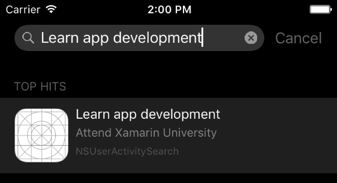
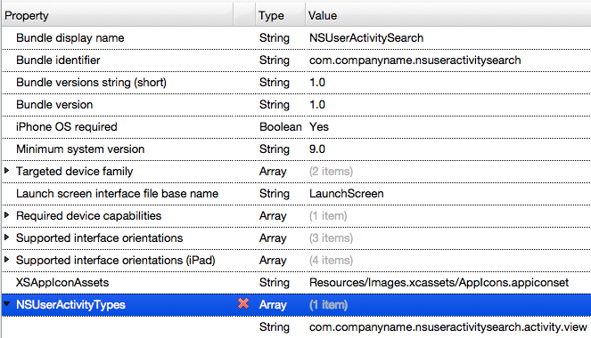

# Overview

The [`NSUserActivity`](/api/type/Foundation.NSUserActivity/) class provides support for defining a user's activity so that it can potentially be continued on another of the user's devices, and is typically used to provide data for [Handoff](/guides/ios/platform_features/introduction_to_ios9/handoff/). In iOS 9, each activity can also be indexed and searched from Spotlight search, therefore making app interaction history searchable by the user. If the user selects a search result that belongs to an activity from an app, the app will be launched and the activity described by the `NSUserActivity` will be restarted and presented to the user. In addition, by adopting app search via activities, additional benefits become available such as Siri suggestions and smart reminders. For more information, see [Search with NSUserActivity](/guides/ios/platform_features/introduction_to_ios9/search/nsuseractivity/).

The sample app demonstrates a Todo list application where the data is stored in an in-memory collection. As each `TodoItem` is displayed on the `TodoItemPage`, the navigation point will be indexed so that it can be found by Spotlight search, as shown in the following screenshot: 



When the user taps on a search result item for the app that was added via `NSUserActivity`, the app is launched and the user is shown the `TodoItem` data on the `TodoItemPage`.

The activity functionality is contained in the `UserActivity` class in the iOS project, and is invoked via the Xamarin.Forms [`DependencyService`](/api/type/Xamarin.Forms.DependencyService/) from the Portable Class Library (PCL) project. For more information about the `DependencyService` class, see [Accessing Native Features with DependencyService](https: //developer.xamarin.com/guides/xamarin-forms/dependency-service/).

## Creating Activity Type Identifiers

Before creating a search activity, an *Activity Type Identifier* must first be created in order to uniquely identify the search activity. This is a short string that's added to the `NSUserActivityTypes` array of the app's **Info.plist** file. There should be one entry in the array for each activity that the app supports and exposes to app search. The following screenshot shows the single activity supported by the sample app: 



In addition, the *Activity Type Identifier* should also be declared as a constant so that it can be easily accessed from code: 

```
public static class ActivityTypes
{
  public const string View = "com.companyname.nsuseractivitysearch.activity.view";
}
```

## Creating an Activity

The following code example shows how to create an activity for a on-device index hosted search: 

```
NSUserActivity CreateActivity (TodoItem item)
{
  // Create app search activity
  var activity = new NSUserActivity (ActivityTypes.View);

  // Populate activity
  activity.Title = item.Name;

  // Add additional data
  var attributes = new CSSearchableItemAttributeSet ();
  attributes.DisplayName = item.Name;
  attributes.ContentDescription = item.Notes;

  activity.ContentAttributeSet = attributes;
  activity.AddUserInfoEntries (NSDictionary.FromObjectAndKey (new NSString (item.ID), new NSString ("Id")));

  // Add app search ability
  activity.EligibleForSearch = true;
  activity.BecomeCurrent ();	// Don't forget to ResignCurrent() later

  return activity;
}
```

The searchable activity is created as follows: 

- A [`NSUserActivity`](/api/type/Foundation.NSUserActivity/) instance is created, which is identified by the values of its [`ActivityType`](/api/property/Foundation.NSUserActivity.ActivityType/) and [`Title`](/api/property/Foundation.NSUserActivity.ActivityType/) properties.
- Additional `TodoItem` data is added to the `NSUserActivity` instance by setting its [`ContentAttributeSet`](/api/property/Foundation.NSUserActivity.ContentAttributeSet/) property to a [`CSSearchableItemAttributeSet`](/api/type/CoreSpotlight.CSSearchableItemAttributeSet/) instance.
- The [`AddUserInfoEntries`](/api/member/Foundation.NSUserActivity.AddUserInfoEntries/p/Foundation.NSDictionary/) method sets the identifier of the activity to the `TodoItem.ID` property value, and stores it in the [`UserInfo`](/api/property/Foundation.NSUserActivity.UserInfo/) dictionary.
- The [`EligibleForSearch`](/api/property/Foundation.NSUserActivity.EligibleForSearch/) property is set to `true` so that the activity will be added to the on-device index and presented in search results.
- The [`BecomeCurrent`](/api/member/Foundation.NSUserActivity.BecomeCurrent()/) method is called in order to mark the activity as the activity currently in use by the user.

<div class="note"><p>Activities that are marked as the current activity by the <code>BecomeCurrent</code> method must later have the <a href="/api/member/Foundation.NSUserActivity.ResignCurrent()/"><code>ResignCurrent</code></a> method called. This method tells the activity that it should no longer be the activity currently in use by the user. In the sample app this occurs when the user navigates back to the <code>TodoListPage</code>.</p></div>

The `CreateActivity` method can be extended to create activities that are added to Apple's cloud-based index and presented to users (via search) who have not already installed the app on their device. For more information, see [Public Search Indexing](/guides/ios/platform_features/introduction_to_ios9/search/nsuseractivity/#Public_Search_Indexing).

## Responding to an Activity

When the user taps on an item added to the search result via [`NSUserActivity`](/api/type/Foundation.NSUserActivity/) for the app, the [`AppDelegate.ContinueUserActivity`](/api/member/UIKit.UIApplicationDelegate.ContinueUserActivity/) method is called, as shown in the following code example: 

```
public override bool ContinueUserActivity (UIApplication application, NSUserActivity userActivity, UIApplicationRestorationHandler completionHandler)
{
  if (userActivity.ActivityType == ActivityTypes.View) {
    string id = userActivity.UserInfo.ObjectForKey (new NSString ("Id")).ToString ();
    if (!string.IsNullOrWhiteSpace (id)) {
      MessagingCenter.Send<NSUserActivitySearch.App, string> (Xamarin.Forms.Application.Current as NSUserActivitySearch.App, "ShowItem", id);
    }
  }
  return true;
}
```

Provided that the activity has an [`ActivityType`](/api/property/Foundation.NSUserActivity.ActivityType/) that matches the *Activity Type Identifier* added to **Info.plist**, the identifier of the activity is restored. This identifier is the `TodoItem.ID` property value that was previously added to the [`UserInfo`](/api/property/Foundation.NSUserActivity.UserInfo/) dictionary of the [`NSUserActivity`](/api/type/Foundation.NSUserActivity/) instance. The identifier is then sent as a `ShowItem` message using the Xamarin.Forms [`MessagingCenter`](/api/type/Xamarin.Forms.MessagingCenter/). In response, the registered callback for the `ShowItem` message is executed, as shown in the following code example: 

```
public App ()
{
  ...
  MessagingCenter.Subscribe <NSUserActivitySearch.App, string> (this, "ShowItem", async (sender, arg) => {
    var todoItems = TodoManager.All;
    var item = todoItems.FirstOrDefault (i => i.ID == arg);

    if (item != null) {
      await MainPage.Navigation.PopToRootAsync ();
      var todoItemPage = new TodoItemPage ();
      todoItemPage.BindingContext = item;
      await MainPage.Navigation.PushAsync (todoItemPage);
    }
  });
}
```

When the callback for the `ShowItem` message is executed, the `TodoItem` for the identifier is retrieved. Provided that it's not `null`, the `TodoItemPage` is then navigated to, where the `TodoItem` instance is displayed through data binding.

For more information about using the [`MessagingCenter`](/api/type/Xamarin.Forms.MessagingCenter/) class, see [Publish and Subscribe with MessagingCenter](/guides/xamarin-forms/messaging-center/).

# Summary

This recipe showed how to use the iOS 9 `NSUserActivity` class to make Xamarin.Forms app content searchable through Spotlight search and Siri.